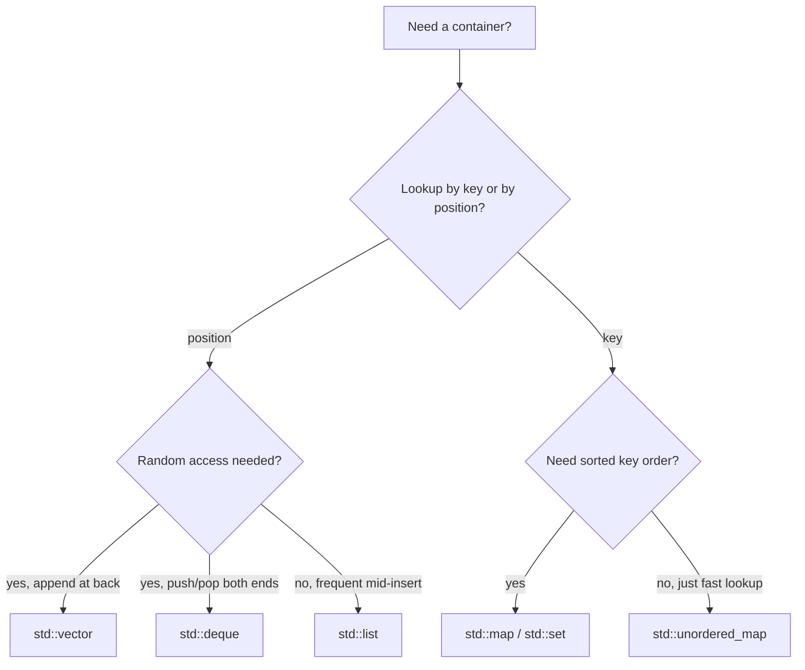

# Advanced Modern C++ for Robotics — Unit 2: The STL Library

The Standard Template Library gives you battle-tested, generic containers and algorithms so you stop hand-rolling arrays and linked lists. Picking the right container is one of the highest-leverage decisions you make when writing robotics code that has to run in real time.

The flowchart below is the decision process to walk through before reaching for `vector` out of habit.



## Containers overview
A container is a generic class template that stores a collection of objects. STL containers fall into two families: **sequence containers** (ordering is by position — array, vector, deque, list, forward_list) and **associative containers** (ordering/lookup is by key — set, map, and their `multi`/`unordered` variants). All of them are template classes, so `std::vector<int>` and `std::vector<Pose>` share the same implementation but hold different types.

## Sequence containers: array, vector, deque, list, forward_list
- `std::array<T, N>` — fixed-size, stack-allocated, zero overhead over a raw C array but with bounds-checked `.at()` and STL iterator support. Size must be known at compile time.
- `std::vector<T>` — dynamically resizable, contiguous storage. Your default choice for "a list of things" in robotics (a scan's ranges, a trajectory's waypoints).
- `std::deque<T>` — double-ended queue; efficient push/pop at both front and back, not contiguous.
- `std::list<T>` — doubly linked list; O(1) insert/erase anywhere given an iterator, but no random access and poor cache locality.
- `std::forward_list<T>` — singly linked list; more memory-efficient than `list` when you only ever traverse forward.

```cpp
#include <vector>
std::vector<double> joint_angles = {0.0, 1.57, -0.78};
joint_angles.push_back(0.5);          // O(1) amortized
joint_angles.reserve(100);            // avoid reallocations in a hot loop
for (double angle : joint_angles) { /* process each joint */ }
```
Rule of thumb for robotics code: reach for `vector` first. Only switch to `deque`/`list` when you have measured a real need for cheap front-insertion or mid-sequence splicing.

## Associative containers: set, multiset, map, unordered_map
- `std::set<T>` / `std::multiset<T>` — sorted, unique (or non-unique) keys; O(log n) insert/find via a red-black tree.
- `std::map<K, V>` — sorted key-value store; ideal when you need to iterate keys in order (e.g. timestamps).
- `std::unordered_map<K, V>` — hash-table based; O(1) average lookup, no ordering guarantee. Best default when you just need "look up robot state by ID".

```cpp
#include <unordered_map>
std::unordered_map<std::string, double> joint_limits;
joint_limits["shoulder_pan"] = 2.9;
if (auto it = joint_limits.find("shoulder_pan"); it != joint_limits.end()) {
    double limit = it->second;
}
```

## Iterators
An iterator is a generalized pointer that lets algorithms and range-based `for` loops work identically across every container, regardless of its internal layout. Every container exposes `.begin()`/`.end()`, and STL algorithms (`std::sort`, `std::find`, `std::accumulate`) operate on iterator *ranges* rather than the container itself.

```cpp
#include <algorithm>
std::vector<double> ranges = {1.2, 0.4, 3.1, 0.9};
std::sort(ranges.begin(), ranges.end());
auto closest = std::min_element(ranges.begin(), ranges.end());
```
Iterators are invalidated by operations that reallocate or restructure a container (e.g. `push_back` on a full `vector`) — a classic source of subtle bugs, so never hold an iterator across a mutation you haven't reasoned about.

## Try it yourself
Given a `std::vector<std::pair<std::string, double>>` of `(sensor_name, reading)` pairs, build an `std::unordered_map<std::string, double>` from it, then use `std::sort` with a custom comparator (via a lambda) to print the sensor names in descending order of reading value.
