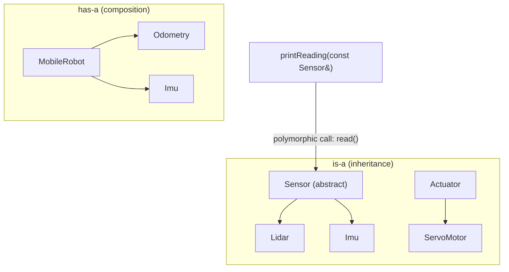

# Advanced Modern C++ for Robotics — Unit 4: Object Oriented Programming (OOP)

Robotics software is built from hierarchies: every driver "is a" `Sensor`, every planner "is a" `Plan`. This unit covers the OOP tools — composition, inheritance, and polymorphism — that let you model those relationships cleanly, and the pitfalls (slicing, missing virtual destructors) that trip up newcomers to C++'s specific flavor of OOP.

The diagram below places this unit's two relationship kinds — "has-a" composition and "is-a" inheritance — side by side with the polymorphic call that only inheritance enables.



## Composition
Composition means building a class out of other objects as members ("has-a") rather than through inheritance ("is-a"). It's generally preferred over inheritance for code reuse because it keeps classes loosely coupled and avoids fragile hierarchies.

```cpp
class Odometry { public: void update(); };
class Imu { public: void read(); };

class MobileRobot {   // "has-a" Odometry and an Imu
public:
    void step() { odom_.update(); imu_.read(); }
private:
    Odometry odom_;
    Imu imu_;
};
```

## Inheritance
Inheritance lets a derived class reuse and extend a base class's interface and implementation. In robotics it's most useful for expressing "these things share a contract" — e.g. every actuator can `enable()`/`disable()`, but *how* differs per hardware.

```cpp
class Actuator {
public:
    virtual void enable() { std::cout << "generic enable\n"; }
    virtual ~Actuator() = default;   // ALWAYS virtual if the class has virtual functions
};

class ServoMotor : public Actuator {
public:
    void enable() override { std::cout << "servo: PWM on\n"; }
};
```
A missing `virtual` destructor is a classic C++ bug: deleting a `ServoMotor` through an `Actuator*` without one only runs `Actuator`'s destructor, leaking any resources `ServoMotor` owns.

## Function overriding, overloading, and virtual functions
These sound similar but are unrelated mechanisms. **Overloading** is multiple functions with the *same name, different parameters*, resolved at compile time. **Overriding** is a derived class replacing a base class's `virtual` function with the *same signature*, resolved at runtime through the vtable.

```cpp
class Base {
public:
    virtual double compute(double x) { return x * 2; }   // overridable
};
class Derived : public Base {
public:
    double compute(double x) override { return x * 3; }  // overriding (same signature)
    double compute(double x, double y) { return x + y; }  // overloading (different signature)
};
```
Without `virtual`, calling `compute()` through a `Base*` always runs `Base::compute`, even if the object is really a `Derived` — this is why forgetting `virtual` on a base method is a common source of "why isn't my override running?" bugs.

## Abstract classes, interfaces, polymorphism, and type casting
A **pure virtual function** (`virtual void foo() = 0;`) has no implementation and makes its class *abstract* — it cannot be instantiated, only inherited from. A class made entirely of pure virtual functions acts as an **interface**, defining a contract with zero implementation.

```cpp
class Sensor {   // abstract interface
public:
    virtual double read() const = 0;
    virtual ~Sensor() = default;
};

void printReading(const Sensor& s) {   // polymorphism: works for any concrete Sensor
    std::cout << s.read() << "\n";
}
```
**Polymorphism** is the payoff: code written against `Sensor&`/`Sensor*` works unmodified for any derived sensor type, which is exactly how ROS 2's plugin/pluginlib mechanisms and sensor driver hierarchies are structured. When you need to go the other way — from a base pointer down to a specific derived type — use `dynamic_cast<Derived*>(base_ptr)` (returns `nullptr` on failure, safe) rather than a C-style cast (unchecked, dangerous).

## Try it yourself
Define an abstract `Sensor` interface with a pure virtual `read() const -> double`. Implement two concrete sensors, `Lidar` and `Imu`, each returning a different fixed value. Store `std::unique_ptr<Sensor>` instances of both in a `std::vector`, loop over it, and call `read()` polymorphically on each — confirm the correct override runs for each type.
