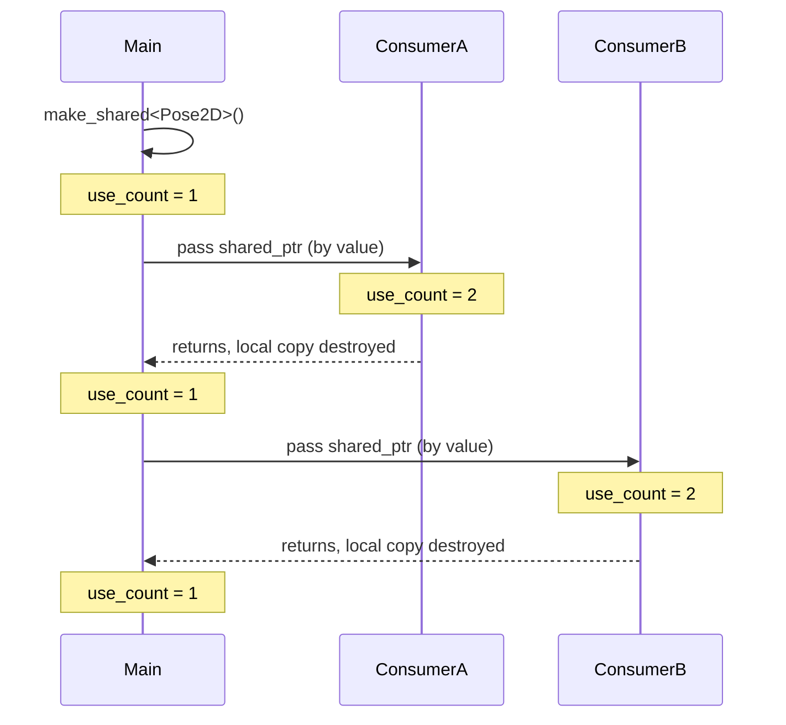

# Advanced Modern C++ for Robotics — Unit 5: Pointers and References

Memory management is where C++ diverges most sharply from Python. Robotics code frequently deals with hardware buffers, shared sensor data, and callback-based APIs (ROS 2 subscriptions hand you data through pointers/references), so understanding pointers precisely — not just "kind of" — is non-negotiable.

The sequence below tracks how `use_count()` on a `shared_ptr<Pose2D>` rises and falls as it is passed to and returned from two consumer functions, exactly like the "Try it yourself" exercise below asks you to observe.



## Pointer basics and pointers to arrays
A pointer is a variable holding a memory address. `T*` points at a `T`; dereferencing (`*ptr`) accesses the value there; `&x` takes the address of `x`.

```cpp
int battery_pct = 87;
int* p = &battery_pct;
*p = 90;                       // modifies battery_pct through the pointer
std::cout << battery_pct;      // 90
```
Arrays and pointers are closely related: an array name decays to a pointer to its first element, and pointer arithmetic (`p + 1`) advances by `sizeof(T)` bytes, not one byte.

```cpp
double waypoints[5] = {0.0, 1.0, 2.0, 3.0, 4.0};
double* p = waypoints;         // decays to &waypoints[0]
std::cout << *(p + 2);         // same as waypoints[2] -> 2.0
```

## Dynamic allocation, pointers to pointers, and function pointers
`new`/`delete` allocate/free memory on the heap at runtime, when you don't know the size at compile time or need an object to outlive its creating scope. Every `new` must be matched by exactly one `delete` — miss one and you leak; call `delete` twice and you corrupt the heap. (Unit 5's smart pointers exist precisely to make this rule automatic.)

```cpp
double* buffer = new double[1024];   // dynamically allocate a scan buffer
// ... use buffer ...
delete[] buffer;                     // must match `new[]` with `delete[]`
```
A pointer to a pointer (`int**`) is common when a function needs to output a pointer through a parameter (C-style APIs) or when managing arrays of dynamically allocated objects. A **function pointer** stores the address of a function, letting you pass behavior as data — the precursor to `std::function` and lambdas (Unit 6):

```cpp
void stop() { std::cout << "stopping\n"; }
void (*callback)() = stop;   // callback is a pointer to a function returning void, no args
callback();                  // calls stop()
```

## const with pointers and references
`const` next to a pointer is easy to misread — read pointer declarations right-to-left. `const T*` (pointer to const data) means you can't modify what's pointed at; `T* const` (const pointer) means you can't repoint the pointer itself.

```cpp
const double* readOnlyData;    // can point elsewhere, can't modify pointee
double* const fixedPointer = &battery_pct;   // can't repoint, can modify pointee
```
A **reference** (`T&`) is an alias for an existing variable — it must be bound at creation and can never be rebound or null. Prefer references for function parameters when the argument must exist and you don't need reseating; prefer pointers when "no value" (`nullptr`) is a valid state.

```cpp
void updatePose(Pose2D& pose) { pose.x += 1.0; }        // mutates caller's Pose2D directly
void printPose(const Pose2D& pose) { /* read-only, no copy */ }
```

## Smart pointers and their use in ROS
Smart pointers wrap a raw pointer in an RAII object that automatically calls `delete` when appropriate, eliminating manual `new`/`delete` bookkeeping.

- `std::unique_ptr<T>` — sole ownership; cannot be copied, only moved. Zero overhead over a raw pointer.
- `std::shared_ptr<T>` — shared ownership via reference counting; the object is destroyed when the last `shared_ptr` to it goes out of scope.
- `std::weak_ptr<T>` — a non-owning observer of a `shared_ptr`, used to break reference cycles.

```cpp
auto lidar = std::make_unique<LidarDriver>("/dev/ttyUSB0", 115200);
std::shared_ptr<Pose2D> shared_pose = std::make_shared<Pose2D>();
```
ROS 2 leans heavily on `std::shared_ptr`: every message your subscription callback receives arrives as `MsgType::SharedPtr`, and nodes themselves are typically created and held as `rclcpp::Node::SharedPtr` — because message ownership is genuinely shared across the middleware and your callback.

## Try it yourself
Write a function `void processScan(std::shared_ptr<std::vector<double>> scan)` that computes the minimum range. In `main`, create the scan with `std::make_shared`, pass it to two different "consumer" functions, and print `scan.use_count()` before and after each call to observe the reference count changing.
