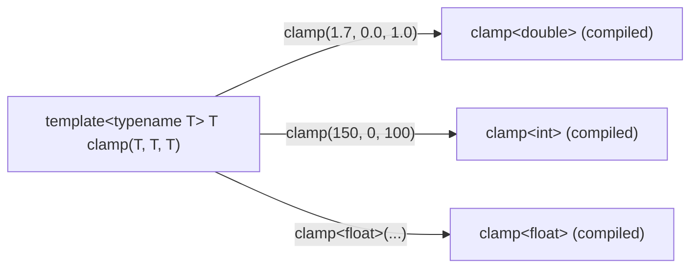

# Advanced Modern C++ for Robotics — Unit 6: Templates and Lambda expressions

Templates let you write one piece of code that works across many types without sacrificing compile-time type safety or runtime performance — think of a hexapod robot whose six legs each run the same inverse-kinematics logic but might use `float` on an embedded controller and `double` in simulation. Lambdas give you a lightweight, inline way to pass behavior around, which STL algorithms and ROS 2 callbacks both depend on constantly.

The diagram below shows the compiler instantiating one function template into several distinct, type-specific functions depending on how it's called.



## Why templates, and function templates
Without templates, you'd need a separate `clamp` function for every numeric type (`clampInt`, `clampDouble`, ...). A **function template** is a blueprint the compiler instantiates on demand for whatever type you actually call it with — you get type-specific, fully optimized code without writing it by hand.

```cpp
template <typename T>
T clamp(T value, T low, T high) {
    return (value < low) ? low : (value > high ? high : value);
}

clamp(1.7, 0.0, 1.0);     // instantiates clamp<double>
clamp(150, 0, 100);       // instantiates clamp<int>
```
The compiler deduces `T` from the arguments; you can also specify it explicitly with `clamp<float>(...)`.

## Class templates and template specialization
A **class template** generalizes an entire class over one or more type parameters — this is literally how `std::vector<T>` itself is implemented.

```cpp
template <typename T, int N>
class FixedRingBuffer {
public:
    void push(T value) { data_[(head_++) % N] = value; }
private:
    T data_[N];
    int head_ = 0;
};

FixedRingBuffer<double, 100> imu_history;   // a 100-sample ring buffer of doubles
```
**Template specialization** lets you override the generic implementation for a specific type when the generic version isn't correct or efficient enough — e.g. a `FixedRingBuffer<bool, N>` might want to pack bits instead of storing one `bool` per byte. You write `template <int N> class FixedRingBuffer<bool, N> { ... };` with a body tailored to `bool`.

## Lambda expressions
A lambda is an unnamed, inline function object — indispensable for short callbacks passed to STL algorithms or ROS 2 APIs (timers, subscriptions) where defining a whole named function would be overkill.

```cpp
auto joint_ids = std::vector<int>{1, 2, 3, 4, 5, 6};
double gain = 1.5;

// [captures](params) -> return_type { body }
std::for_each(joint_ids.begin(), joint_ids.end(),
    [gain](int id) { std::cout << "joint " << id << " gain=" << gain << "\n"; });

auto scaled = [gain](double torque) { return torque * gain; };   // capture by value
std::cout << scaled(4.0);   // 6.0
```
`[gain]` captures `gain` by value (a snapshot); `[&gain]` captures by reference (sees live updates); `[=]`/`[&]` capture everything used in the body by value/reference respectively. Capturing by reference into a lambda that outlives the captured variable is a dangling-reference bug — be deliberate about it, especially in ROS 2 timer/subscription callbacks that get stored and called later.

## Worked example: a small header-only templated library
Templates are typically implemented entirely in headers (no separate `.cpp`), because the compiler needs the full definition available at every call site to instantiate it.

```cpp
// clamp.hpp
#pragma once
template <typename T>
T clamp(T value, T low, T high) {
    return (value < low) ? low : (value > high ? high : value);
}
```
Any translation unit that `#include "clamp.hpp"` can instantiate `clamp` for whatever type it needs — this is exactly the pattern ROS 2's `rclcpp::Node::create_publisher<MsgType>()` and similar templated APIs use, letting a single library serve arbitrary message types.

## Try it yourself
Write a class template `Vec3<T>` with `x, y, z` members and an `add(const Vec3<T>&)` method. Instantiate `Vec3<int>` and `Vec3<double>` and add two of each. Then write a lambda that takes a `Vec3<double>` by const-reference and returns its magnitude (`std::sqrt(x*x+y*y+z*z)`), and call it on your instance.
