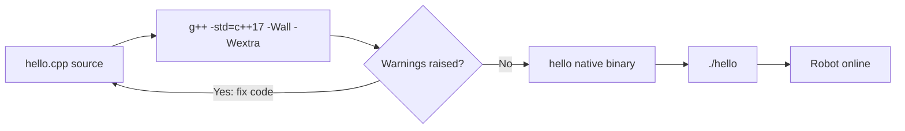

# C++ for Robotics — Unit 1: C++ Basics

This unit gets you writing and compiling real C++ programs, and covers the variable and type system you'll use constantly to hold sensor readings, joint angles, and robot state.

The diagram below traces the compile-then-run pipeline every C++ program goes through before it can control a robot:



## Compiling a C++ program
Unlike Python, C++ is compiled ahead of time: a compiler (GCC's `g++` or LLVM's `clang++`) translates your `.cpp` source into a native binary before it runs. This matters for robotics because compiled code runs deterministically fast, which is exactly what you want in a control loop.

```bash
# hello.cpp
#include <iostream>

int main() {
    std::cout << "Robot online\n";
    return 0;
}
```

```bash
g++ -std=c++17 -Wall -Wextra hello.cpp -o hello
./hello
```

`-std=c++17` pins the language standard (worth being explicit about — robotics codebases, including most ROS 2 packages, target C++17), and `-Wall -Wextra` turn on warnings that catch real bugs (uninitialized variables, sign mismatches) before they become robot-crashing runtime bugs.

## Variables and types
C++ is statically typed: every variable's type is fixed at compile time, and the compiler checks your usage against it. This is a real asset in robotics — a mismatched type between a distance in meters and a raw sensor tick count is a bug you want caught at compile time, not discovered when a robot drives into a wall.

```cpp
int wheel_ticks = 0;
double linear_velocity_mps = 0.35;   // meters/second
float battery_voltage = 12.6f;       // float saves space on embedded targets
bool obstacle_detected = false;
char joint_name = 'A';
```

Prefer `double` for physical quantities unless you're on a memory-constrained microcontroller, where `float` is the norm. Always initialize variables — an uninitialized `int` in C++ holds garbage, not zero.

## Operators and expressions
The arithmetic, comparison, and logical operators work as you'd expect from any C-family language, but a few habits matter for robotics code:

```cpp
double distance_traveled = wheel_ticks * 0.0002;   // ticks -> meters
double remaining = target_distance - distance_traveled;
bool close_enough = remaining < 0.01;              // avoid == on floats
```

Never compare floating-point sensor or actuator values with `==`; use a tolerance threshold instead, since accumulated rounding error is unavoidable with real hardware measurements.

## Comments and readability
`//` for single-line, `/* ... */` for block comments. In robotics code, comment the *units* and *coordinate frame* of every physical quantity — it is the single most common source of bugs when integrating code from multiple contributors.

```cpp
// linear_x is in m/s, in the robot's base_link frame
double linear_x = 0.2;
```

## Try it yourself
Write a program that declares variables for a robot's x and y position (in meters) and heading (in radians), prints them with `std::cout`, then updates the x position by adding a `step` variable and prints the new value. Compile it with `g++ -std=c++17 -Wall -Wextra` and make sure it produces zero warnings.
