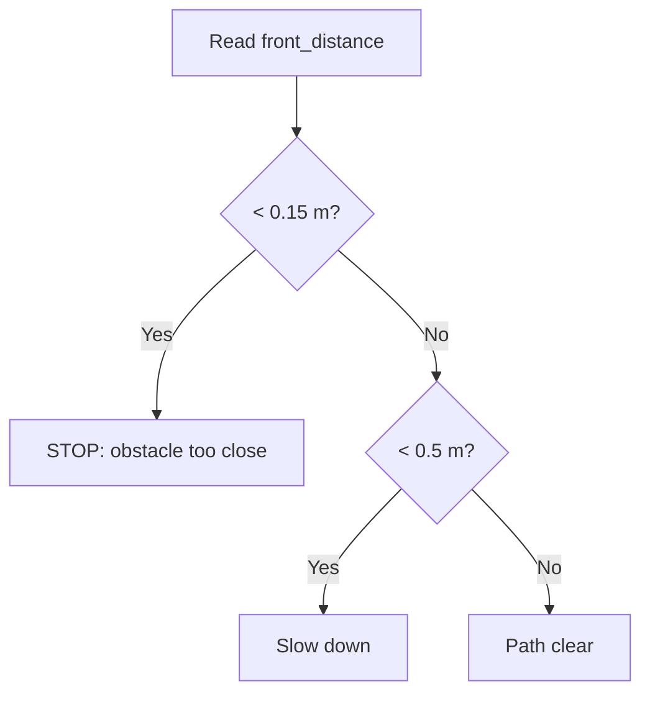

# C++ for Robotics — Unit 2: Conditional Statements and Loops

Robots constantly make decisions ("is the path clear?") and repeat actions ("keep driving until you reach the goal"). This unit covers the control-flow tools — `if`/`else`, `switch`, and the three loop forms — that let you express that logic in C++.

The diagram below traces the decision logic of the `front_distance` example, showing how an `if`/`else if`/`else` chain routes a single sensor reading to one of three outcomes:



## Conditional statements
`if`/`else if`/`else` branch on boolean expressions, exactly like in Python or C, just with braces instead of indentation defining scope.

```cpp
double front_distance = 0.42;   // meters, from a range sensor

if (front_distance < 0.15) {
    std::cout << "STOP: obstacle too close\n";
} else if (front_distance < 0.5) {
    std::cout << "Slow down\n";
} else {
    std::cout << "Path clear\n";
}
```

For discrete states (robot mode, sensor status codes) a `switch` is often clearer than a chain of `else if`:

```cpp
enum class RobotState { IDLE, MOVING, CHARGING, ERROR };
RobotState state = RobotState::MOVING;

switch (state) {
    case RobotState::IDLE:     std::cout << "Idle\n"; break;
    case RobotState::MOVING:   std::cout << "Moving\n"; break;
    case RobotState::CHARGING: std::cout << "Charging\n"; break;
    case RobotState::ERROR:    std::cout << "ERROR\n"; break;
}
```

Using `enum class` (a scoped enum) instead of a plain `int` or old-style `enum` gives you compile-time checking that you handled a real state, not an arbitrary integer.

## `for` loops — known iteration counts
Use a `for` loop when you know (or can compute) how many times you'll iterate — e.g., processing a fixed-size array of joint angles.

```cpp
double joint_angles[6] = {0.0, 0.1, -0.2, 0.0, 0.3, 0.0};
for (int i = 0; i < 6; ++i) {
    std::cout << "Joint " << i << ": " << joint_angles[i] << " rad\n";
}
```

## `while` and `do-while` — control loops
`while` loops are the natural fit for a robot's main control loop, which runs until some condition (goal reached, shutdown requested) becomes true. `do-while` guarantees the body runs at least once, useful for "read a sensor, then check if it's valid" patterns.

```cpp
double distance_to_goal = 2.0;
while (distance_to_goal > 0.05) {
    distance_to_goal -= 0.1;   // simulate one control step of progress
    std::cout << "Remaining: " << distance_to_goal << " m\n";
}
```

`break` exits a loop immediately (e.g., on an emergency stop signal) and `continue` skips to the next iteration (e.g., ignoring an out-of-range sensor reading without aborting the whole loop).

## Try it yourself
Write a program that simulates a battery draining from 100.0 down to 0.0 in steps of 3.5 inside a `while` loop. On each iteration, print the battery level; if the level drops below 20.0, print a "low battery" warning; if it drops to or below 0.0, `break` out of the loop and print "shutting down".
