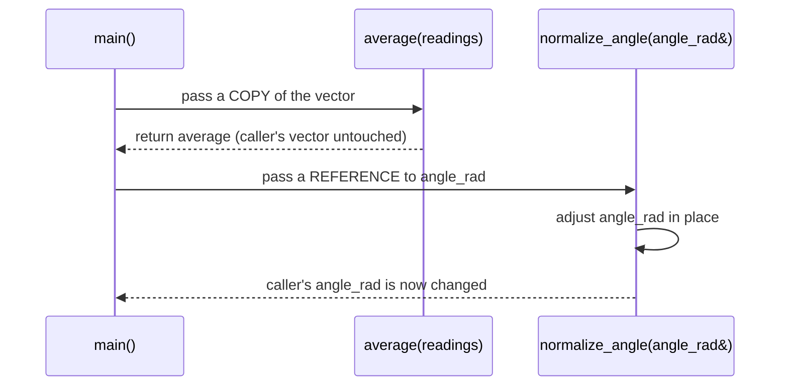

# C++ for Robotics — Unit 3: Functions

Functions let you break a robot program into named, reusable, testable pieces instead of one long block of control logic. This unit covers how to declare, call, and pass data through C++ functions — including the pass-by-value vs. pass-by-reference distinction that trips up most newcomers to the language.

The sequence below contrasts what happens at call time for pass-by-value versus pass-by-reference, showing why only the reference call can change the caller's own variable:



## Declaring and calling functions
A C++ function has an explicit return type, a name, and a typed parameter list — the compiler enforces all of it, unlike Python's duck typing.

```cpp
double compute_speed(double distance_m, double time_s) {
    return distance_m / time_s;
}

int main() {
    double speed = compute_speed(4.0, 2.0);
    std::cout << "Speed: " << speed << " m/s\n";
    return 0;
}
```

If a function doesn't return anything, its return type is `void`. In larger projects you typically split the function's *declaration* (in a `.hpp` header) from its *definition* (in a `.cpp` file) so other files can call it without seeing its implementation.

## Pass by value vs. pass by reference
By default, C++ passes arguments **by value**: the function gets its own copy, and changes inside the function don't affect the caller's variable. For large objects (like a vector of sensor readings) that copy is wasteful; for cases where you *want* the function to modify the caller's data (like updating a robot's pose in place), you need a reference.

```cpp
// pass by value: safe, but copies the whole vector — expensive for large data
double average(std::vector<double> readings) {
    double sum = 0.0;
    for (double r : readings) sum += r;
    return sum / readings.size();
}

// pass by const reference: no copy, and the caller's data is protected from modification
double average_ref(const std::vector<double>& readings) {
    double sum = 0.0;
    for (double r : readings) sum += r;
    return sum / readings.size();
}

// pass by non-const reference: function is allowed to modify the caller's variable
void normalize_angle(double& angle_rad) {
    while (angle_rad > M_PI)  angle_rad -= 2 * M_PI;
    while (angle_rad < -M_PI) angle_rad += 2 * M_PI;
}
```

A good default rule: pass small built-in types (`int`, `double`, `bool`) by value, and pass everything else (`std::vector`, `std::string`, custom objects) by `const &` unless the function specifically needs to modify the caller's data, in which case use a plain `&`.

## Default arguments and overloading
C++ lets you give parameters default values, and lets you define multiple functions with the same name but different parameter types (overloading) — both reduce boilerplate when a function has sensible defaults or needs to handle a few input shapes.

```cpp
double clamp_speed(double speed, double max_speed = 1.0) {
    if (speed > max_speed) return max_speed;
    if (speed < -max_speed) return -max_speed;
    return speed;
}

clamp_speed(1.5);        // uses default max_speed = 1.0
clamp_speed(1.5, 2.0);   // explicit max_speed = 2.0
```

## Try it yourself
Write a function `bool is_within_bounds(double x, double y, double min_val, double max_val)` that returns `true` if both `x` and `y` fall within `[min_val, max_val]`. Then write a second function `void clamp_position(double& x, double& y, double min_val, double max_val)` that modifies `x` and `y` in place so they fall inside the bounds. Call both from `main` and print the results.
