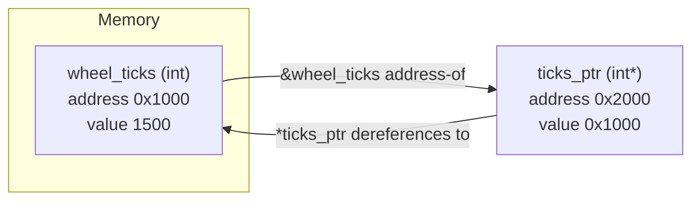

# C++ for Robotics — Unit 4: Arrays and Pointers

Pointers are the C++ feature that scares newcomers most, but they're unavoidable in robotics code: sensor drivers, ROS message buffers, and performance-critical loops all lean on direct memory access. This unit demystifies pointers by connecting them to how memory actually works, then shows the modern, safer alternatives you should prefer in day-to-day code.

The diagram below shows how a pointer variable and the variable it points to relate to each other in memory, using the `wheel_ticks` / `ticks_ptr` example:



## Arrays: fixed-size contiguous storage
A C-style array is a fixed-length block of same-typed elements laid out contiguously in memory — this is what makes iterating over it fast (great cache locality, which matters when processing e.g. a LIDAR scan of thousands of range values).

```cpp
double joint_angles[6] = {0.0, 0.1, -0.2, 0.0, 0.3, 0.0};
std::cout << "First joint: " << joint_angles[0] << "\n";
std::cout << "Array size in bytes: " << sizeof(joint_angles) << "\n";
```

The catch: a raw array doesn't know its own length once it decays to a pointer (e.g., when passed to a function), and there's no bounds checking — reading `joint_angles[6]` reads whatever memory happens to sit past the end of the array. That's how a lot of real segfaults happen.

## Pointers: what an address actually is
A pointer is a variable that stores a memory address rather than a value. `&x` gets the address of `x`; `*p` dereferences a pointer `p` to get the value it points to.

```cpp
int wheel_ticks = 1500;
int* ticks_ptr = &wheel_ticks;   // ticks_ptr holds wheel_ticks's address

std::cout << "Value: " << *ticks_ptr << "\n";   // dereference: 1500
*ticks_ptr = 1600;                              // writes through the pointer
std::cout << "wheel_ticks is now: " << wheel_ticks << "\n";  // 1600
```

This is exactly how pass-by-reference is implemented under the hood, and it's why a sensor driver can hand you a raw pointer to a buffer it fills directly, without copying data on every read — critical when you're streaming camera frames or point clouds at high rates.

## Pointer arithmetic and arrays
An array name decays to a pointer to its first element, and pointer arithmetic advances by the size of the pointed-to type, not by raw bytes — this is why `array[i]` is really shorthand for `*(array + i)`.

```cpp
double* p = joint_angles;
for (int i = 0; i < 6; ++i) {
    std::cout << *(p + i) << " ";   // identical to joint_angles[i]
}
std::cout << "\n";
```

Never let a pointer outlive the memory it points to (a "dangling pointer") and never use an uninitialized pointer — both are classic sources of undefined behavior that can silently corrupt robot state instead of crashing cleanly.

## Prefer std::vector and std::array in modern C++
In real robotics code — including ROS 2 packages — raw arrays and manual pointer bookkeeping are mostly replaced by `std::vector` (dynamic, bounds-checkable with `.at()`) and `std::array` (fixed-size, but knows its own length). Reach for these first; only drop to raw pointers when interfacing with a C API or hardware driver that requires it.

```cpp
std::vector<double> scan_ranges = {1.2, 0.8, 3.4, 2.1};
scan_ranges.push_back(0.9);              // grows dynamically
double closest = scan_ranges.at(0);       // bounds-checked access, throws if out of range
```

## Try it yourself
Write a function `double closest_reading(const double* ranges, int count)` that takes a raw pointer and a length, and returns the smallest value using pointer arithmetic (no `[]` indexing). Then write the equivalent using `std::vector<double>` and `std::min_element` (from `<algorithm>`), and compare the two implementations side by side.
