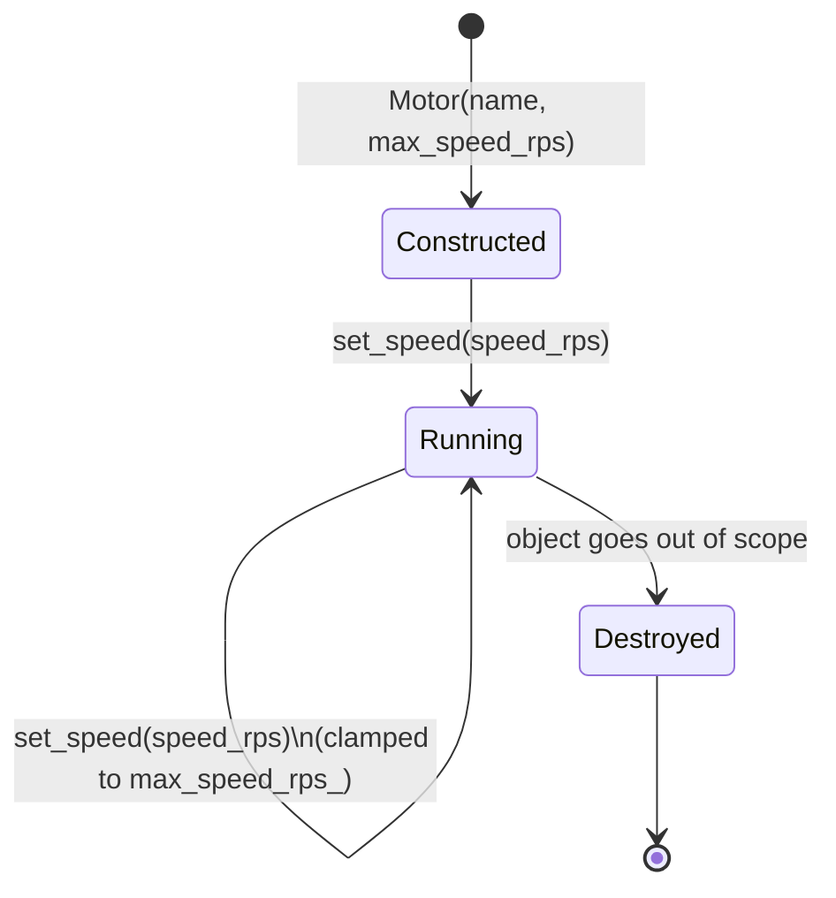

# C++ for Robotics — Unit 5: C++ Classes

Real robot software has many moving parts — sensors, controllers, state machines — and classes are how C++ keeps that complexity manageable. This unit covers defining classes, controlling access to their data, and the constructor/destructor lifecycle, all through the lens of modeling a piece of a robot.

The state diagram below traces a `Motor` object through its lifecycle, from construction through repeated (encapsulated, clamp-enforcing) use to destruction:



## Defining a class
A class bundles data (member variables) with the functions that operate on that data (member functions/methods). Encapsulating a robot component — say, a single motor — as a class keeps its internal state and behavior together instead of scattered across loose variables and functions.

```cpp
class Motor {
public:
    Motor(std::string name, double max_speed_rps)
        : name_(name), max_speed_rps_(max_speed_rps), current_speed_rps_(0.0) {}

    void set_speed(double speed_rps) {
        if (speed_rps > max_speed_rps_) speed_rps = max_speed_rps_;
        if (speed_rps < -max_speed_rps_) speed_rps = -max_speed_rps_;
        current_speed_rps_ = speed_rps;
    }

    double speed() const { return current_speed_rps_; }
    const std::string& name() const { return name_; }

private:
    std::string name_;
    double max_speed_rps_;
    double current_speed_rps_;
};
```

## Access control: public vs. private
`private` members are only reachable through the class's own methods; `public` members form the class's external interface. This is the core of encapsulation: `set_speed()` enforces the speed limit every time, so `current_speed_rps_` can never be set to an invalid value from outside — a caller cannot bypass the safety clamp by writing `motor.current_speed_rps_ = 999;` because that line won't even compile.

```cpp
Motor left_motor("left_wheel", 5.0);
left_motor.set_speed(7.0);          // clamped to 5.0 internally
std::cout << left_motor.speed();    // 5
// left_motor.current_speed_rps_ = 999;  // compile error: private
```

## Constructors and the object lifecycle
The constructor (same name as the class, no return type) runs automatically when an object is created, and is the right place to guarantee the object starts in a valid state — notice `current_speed_rps_` is always initialized to `0.0`, so there's no uninitialized-member bug possible. A destructor (`~Motor()`) runs automatically when the object goes out of scope, and is where you'd release any resource the object acquired (closing a device handle, freeing a buffer).

```cpp
class SerialConnection {
public:
    SerialConnection(const std::string& port) : port_(port) {
        std::cout << "Opening " << port_ << "\n";
        // in real code: open the device handle here
    }
    ~SerialConnection() {
        std::cout << "Closing " << port_ << "\n";
        // in real code: close the device handle here
    }
private:
    std::string port_;
};
```

This pattern — acquire a resource in the constructor, release it in the destructor — is called RAII (Resource Acquisition Is Initialization), and it's the main reason C++ robotics code can manage hardware resources safely without manual cleanup calls scattered everywhere.

## Composing objects: a robot made of parts
Classes compose naturally: a `Robot` class can simply hold a collection of `Motor` objects, modeling the real structure of the system.

```cpp
class Robot {
public:
    Robot() {
        motors_.push_back(Motor("left_wheel", 5.0));
        motors_.push_back(Motor("right_wheel", 5.0));
    }

    void stop_all() {
        for (auto& m : motors_) m.set_speed(0.0);
    }

private:
    std::vector<Motor> motors_;
};
```

This is exactly the pattern you'll see scaled up in real ROS 2 node classes: member objects for publishers, subscribers, and hardware interfaces, all owned and managed by one class.

## Try it yourself
Model a `DistanceSensor` class with a private `double reading_m_`, a public method `update(double new_reading)` that rejects negative values (leaving `reading_m_` unchanged if the input is invalid), and a public `double reading() const` getter. Add a constructor that initializes `reading_m_` to `0.0`, and a destructor that prints a message when the sensor object is destroyed.
