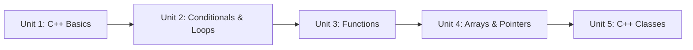

# C++ for Robotics

C++ is the language behind most industrial and production robot software, and it's the language most ROS 2 packages are ultimately built on. This course takes you from a working knowledge of another language up to real C++ fluency — compiling programs, using variables and control flow, writing functions, working with arrays and pointers, and organizing code into classes — so that when you move on to ROS 2, the C++ side of it feels familiar rather than foreign.

The diagram below shows how each unit builds on the one before it, from compiling your first program up to organizing robot code into classes:

1. [C++ Basics](01-cpp-basics.md) — Compiling C++ programs and working with variables, types, and operators to hold and manipulate robot data.
2. [Conditional Statements and Loops](02-conditional-statements-and-loops.md) — Branching on sensor conditions and looping for control cycles and fixed-size data.
3. [Functions](03-functions.md) — Breaking programs into reusable functions, and the pass-by-value vs. pass-by-reference distinction.
4. [Arrays and Pointers](04-arrays-and-pointers.md) — How memory and pointers work under the hood, and the modern `std::vector`/`std::array` alternatives.
5. [C++ Classes](05-cpp-classes.md) — Organizing robot code with encapsulation, constructors/destructors, and object composition.
