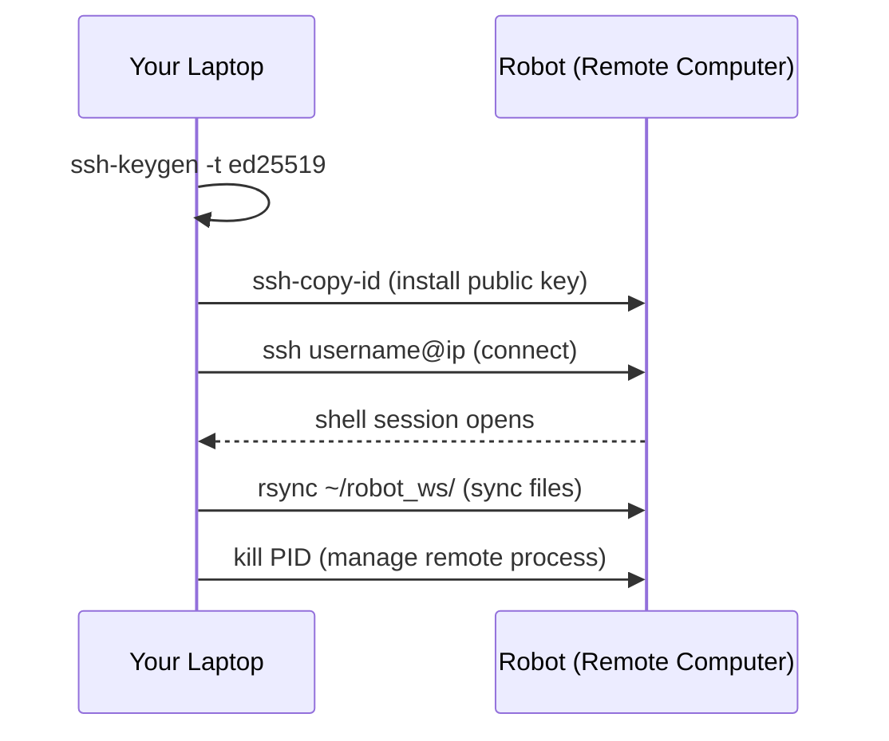

# Linux for Robotics — Unit 4: Advanced Utilities II

The final unit covers processes, remote access over SSH, and package management with `apt`/`sudo` — the tools you need once a "robot" stops being a directory on your laptop and becomes a separate machine you reach over a network.

The diagram below shows the sequence of an SSH session: setting up key-based auth once, then connecting, transferring files, and managing a process on the remote robot.



## Linux processes
Every running program is a process with a numeric PID. On a robot, a launch file typically starts a dozen or more processes at once (drivers, controllers, perception nodes), so being able to inspect and manage them by hand is essential when something misbehaves.

```bash
./check_ws.bash &      # run in the background, shell prompt returns immediately
jobs                     # list background jobs in this shell
ps aux | grep bash        # list all processes, filter for bash
top                         # live-updating process viewer (press q to quit)
htop                         # nicer alternative if installed: sudo apt install htop
kill 12345                    # send SIGTERM (ask nicely) to PID 12345
kill -9 12345                   # send SIGKILL (force) — last resort
fg                                # bring a backgrounded job to the foreground
```

On a real deployed robot, long-running nodes are usually managed by `systemd` instead of a manually backgrounded shell job, so that they restart automatically on crash or reboot — but `ps`/`top`/`kill` are exactly what you use to inspect what `systemd` is running underneath.

## SSH protocol
SSH (Secure Shell) lets you open a shell session on another machine over the network, encrypted. This is how you'll interact with almost every real robot's onboard computer (a Raspberry Pi, an NVIDIA Jetson, an industrial PC) once it's headless — no monitor or keyboard attached.

```bash
ssh username@192.168.1.50          # connect to a remote machine by IP
ssh-keygen -t ed25519                # generate a keypair (once, on your laptop)
ssh-copy-id username@192.168.1.50     # install your public key on the remote — no more password prompts
scp report.txt username@192.168.1.50:~/           # copy a file to the remote
rsync -av ~/robot_ws/ username@192.168.1.50:~/robot_ws/  # sync a whole directory, only transferring changes
```

Key-based auth isn't just convenience — it's what lets automated scripts and CI pipelines deploy to a robot without a human typing a password, and it's markedly more secure than password auth over a network.

## Commands apt and sudo
`apt` is Ubuntu/Debian's package manager, and it's how you'll install ROS itself, drivers, and most system dependencies. `sudo` ("superuser do") runs a single command with administrator privileges, which package installation requires because it writes outside your home directory.

```bash
sudo apt update                     # refresh the list of available packages
sudo apt upgrade                     # upgrade installed packages
sudo apt install ros-<distro>-desktop  # example: install a full ROS 2 distribution
apt list --installed | grep ros         # check what ROS packages are already present
sudo apt remove <package>                # uninstall
```

Use `sudo` deliberately, one command at a time — never habitually prefix everything with it "just in case." A misplaced `sudo rm -rf` is far more dangerous than the same command without it, because it can touch files anywhere on the system, not just ones you own.

## Try it yourself
If you have access to a second machine (a Raspberry Pi, an old laptop, a cloud VM, or even a local VM) install its IP, `ssh` into it, and `rsync` your `~/robot_ws` directory over. From your laptop's terminal, background `check_ws.bash` with `&`, find its PID with `ps aux | grep check_ws`, then `kill` it. If you don't have a second machine handy, `ssh localhost` works for practicing the connection and key-copying steps against your own machine — this closes out the final project you started in Unit 2.
