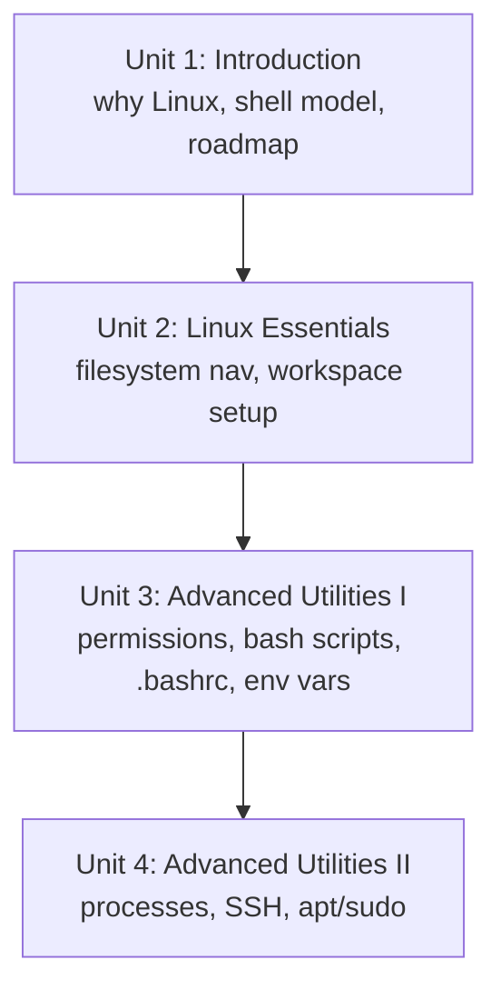

# Linux for Robotics

ROS and ROS 2 are built and best supported on Linux, which means almost every robotics workflow — building code, launching nodes, reading sensor data, and deploying to an onboard computer — happens through a Linux shell. This course assumes you can already program but are new to Linux, and takes you from basic filesystem navigation through permissions, bash scripting, environment variables, process management, and SSH, using one running "final project" workspace that grows across the units.

The diagram below shows how each unit's skills build directly on the one before it, all through the same running workspace.

1. [Introduction](01-introduction.md) — Why ROS runs on Linux, how the shell works, and how this course's units connect through a single final project.
2. [Linux Essentials](02-linux-essentials.md) — Navigating and manipulating the filesystem, and setting up the workspace directory used for the rest of the course.
3. [Advanced Utilities I](03-advanced-utilities-i.md) — File permissions, bash scripting, `.bashrc`, and environment variables.
4. [Advanced Utilities II](04-advanced-utilities-ii.md) — Managing Linux processes, connecting remotely over SSH, and installing packages with `apt`/`sudo`.
