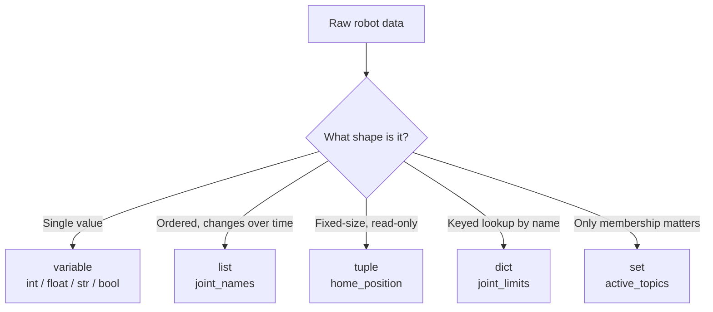

# Python 3 for Robotics — Unit 2: Python Essentials

Every robot program is, underneath, just data being read, stored, and transformed — a sensor reading becomes a variable, a set of joint angles becomes a list, a robot's configuration becomes a dictionary. This unit covers Python's variables, core types, and built-in collections, the raw material everything else in the course builds on.

The flowchart below maps the shape of your data to the Python type you'd reach for, matching the guidance in the Collections section:



## Variables and dynamic typing

Python variables are names bound to objects; you don't declare a type, and a name can be rebound to a value of a different type at any time:

```python
battery_voltage = 12.6      # float
robot_name = "spot-01"      # str
is_charging = False         # bool
lidar_range_m = 3           # int

battery_voltage = "unknown"  # legal, but usually a sign of a bug
```

This flexibility is convenient but it means Python won't catch a type mistake for you until the line actually runs. Use `type()` to inspect what you're holding when debugging:

```python
print(type(lidar_range_m))   # <class 'int'>
```

## Core data types

The types you'll use constantly: `int` and `float` for numeric readings, `str` for names and topic strings, `bool` for flags, and `None` for "no value yet" (e.g., a sensor that hasn't reported in). Arithmetic and comparison operators behave as you'd expect from any C-family language, with a few Python-specific ones worth knowing:

```python
distance = 10 // 3      # floor division -> 3
remainder = 10 % 3      # modulo -> 1
power = 2 ** 8           # exponent -> 256
in_range = 0.0 <= lidar_range_m <= 5.0   # chained comparison, common in robotics range checks
```

String formatting with f-strings is the idiomatic way to build log messages and topic names:

```python
joint = "shoulder_pan"
angle_deg = 42.5
print(f"{joint} angle: {angle_deg:.2f} degrees")
```

## Collections for robot state

Robots rarely have just one number to track — you'll reach for `list`, `tuple`, `dict`, and `set` constantly:

```python
joint_names = ["shoulder_pan", "shoulder_lift", "elbow", "wrist"]      # list: ordered, mutable
home_position = (0.0, -1.57, 0.0, 0.0)                                  # tuple: ordered, immutable
joint_limits = {"shoulder_pan": (-3.14, 3.14), "elbow": (-2.0, 2.0)}    # dict: keyed lookup
active_topics = {"/cmd_vel", "/scan", "/odom"}                          # set: unique, unordered
```

Use a `list` when order matters and values change; a `tuple` for fixed-size, read-only data like a coordinate; a `dict` when you look things up by name (joint name to angle, topic name to type); a `set` when you only care about membership and uniqueness (which topics have I already subscribed to?).

## Operating on the data

Common operations you'll use on every robotics script:

```python
joint_angles = [0.1, -0.4, 1.2, 0.0]

total = sum(joint_angles)
average = total / len(joint_angles)
max_angle = max(joint_angles)

joint_angles.append(0.5)          # add a reading
joint_angles[0] = 0.15             # update by index

for name, angle in zip(joint_names, joint_angles):
    print(f"{name}: {angle:.2f}")
```

`zip()` pairing two parallel lists (names and values) is an extremely common robotics pattern — ROS 2 joint state messages, for instance, carry parallel `name` and `position` arrays that you'll frequently zip together.

## Try it yourself

Write a script that stores five simulated distance-sensor readings (in meters) in a list, then computes and prints the minimum, maximum, and average using an f-string formatted to two decimal places. Then build a dictionary mapping sensor names (`"front"`, `"left"`, `"right"`) to readings and print only the ones below a `0.5` m safety threshold.
