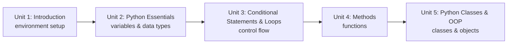

# Python 3 for Robotics

Python is the fastest on-ramp into ROS 2 and robotics scripting generally: it needs no compile step, `rclpy` gives it full access to topics, services, and actions, and its syntax lets you focus on robot behavior instead of language ceremony. This course assumes you can already program and walks through Python 3's specific tools — variables and data types, conditionals and loops, functions, and classes — each framed with robotics-flavored examples (sensor readings, joint angles, velocity commands) so the language feels connected to the machines you'll eventually be commanding.

The diagram below shows how the five units build on each other in order, from environment setup through to the class-based patterns ROS 2 itself uses:

1. [Introduction](01-introduction.md) — Unit for previewing the contents of the course, including environment setup.
2. [Python Essentials](02-python-essentials.md) — Variables, core data types, and the collections you'll use to hold robot state.
3. [Conditional Statements & Loops](03-conditional-statements-loops.md) — Control-flow tools behind every decision a robot's code makes.
4. [Methods](04-methods.md) — Packaging logic into reusable, well-scoped functions.
5. [Python Classes & OOP](05-python-classes-oop.md) — Organizing code into classes and objects, the same pattern ROS 2 nodes use.
