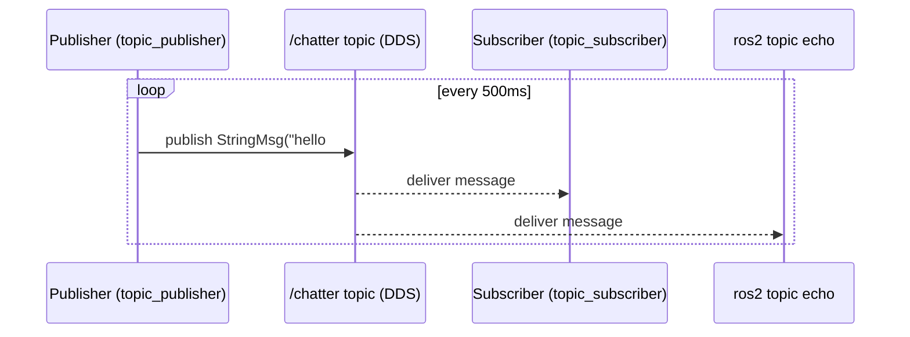

# ROS2 Basics in 3 Days (Rust) — Unit 3: ROS2 Topics

Topics are the workhorse communication pattern in ROS 2: an anonymous, many-to-many publish/subscribe channel identified by a name and a message type. This unit takes you from inspecting topics on the command line to writing your own publisher, subscriber, and custom message type in Rust.

The sequence below shows the publisher and subscriber built later in this unit exchanging messages over the `/chatter` topic, with `ros2 topic echo` observing independently, exactly as the many-to-many, decoupled nature of topics described above implies:



## How topics work
A topic is not a queue owned by any single node — it's a named, typed channel that the DDS middleware routes for you. Any number of nodes can publish to a topic, and any number can subscribe, and none of them need to know about each other; they only need to agree on the topic name and the message type. This decoupling is what lets you swap a simulated camera node for a real one without touching the nodes that consume its images. Before writing code, get comfortable inspecting live topics:

```bash
ros2 topic list                      # every active topic in the graph
ros2 topic info /some_topic          # message type, publisher/subscriber counts
ros2 topic echo /some_topic          # print messages as they arrive
ros2 topic hz /some_topic            # measure actual publish rate
```

These commands work regardless of what language published the topic — Rust, Python, and C++ nodes are indistinguishable from the outside, which is the whole point of the abstraction.

## Writing a publisher in Rust
A publisher owns a handle tied to a topic name and message type, and a timer callback (or any other trigger) calls `publish` on it. Using a standard message type (`std_msgs/msg/String`) keeps the example self-contained:

```rust
use rclrs::{Context, Node, Publisher, QoSProfile};
use std_msgs::msg::String as StringMsg;
use std::sync::Arc;

fn main() -> Result<(), rclrs::RclrsError> {
    let context = Context::default_from_env()?;
    let node = Node::new(&context, "topic_publisher")?;
    let publisher: Arc<Publisher<StringMsg>> =
        node.create_publisher("chatter", QoSProfile::default())?;

    let mut count = 0u32;
    let timer = node.create_wall_timer(std::time::Duration::from_millis(500), {
        let publisher = publisher.clone();
        move || {
            count += 1;
            let msg = StringMsg { data: format!("hello #{count}") };
            publisher.publish(&msg).unwrap();
        }
    })?;

    rclrs::spin(node)?;
    Ok(())
}
```

## Writing a subscriber in Rust
A subscriber registers a callback that fires each time a message arrives on the topic. The callback runs on the executor's thread during `spin`, so keep it fast — do heavy work elsewhere and hand off through a channel if needed:

```rust
use rclrs::{Context, Node, QoSProfile};
use std_msgs::msg::String as StringMsg;

fn main() -> Result<(), rclrs::RclrsError> {
    let context = Context::default_from_env()?;
    let node = Node::new(&context, "topic_subscriber")?;
    let _subscription = node.create_subscription::<StringMsg, _>(
        "chatter",
        QoSProfile::default(),
        |msg: StringMsg| {
            println!("heard: {}", msg.data);
        },
    )?;

    rclrs::spin(node)?;
    Ok(())
}
```

Run the two nodes in separate terminals (or via a launch file, as in Unit 2) and confirm with `ros2 topic echo /chatter` that a third, independent tool sees the same traffic.

## Custom message interfaces
Standard messages (`std_msgs`, `geometry_msgs`, `sensor_msgs`) cover a lot, but real projects usually need their own data shapes. A custom interface package holds `.msg` files, no code:

```
my_interfaces/
  msg/
    Detection.msg
  CMakeLists.txt
  package.xml
```

```
# Detection.msg
string label
float32 confidence
geometry_msgs/Point position
```

That package is built once (typically with `rosidl` via CMake, since interface generation is language-agnostic) and then referenced as a build dependency by your Rust package's `Cargo.toml`/`package.xml`; your `build.rs` (from Unit 2) generates the corresponding Rust struct, which you then `use` in publishers and subscribers exactly like `std_msgs::msg::String` above. Keep individual fields simple and avoid deeply nested or unbounded-array messages where you can — they're harder to reason about across languages and add serialization overhead on every publish.

## Try it yourself
Define a small custom message (two or three fields, e.g. a `label: string` and a `count: int32`), build it, then adapt the publisher and subscriber above to use it instead of `std_msgs::msg::String`. Verify with `ros2 interface show` on your new message type and `ros2 topic echo` on the topic that both nodes agree on the shape.
