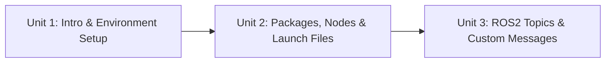

# ROS2 Basics in 3 Days (Rust)

A compact, three-unit path into ROS 2 development using Rust and the `ros2_rust` (`rclrs`) client library: starting from a working ROS 2 + Rust toolchain, moving through how packages, nodes, and launch files are structured, and finishing with hands-on publisher/subscriber topic communication — including defining a custom message type — so you come away able to build and run your own ROS 2 nodes entirely in Rust.

The diagram below shows how each unit builds directly on the one before it:

1. [Introduction to the Course](01-introduction-to-the-course.md) — Why Rust for ROS 2, what the course covers, and verifying your Rust/ROS 2 environment before you begin.
2. [Basic Concepts](02-basic-concepts.md) — Package structure and the Cargo/colcon build, Cargo build scripts for generated messages, nodes and client libraries via `rclrs`, and Python-based launch files.
3. [ROS2 Topics](03-ros2-topics.md) — How topics work, writing a publisher and subscriber in Rust, and defining a custom message interface.
