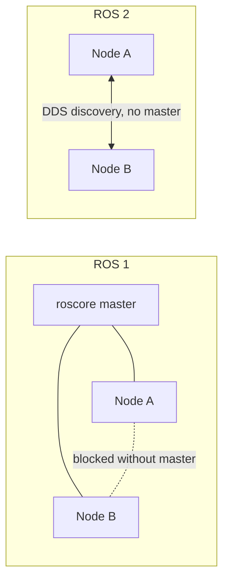

# ROS2 Basics in 5 Days (C++) — Unit 1: Introduction

This unit sets expectations for the course: what ROS 2 is, how it differs from ROS 1 if you're coming from there, what you need installed, and the running example (a simulated planetary rover) that later units build on.

The diagram below contrasts ROS 1's centralized-master discovery with ROS 2's masterless, DDS-based discovery — the single biggest architectural difference driving everything else in this course.



## Why ROS 2, and why C++

ROS (Robot Operating System) is not an operating system — it's a middleware and a set of conventions for building robot software out of communicating processes ("nodes"). ROS 2 is a from-scratch redesign of ROS 1 built on top of DDS (Data Distribution Service), an industrial pub/sub standard. The practical consequences you'll feel throughout this course:

- **No central master.** ROS 1 required a `roscore` process; ROS 2 nodes discover each other automatically via DDS discovery.
- **QoS (Quality of Service) is explicit.** You can choose reliable vs. best-effort delivery, history depth, durability, etc., per topic — important for real-time and lossy-network robotics.
- **Real-time and production support.** ROS 2 was designed with real-time control loops and multi-robot, multi-vendor deployments in mind, not just research labs.
- **Two first-class client libraries.** `rclcpp` (C++) and `rclpy` (Python) share the same underlying concepts. This course uses `rclcpp` because most production robotics code — drivers, control loops, anything latency-sensitive — is written in C++.

If you already know ROS 1, most concepts (nodes, topics, services, launch files) carry over; the syntax and some architecture (executors, composition) do not.

## What this course covers

Across the remaining eight units you will go from an empty workspace to writing nodes that publish and subscribe to topics, offer and call services, run long actions with feedback, manage multithreaded callbacks safely, compose multiple nodes into one process, and debug a running ROS 2 graph. Each unit builds directly on the previous one's code, so plan to work through them in order rather than skipping around.

## Minimum requirements

Before Unit 2 you should have:

- A Linux machine (native or VM) with a ROS 2 distribution installed (any current distro from `docs.ros.org` — Humble, Iron, Jazzy, etc. all work for this course; just be consistent throughout).
- `colcon` and `rosdep` installed (usually pulled in alongside ROS 2 via your package manager).
- Comfort with C++ (classes, templates basics, smart pointers) and the command line — this course does not re-teach C++ syntax, only how ROS 2 uses it.
- A text editor or IDE of your choice; nothing in this course is IDE-specific.

Sanity-check your install:

```bash
ros2 doctor --report | head -20
ros2 pkg list | wc -l   # should print a few hundred packages
```

## The running example: a Mars rover

Throughout the course, examples and exercises are framed around a simulated rover exploring Mars — a `/cmd_vel` topic to drive it, camera and laser topics to sense the environment, services to trigger onboard actions, and actions for longer tasks like "drive to waypoint." You don't need an actual simulator to follow the code in these lessons — the same node structure applies whether you're driving a Gazebo/Ignition rover, a real robot, or nothing at all (a bare node that just prints what it would send). If you do have a simulator available, feel free to swap it in as you go.

## Try it yourself

Install or confirm your ROS 2 environment, then create an empty workspace so it's ready for Unit 2:

```bash
mkdir -p ~/ros2_ws/src
cd ~/ros2_ws
colcon build
source install/setup.bash
```

Run `ros2 doctor` and `ros2 topic list` (with nothing else running, you should see only `/parameter_events` and `/rosout`). Note down your ROS 2 distro name — you'll need to source its setup file every new terminal for the rest of this course.
