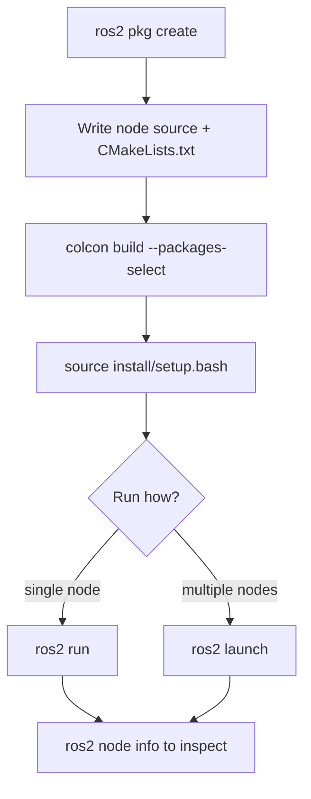

# ROS2 Basics in 5 Days (C++) — Unit 2: Basics

This unit covers the mechanics you'll use in every unit after this one: what a ROS 2 package is, how to build one with colcon, how to write and run your first node, and how to inspect and launch it.

The flow below is the edit-build-run cycle you'll repeat for essentially every exercise in this course, whether running a node directly or through a launch file.



## What is a package, and how is a workspace organized?

A ROS 2 **package** is the smallest unit of software you can build, install, and depend on independently — source files, a manifest (`package.xml`), and a build description (`CMakeLists.txt` for C++). Packages live inside a **workspace**, conventionally under `~/ros2_ws/src/`. You never build inside `src/`; colcon builds out-of-tree into sibling `build/`, `install/`, and `log/` directories.

## Creating and compiling a package

```bash
cd ~/ros2_ws/src
ros2 pkg create --build-type ament_cmake --license Apache-2.0 my_rover_pkg \
  --dependencies rclcpp std_msgs
```

This scaffolds `package.xml`, `CMakeLists.txt`, and a `src/` folder. Build it from the workspace root, not from inside the package:

```bash
cd ~/ros2_ws
colcon build --packages-select my_rover_pkg
source install/setup.bash
```

`--packages-select` keeps rebuilds fast once your workspace has more than one package. `colcon build --symlink-install` is worth knowing too: for interpreted files it symlinks instead of copying, so edits take effect without a rebuild (less relevant for C++ binaries, but handy once you add launch/config files).

## Your first ROS 2 program

A minimal node is just a class deriving from `rclcpp::Node`:

```cpp
// src/hello_rover.cpp
#include "rclcpp/rclcpp.hpp"

class HelloRover : public rclcpp::Node
{
public:
  HelloRover() : Node("hello_rover")
  {
    RCLCPP_INFO(this->get_logger(), "Hello from the rover node!");
  }
};

int main(int argc, char ** argv)
{
  rclcpp::init(argc, argv);
  rclcpp::spin(std::make_shared<HelloRover>());
  rclcpp::shutdown();
  return 0;
}
```

Register it in `CMakeLists.txt`:

```cmake
add_executable(hello_rover src/hello_rover.cpp)
ament_target_dependencies(hello_rover rclcpp)
install(TARGETS hello_rover DESTINATION lib/${PROJECT_NAME})
```

Rebuild, source, and run it with `ros2 run`:

```bash
colcon build --packages-select my_rover_pkg
source install/setup.bash
ros2 run my_rover_pkg hello_rover
```

## What is a node, and the Node class

A **node** is a single process (or, as you'll see in Unit 8, a component inside a process) that does one job in the ROS graph — it publishes, subscribes, serves, or calls, and nothing forces it to do only one of those. `rclcpp::Node` is the base class that gives you a name, a logger, a parameter interface, and factory methods (`create_publisher`, `create_subscription`, `create_service`, `create_client`, `create_wall_timer`) that you'll use constantly starting in Unit 3.

Inspect a running node from another terminal:

```bash
ros2 node list
ros2 node info /hello_rover
```

`ros2 node info` is the fastest way to answer "what does this node actually publish, subscribe to, and serve?" without reading its source.

## What is a launch file?

Launch files start (and configure) one or more nodes together instead of running `ros2 run` repeatedly by hand. ROS 2 launch files are Python, even in a C++-focused course — this is intentional in ROS 2's design, since launch is orchestration, not robot logic:

```python
# launch/hello_rover.launch.py
from launch import LaunchDescription
from launch_ros.actions import Node

def generate_launch_description():
    return LaunchDescription([
        Node(
            package='my_rover_pkg',
            executable='hello_rover',
            name='hello_rover',
            output='screen',
        )
    ])
```

```bash
ros2 launch my_rover_pkg hello_rover.launch.py
```

## Try it yourself

Extend `HelloRover` with a `rclcpp::TimerBase` that fires every second and logs the node's uptime (hint: `create_wall_timer` and `std::chrono::seconds(1)`). Add it to your launch file and confirm it runs via `ros2 launch`, then verify it with `ros2 node info`.
