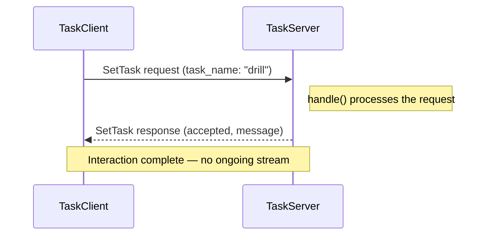

# ROS2 Basics in 5 Days (C++) — Unit 4: Services

Topics are great for streams, but not every interaction is a stream — sometimes you need a request that gets exactly one response, like "take a photo now" or "compute a path." That's what ROS 2 services are for. This unit covers writing service servers and clients, the sync/async tradeoff, and custom service interfaces, using a small "NASA mission" scenario as the running example.

The sequence below shows the one request, one response shape of a service call, contrasted with a topic's ongoing stream — this is the core distinction the rest of the unit builds on.



## What makes a service different from a topic?

A service is a **request/response** call, not a stream: one client sends a request, one server processes it and sends back exactly one response, then the interaction is done. Where a topic is many-to-many and asynchronous by nature, a service is typically one-to-one and — from the client's point of view — often used synchronously, like a remote function call. Use a service when you need a result back and a clear success/failure per call (e.g., "reset the odometry," "compute inverse kinematics for this pose"); use a topic when you're streaming ongoing state or events nobody needs to acknowledge.

Services are defined with a `.srv` file, split into request and response by `---`:

```
# srv/SetTask.srv
string task_name
---
bool accepted
string message
```

## Scenario: NASA mission control

Imagine ground control needs to command the rover to switch tasks ("drill," "photograph," "return to base") and get back an acknowledgment. That's a natural service: one request, one clear response, no ongoing stream needed.

## Service server

```cpp
#include "rclcpp/rclcpp.hpp"
#include "my_interfaces/srv/set_task.hpp"

class TaskServer : public rclcpp::Node
{
public:
  TaskServer() : Node("task_server")
  {
    srv_ = create_service<my_interfaces::srv::SetTask>(
      "set_task",
      std::bind(&TaskServer::handle, this,
                std::placeholders::_1, std::placeholders::_2));
  }

private:
  void handle(
    const std::shared_ptr<my_interfaces::srv::SetTask::Request> req,
    std::shared_ptr<my_interfaces::srv::SetTask::Response> res)
  {
    RCLCPP_INFO(get_logger(), "Requested task: %s", req->task_name.c_str());
    res->accepted = true;
    res->message = "Switching to " + req->task_name;
  }
  rclcpp::Service<my_interfaces::srv::SetTask>::SharedPtr srv_;
};
```

## Service client: synchronous vs. asynchronous

`rclcpp` clients are fundamentally async — `async_send_request` returns a future immediately. Whether you *block* on that future ("synchronous" usage) or register a callback for it ("asynchronous" usage) is your choice:

```cpp
auto client = node->create_client<my_interfaces::srv::SetTask>("set_task");
client->wait_for_service(1s);

auto request = std::make_shared<my_interfaces::srv::SetTask::Request>();
request->task_name = "drill";

// Synchronous-style: block until the future resolves.
// WARNING: never spin() the same node you're blocking on the future for —
// that deadlocks, since the response callback needs the executor to run.
auto future = client->async_send_request(request);
if (rclcpp::spin_until_future_complete(node, future) ==
    rclcpp::FutureReturnCode::SUCCESS) {
  RCLCPP_INFO(node->get_logger(), "%s", future.get()->message.c_str());
}
```

For a truly asynchronous client — one that keeps handling other callbacks while waiting — pass a callback to `async_send_request` instead of blocking on the returned future:

```cpp
client->async_send_request(request,
  [node](rclcpp::Client<my_interfaces::srv::SetTask>::SharedFuture f) {
    RCLCPP_INFO(node->get_logger(), "%s", f.get()->message.c_str());
  });
```

Use the callback form inside any node that must keep processing subscriptions or timers while the request is in flight — which, in practice, is most real robot nodes.

## Custom service interfaces

Custom `.srv` files live in the same kind of `interfaces` package as custom messages (Unit 3), just under `srv/` instead of `msg/`, and are declared the same way in `CMakeLists.txt` via `rosidl_generate_interfaces`. Once built, inspect any service type from the CLI:

```bash
ros2 interface show my_interfaces/srv/SetTask
ros2 service list -t
ros2 service call /set_task my_interfaces/srv/SetTask "{task_name: 'photograph'}"
```

`ros2 service call` is invaluable for testing a server manually before wiring up a client node at all.

## Try it yourself

Write `SetTask` end to end: the `.srv` file, a `TaskServer` node, and a `TaskClient` node that sends one request using the async-callback pattern and logs the response. Test the server alone first with `ros2 service call` before running your client.
