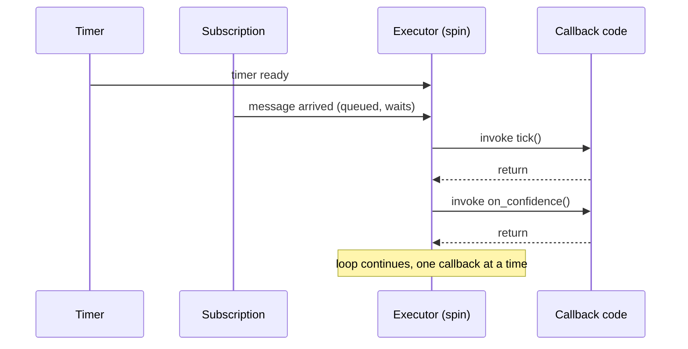

# ROS2 Basics in 5 Days (C++) — Unit 5: Multithreading

Before you can understand why ROS 2 offers multithreaded executors and callback groups (Unit 6), you need a solid mental model of how a *single*-threaded ROS 2 program actually runs your code. This unit builds that model: functions as callbacks, what the executor does, and the difference between `spin()` and `spin_once()`.

The sequence below shows why a single-threaded executor serializes work: even though a timer fires and a message arrives close together, the executor only ever runs one callback at a time before checking what's ready next.



## Functions and callbacks, in a ROS 2 program

You've already written callbacks without necessarily naming them as such — the `tick()` method bound to a timer in Unit 3, the `on_scan()` method bound to a subscription. A **callback** is just a function you hand to ROS 2 that it calls *for* you when something happens (a timer fires, a message arrives, a service request lands). You never call these functions yourself; you register them once (usually in the constructor, via `create_wall_timer`, `create_subscription`, etc.) and the executor invokes them at the right time.

This matters because it means your class's job is really to own **state** (member variables) that callbacks read and write, plus the wiring to register those callbacks — not to run a top-to-bottom "main loop" the way a non-ROS C++ program might.

## Mission: automatic plant detection

Imagine a node that polls a camera-derived `/plant_confidence` topic and, whenever confidence crosses a threshold, calls a `log_plant` service to record the find. You have two callbacks here: a subscription callback (reacts to incoming confidence readings) and a client callback (reacts to the logging service's response). Both run only when the executor gives them a turn — which is exactly what the rest of this unit explains.

```cpp
class PlantDetector : public rclcpp::Node
{
public:
  PlantDetector() : Node("plant_detector")
  {
    sub_ = create_subscription<std_msgs::msg::Float32>(
      "plant_confidence", 10,
      std::bind(&PlantDetector::on_confidence, this, std::placeholders::_1));
  }

private:
  void on_confidence(const std_msgs::msg::Float32::SharedPtr msg)
  {
    if (msg->data > 0.8) {
      RCLCPP_INFO(get_logger(), "Plant detected! confidence=%.2f", msg->data);
    }
  }
  rclcpp::Subscription<std_msgs::msg::Float32>::SharedPtr sub_;
};
```

## What actually calls your callbacks: the executor

`rclcpp::spin(node)` hands your node to a **default single-threaded executor**, which loops forever, checking which callbacks are ready (a timer elapsed, a message is queued, a service request arrived) and invoking them one at a time, in some order, on the calling thread. Nothing runs concurrently — while `on_confidence` is executing, no other callback on that node can run, even if a new message has already arrived. That's the key limitation Unit 6 addresses.

## `spin()` vs. `spin_once()`

`rclcpp::spin(node)` blocks forever, servicing callbacks until shutdown. `rclcpp::spin_some(node)` or the more explicit `executor.spin_once(timeout)` process only *currently ready* work and then return control to you — useful when you need to interleave ROS callback processing with your own loop logic instead of handing control over entirely:

```cpp
rclcpp::executors::SingleThreadedExecutor executor;
executor.add_node(node);

while (rclcpp::ok()) {
  executor.spin_once(std::chrono::milliseconds(100));
  // ... your own logic can run here between callback dispatches ...
}
```

This pattern is less common in production nodes (which usually just `spin()`), but it's the right tool when you're integrating ROS 2 into an existing non-ROS control loop, or writing test code that needs fine-grained control over when callbacks fire.

## Try it yourself

Take the `PlantDetector` above and replace the plain log with a call to a `log_plant` service (reuse the service-client pattern from Unit 4). Run it with `spin_once` in an explicit loop instead of `spin()`, and add a print statement in the loop body that runs on every iteration regardless of whether a callback fired — this makes the difference between "the executor processed a callback" and "your loop took a turn" concrete.
