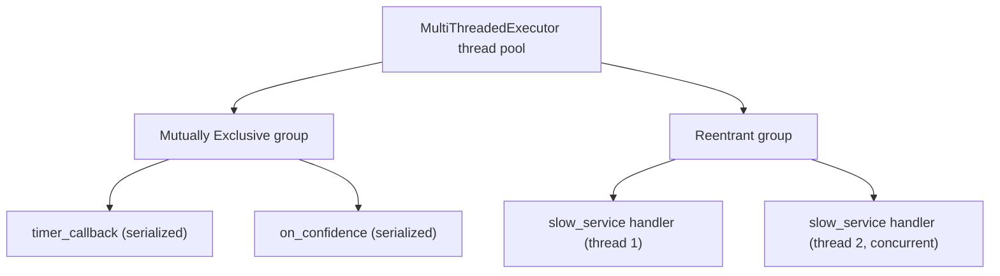

# ROS2 Basics in 5 Days (C++) — Unit 6: MultiThreading Part 2

Unit 5 showed that a single-threaded executor runs one callback at a time. This unit covers what to do when that's not good enough: callback groups, the multithreaded executor, and running several nodes in one process/executor.

The diagram below shows how a `MultiThreadedExecutor` schedules callbacks according to their group: Mutually Exclusive callbacks still serialize against each other, while Reentrant callbacks and callbacks in different groups can run concurrently across the thread pool.



## Why you need multithreading

Picture the plant-detector-turned-mission-node from Unit 5, but now it also has a slow callback — say, a service that takes 2 seconds to analyze a sample. With a single-threaded executor, that 2-second callback blocks *everything else on that node*: no new sensor readings processed, no other services answered, until it returns. In a real rover this could mean missing obstacle data for two full seconds. Multithreading exists to let independent callbacks run concurrently instead of queuing behind each other.

The fix is not automatic — just switching to a multithreaded executor is not enough by itself, because by default ROS 2 still won't run two callbacks from the *same* callback group concurrently. That's what callback groups control.

## Why you need callback groups

A **callback group** is a bucket that callbacks (timers, subscriptions, services, actions) belong to. Every callback belongs to exactly one group; by default, all of a node's callbacks land in the same implicitly-created **MutuallyExclusive** group. Callback groups exist to answer one question per pair of callbacks: *are these two allowed to run at the same time?* Grouping is how you make that decision explicit instead of leaving it to defaults.

## Mutually Exclusive vs. Reentrant

- **Mutually Exclusive group**: callbacks in this group never run concurrently with each other (they can still run concurrently with callbacks in *other* groups, given a multithreaded executor). This is the safe default — no risk of two callbacks racing on the same member variables.
- **Reentrant group**: callbacks in this group *can* run concurrently with each other, including multiple concurrent invocations of the same callback. Use this only where you've deliberately made the code safe for that (e.g., no shared mutable state without a mutex, or the work is naturally parallel like independent per-request computation).

```cpp
auto slow_service_group =
  create_callback_group(rclcpp::CallbackGroupType::Reentrant);

rclcpp::SubscriptionOptions sub_opts;
sub_opts.callback_group = slow_service_group;

sub_ = create_subscription<std_msgs::msg::Float32>(
  "plant_confidence", 10, callback, sub_opts);
```

The same `callback_group` option exists when creating services, clients, and timers — every callback-producing entity lets you assign it to a specific group at creation time.

## Multiple nodes in one executor

A `MultiThreadedExecutor` doesn't require multiple nodes, but it's common to combine both: add several nodes to one executor so they share a thread pool instead of each spawning its own process.

```cpp
int main(int argc, char ** argv)
{
  rclcpp::init(argc, argv);

  auto sensing_node = std::make_shared<PlantDetector>();
  auto control_node = std::make_shared<DriveForward>();

  rclcpp::executors::MultiThreadedExecutor executor;
  executor.add_node(sensing_node);
  executor.add_node(control_node);
  executor.spin();   // callbacks from both nodes may now run concurrently

  rclcpp::shutdown();
  return 0;
}
```

The number of threads defaults to the number of CPU cores; you can cap it with `MultiThreadedExecutor(rclcpp::ExecutorOptions(), number_of_threads)`. Note this is a *different* technique from Node Composition (Unit 8) — here you still have two separate processes worth of setup code manually combined in one `main()`; composition formalizes this into loadable components.

## Try it yourself

Take the `TaskServer` from Unit 4 and simulate a slow request by adding `std::this_thread::sleep_for(std::chrono::seconds(2))` inside its handler. Run it under a `SingleThreadedExecutor` with a timer node also spinning and observe the timer stall during the sleep. Then switch the service callback to a `Reentrant` group under a `MultiThreadedExecutor` and confirm the timer keeps firing on schedule while the service call is in flight.
