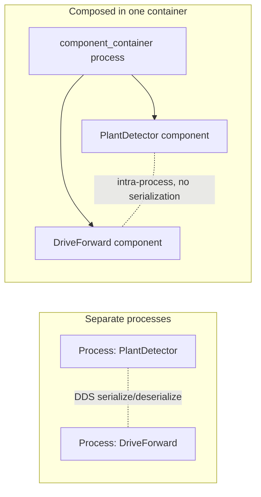

# ROS2 Basics in 5 Days (C++) — Unit 8: Node Composition

So far, every node you've written has been its own executable and, typically, its own OS process. Node composition lets you instead load multiple nodes as **components** into a single process, sharing memory and avoiding inter-process serialization overhead. This unit covers what components are and the two ways to compose them: at run-time and at compile-time.

The diagram below contrasts the separate-process arrangement you've used through Unit 7 with composition, where the same node classes are loaded as components sharing one process's memory.



## What are ROS 2 components?

A component is a node packaged as a shared library that exposes a standard registration entry point, instead of (or in addition to) a `main()` that runs it standalone. The same class you've been writing all course — `public rclcpp::Node` — becomes a component just by registering it as a plugin:

```cpp
// after your node class definition
#include "rclcpp_components/register_node_macro.hpp"
RCLCPP_COMPONENTS_REGISTER_NODE(my_rover_pkg::PlantDetector)
```

And building it as a shared library rather than (or in addition to) an executable in `CMakeLists.txt`:

```cmake
add_library(plant_detector_component SHARED src/plant_detector.cpp)
ament_target_dependencies(plant_detector_component rclcpp rclcpp_components)
rclcpp_components_register_nodes(plant_detector_component "my_rover_pkg::PlantDetector")
```

Why bother? Two or more components loaded into one process can pass messages via intra-process communication instead of going through the full DDS serialize/publish/deserialize path — meaningfully faster for high-frequency data like camera frames, and it also means fewer processes to manage for a fixed pipeline of nodes that always run together.

## Run-time composition

The **component container** is a process whose only job is to host components you load into it dynamically, after the container is already running:

```bash
ros2 run rclcpp_components component_container &
ros2 component list
ros2 component load /ComponentManager my_rover_pkg my_rover_pkg::PlantDetector
ros2 component load /ComponentManager my_rover_pkg my_rover_pkg::DriveForward
ros2 component list   # now shows both loaded
ros2 component unload /ComponentManager 1
```

This is composition decided at runtime — you choose which components go into which container by issuing commands, and can load or unload them while the container keeps running.

**Quick recap of the commands so far**: `component_container` starts an empty host process; `ros2 component list` shows containers and what's loaded in them; `ros2 component load <container> <package> <plugin>` adds one; `ros2 component unload <container> <id>` removes one.

## Loading components with a launch file

In practice you rarely type `component load` by hand — a launch file declares the container and its components together, so `ros2 launch` sets the whole thing up in one shot:

```python
from launch import LaunchDescription
from launch_ros.actions import ComposableNodeContainer
from launch_ros.descriptions import ComposableNode

def generate_launch_description():
    container = ComposableNodeContainer(
        name='rover_container',
        namespace='',
        package='rclcpp_components',
        executable='component_container',
        composable_node_descriptions=[
            ComposableNode(
                package='my_rover_pkg',
                plugin='my_rover_pkg::PlantDetector',
                name='plant_detector'),
            ComposableNode(
                package='my_rover_pkg',
                plugin='my_rover_pkg::DriveForward',
                name='drive_forward'),
        ],
    )
    return LaunchDescription([container])
```

## Compile-time composition

Run-time composition still pays a small dynamic-loading cost and requires the shared libraries to exist as loadable plugins at launch. **Compile-time composition** goes one step further: you write a single `main()` that directly instantiates the component classes and adds them to one executor in the same binary, with no plugin-loading machinery at all — essentially what you already did manually with `MultiThreadedExecutor::add_node()` in Unit 6, just formalized as the deliberate composition pattern rather than an ad hoc combination. Use compile-time composition when the set of nodes that run together is fixed and known at build time; use run-time composition when you want to decide the mix of components at launch/deploy time without recompiling.

## Service composition

The same registration mechanism applies to nodes whose main job is offering services — a component doesn't have to be built around a publisher or subscriber. A `TaskServer` (Unit 4) can be composed into the same container as your sensing and driving components, letting ground-control-style service calls, streaming sensor data, and control output all share one process's memory space and lifecycle.

## Try it yourself

Convert your `PlantDetector` node (Unit 5) into a component library, then load it into a `component_container` first via `ros2 component load` on the command line, and again via a `ComposableNodeContainer` launch file. Confirm both approaches produce the same running node with `ros2 component list` and `ros2 node info`.
