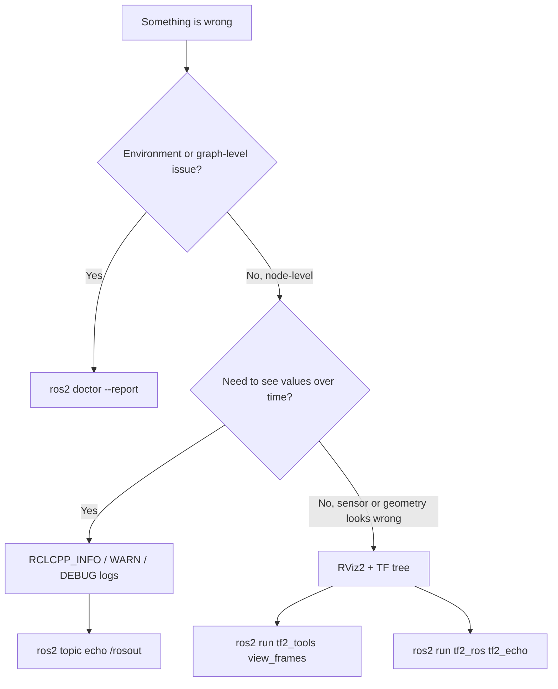

# ROS2 Basics in 5 Days (C++) — Unit 9: Debugging

You now know how to build most of a ROS 2 system; this closing unit covers how to figure out what's wrong when it doesn't behave — logging, visualizing sensor data and robot geometry, and a couple of built-in diagnostic tools.

The flowchart below is a rough decision path for choosing which of this unit's tools to reach for first, depending on what kind of problem you're chasing.



## ROS2 debugging messages

You've been using `RCLCPP_INFO` since Unit 2, but `rclcpp` gives you a full severity ladder, and choosing the right level matters once a real system is producing thousands of log lines a minute:

```cpp
RCLCPP_DEBUG(get_logger(), "raw sensor value: %f", raw);   // verbose, off by default
RCLCPP_INFO(get_logger(), "task switched to %s", task.c_str());
RCLCPP_WARN(get_logger(), "battery below 20%%");
RCLCPP_ERROR(get_logger(), "service call failed: %s", e.what());
RCLCPP_FATAL(get_logger(), "unrecoverable state, shutting down");
```

Debug-level messages are suppressed by default; enable them per node without recompiling:

```bash
ros2 run my_rover_pkg plant_detector --ros-args --log-level debug
```

For noisy repeated warnings (e.g., inside a subscription callback firing at 30 Hz), throttle instead of flooding the log:

```cpp
RCLCPP_WARN_THROTTLE(get_logger(), *get_clock(), 1000, "still no /scan data");
```

And when you just want to see everything a node is doing without adding print statements, `ros2 topic echo /rosout` shows every log message published on the graph, from any node, in one stream.

## Visualizing complex data with RViz2

Log lines don't scale to understanding a laser scan or a camera feed at a glance — that's what **RViz2** is for, ROS 2's 3D visualization tool. Launch it and add a display for the topic you want to inspect:

```bash
rviz2
```

Inside RViz2: set the **Fixed Frame** (top left, under Global Options) to a frame that actually exists in your TF tree, then `Add` a display matching your data — `LaserScan` for `/scan`, `Image` for a camera topic, `PointCloud2` for depth data, `Odometry` for `/odom`. A blank or red display almost always means either the Fixed Frame doesn't match your data's frame, or the topic simply isn't publishing — check both before assuming the visualization tool is broken.

## Visualizing robot frames (TF)

ROS 2 tracks coordinate frames — `base_link`, `laser_frame`, `map`, `odom`, and so on — through the **TF2** library, and most "my sensor data looks wrong" bugs are actually TF bugs: a missing transform, a wrong static offset, or two frames that were never connected. Inspect the tree directly:

```bash
ros2 run tf2_tools view_frames        # renders frames.pdf showing the whole tree
ros2 run tf2_ros tf2_echo base_link laser_frame   # live transform between two frames
```

In RViz2, add a `TF` display to see every frame and its axes overlaid on the 3D view — an extremely fast way to spot a frame that's floating disconnected from the rest of the tree, or one with an obviously wrong orientation.

## ROS2 Doctor

`ros2 doctor` runs a battery of environment and graph health checks — network configuration, missing dependencies, QoS mismatches between a publisher and subscriber, topics with no subscriber, and more:

```bash
ros2 doctor                 # pass/fail summary
ros2 doctor --report        # full diagnostic detail, worth pasting into a bug report
ros2 wtf                    # alias for `ros2 doctor --report`
```

Reach for `ros2 doctor` first whenever something is failing in a way that doesn't point at your own code specifically — before diving into individual nodes' logs, confirm the environment itself (sourcing, DDS discovery, dependency install) is sound.

## Try it yourself

Take any node from an earlier unit, deliberately introduce a bug (e.g., publish a `LaserScan` under a `frame_id` that has no corresponding TF frame), and use RViz2 plus `ros2 run tf2_ros tf2_echo` to diagnose why the display looks wrong before fixing it. Then run `ros2 doctor --report` on your full workspace and read through what it checks, even where everything passes.
