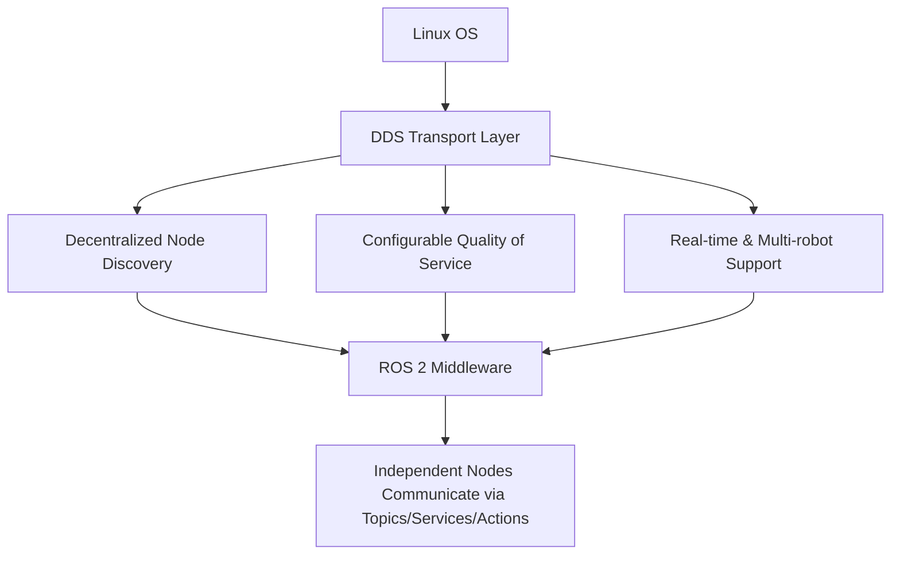

# ROS2 Basics in 5 Days (Python) — Unit 1: Introduction to the Course

This unit sets expectations before you touch any code: what ROS 2 is, what you'll be able to build by the end of the course, and what needs to be installed and working on your machine first. Treat it as a checklist, not a lecture.

The diagram below shows how the pieces described in this unit relate: the OS hosts a DDS transport layer, which is what gives ROS 2 its core capabilities, which in turn is what lets independent nodes talk to each other.



## What ROS 2 actually is
ROS 2 (Robot Operating System 2) is not an operating system in the kernel sense — it's a middleware framework that sits on top of a real OS (typically Linux) and gives you three things a robotics project always needs: a way for independent processes ("nodes") to discover and talk to each other, a standard set of message/data types for that communication, and a build/packaging convention (`ament`/`colcon`) so code from different teams composes cleanly. Compared to ROS 1, ROS 2 was rebuilt around DDS (Data Distribution Service) for its transport layer, which brings decentralized discovery (no `roscore` to babysit), configurable Quality of Service, and better support for real-time and multi-robot systems.

As an experienced programmer, the closest mental model is: ROS 2 is a pub/sub and RPC framework (think a lightweight message bus plus RPC, similar in spirit to how you'd combine a message broker with gRPC) with strong conventions for how processes are packaged, launched, and versioned.

## Why this course is scoped the way it is
This is a *basics* course — it deliberately stops short of navigation stacks, MoveIt, or advanced simulation. The goal is fluency with the primitives (nodes, topics, services, actions, launch files, parameters, debugging) so that when you move on to a specialized course (manipulation, navigation, perception), you're not simultaneously learning ROS 2 mechanics and the specialized topic. Everything after this unit builds directly on Python (`rclpy`), since that's the client library this course track uses.

## Minimum requirements
Before Unit 2, make sure you have:
- A Linux machine (native or VM) with a supported ROS 2 distribution installed, or a container/dev-environment image that provides one.
- Python 3 and basic comfort with the command line (you already have this).
- `colcon` installed for building workspaces, and a text editor/IDE of your choice.
- A terminal multiplexer or multiple terminal tabs — ROS 2 development involves running several processes (nodes, `ros2 topic echo`, launch files) side by side.

Verify your install works before moving on:
```bash
ros2 doctor --report   # sanity-checks your ROS 2 environment
ros2 pkg list | head    # confirms the core packages are discoverable
```

## How to use the rest of this course
Each remaining unit introduces one ROS 2 concept, shows you the command-line tools for inspecting it live, and then has you write the Python code that implements it. Work through units in order — Topics (Unit 3) is the foundation that Services (Unit 4), Callbacks (Unit 5), and Actions (Unit 7) all build on.

## Try it yourself
Run `ros2 doctor --report` and `ros2 topic list` on your machine (even with nothing else running). Read through the doctor output and note anything flagged as a warning — you'll want those resolved before Unit 2, where you create your first package.
