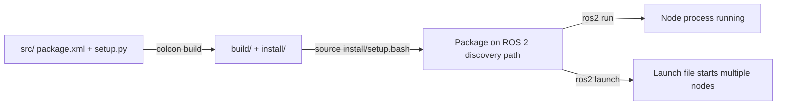

# ROS2 Basics in 5 Days (Python) — Unit 2: ROS2 Basic Concepts

This unit covers the mechanical building blocks you'll use in every ROS 2 project: packages, workspaces, compilation, nodes, and launch files. Get comfortable with the create-build-run loop here, because you'll repeat it constantly for the rest of the course.

The diagram below traces that create-build-run loop end to end, from source files to a running (or launch-started) node:



## What is a package?
A ROS 2 package is the smallest unit of software organization — a directory with a manifest (`package.xml`) declaring its name, dependencies, and metadata, plus a build description (`setup.py`/`setup.cfg` for pure Python packages, or `CMakeLists.txt` for C++ or mixed packages). Packages live inside a **workspace**, a directory tree with `src/`, `build/`, `install/`, and `log/` subfolders, all managed by `colcon`. One workspace can hold many packages; you build the whole workspace at once.

## Create a package
From inside your workspace's `src/` directory:
```bash
ros2 pkg create --build-type ament_python my_robot_pkg --dependencies rclpy
```
This scaffolds `package.xml`, `setup.py`, `setup.cfg`, and a Python module directory (`my_robot_pkg/`) where your node source files go. `--dependencies rclpy` adds the ROS 2 Python client library as a declared dependency, which matters when someone else builds your package from scratch.

## Compile a package
Building happens at the workspace root, not inside the package:
```bash
cd ~/ros2_ws
colcon build --packages-select my_robot_pkg
source install/setup.bash
```
`colcon build` compiles/installs every package it finds under `src/` unless you scope it with `--packages-select`. The `source install/setup.bash` step is easy to forget and is the single most common cause of "ros2 run says my node doesn't exist" — it puts your newly built package on ROS 2's discovery path for the current shell.

## Create your first ROS 2 program
Inside `my_robot_pkg/my_robot_pkg/`, add `hello_node.py`:
```python
import rclpy
from rclpy.node import Node

class HelloNode(Node):
    def __init__(self):
        super().__init__('hello_node')
        self.get_logger().info('Hello from ROS 2!')

def main():
    rclpy.init()
    node = HelloNode()
    rclpy.spin(node)
    node.destroy_node()
    rclpy.shutdown()
```
Register it as a console script in `setup.py`'s `entry_points`, then rebuild and run:
```bash
ros2 run my_robot_pkg hello_node
```

## What are ROS 2 nodes?
A node is a single, addressable process — the unit of composition in a ROS 2 graph. Each node typically owns one responsibility (drive a sensor, run a controller, plan a path) and communicates with other nodes via topics, services, actions, and parameters rather than direct function calls. This is why ROS 2 systems scale: nodes can be started, killed, or replaced independently, and can even run on different machines.

## Interacting with nodes from the command line
```bash
ros2 node list                 # see every running node
ros2 node info /hello_node     # publishers, subscribers, services it exposes
```
These commands are your primary debugging tool for "is my node even alive and wired up correctly" before you dig into topic-level or code-level debugging.

## The Node class in depth
`rclpy.node.Node` is the base class every node inherits from. Beyond logging, it's the object you call to create publishers (`create_publisher`), subscribers (`create_subscription`), services (`create_service`/`create_client`), timers (`create_timer`), and to declare/read parameters (`declare_parameter`/`get_parameter`). You'll use these methods constantly starting in Unit 3.

## What is a launch file?
A launch file is a Python script (using the `launch` and `launch_ros` libraries) that starts a set of nodes together, with their parameters and remappings, instead of you opening a terminal per node:
```python
from launch import LaunchDescription
from launch_ros.actions import Node

def generate_launch_description():
    return LaunchDescription([
        Node(package='my_robot_pkg', executable='hello_node', name='hello_node'),
    ])
```
Run it with `ros2 launch my_robot_pkg hello.launch.py` (after registering the file in `setup.py`'s `data_files`).

## Try it yourself
Create a package called `unit2_demo`, add a node that logs your name every 2 seconds using `create_timer`, build it with `colcon build`, and write a one-node launch file that starts it. Confirm it shows up in `ros2 node list` while running.
