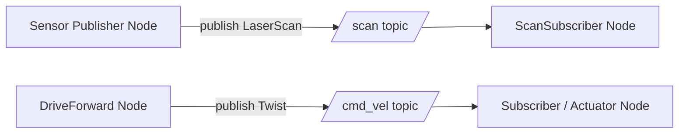

# ROS2 Basics in 5 Days (Python) — Unit 3: Understanding ROS2 Topics

Topics are the workhorse communication mechanism in ROS 2: continuous, many-to-many, asynchronous data streams for sensor readings, actuator commands, and state broadcasts. Almost everything else in ROS 2 (including the messages actions and services use internally) builds on the same underlying concepts, so this is the most important unit in the course.

The diagram below shows the decoupled publish/subscribe flow for this unit's two running examples — publishers never know who (if anyone) is subscribed, and subscribers never know who published:



## What is a ROS 2 topic?
A topic is a named, typed data channel. "Named" means nodes find each other by agreeing on a string like `/scan` or `/cmd_vel`; "typed" means every message sent on that topic must match a specific `.msg` definition (e.g. `sensor_msgs/msg/LaserScan`). Communication is publish/subscribe: publishers don't know who (if anyone) is listening, and subscribers don't know who's publishing — the DDS middleware handles discovery and delivery. This decoupling is what lets you swap a simulated camera for a real one without touching the nodes that consume the image data.

## Basic topic commands
Before writing any code, learn to inspect the graph from the terminal:
```bash
ros2 topic list                    # every active topic
ros2 topic list -t                 # ...with their message types
ros2 topic echo /some_topic        # print messages as they arrive
ros2 topic info /some_topic        # publisher/subscriber counts, type
ros2 topic hz /some_topic          # measure publish rate
ros2 topic pub /cmd_vel geometry_msgs/msg/Twist "{linear: {x: 0.2}}"  # publish once from the CLI
```
These commands are how you'll verify a robot (real or simulated) is actually publishing what you expect, without writing a line of code — invaluable when debugging "my subscriber never fires."

## Topic Subscriber
A subscriber node registers a callback that fires each time a message arrives:
```python
import rclpy
from rclpy.node import Node
from sensor_msgs.msg import LaserScan

class ScanSubscriber(Node):
    def __init__(self):
        super().__init__('scan_subscriber')
        self.sub = self.create_subscription(LaserScan, '/scan', self.on_scan, 10)

    def on_scan(self, msg: LaserScan):
        self.get_logger().info(f'Closest reading: {min(msg.ranges):.2f} m')
```
The `10` is the QoS queue depth (how many undelivered messages to buffer) — you'll meet full QoS profiles in later, more advanced courses; a small integer is fine for now.

## Topic Publisher
A publisher creates a message object, populates its fields, and calls `publish()` — typically on a timer:
```python
from geometry_msgs.msg import Twist

class DriveForward(Node):
    def __init__(self):
        super().__init__('drive_forward')
        self.pub = self.create_publisher(Twist, '/cmd_vel', 10)
        self.timer = self.create_timer(0.5, self.tick)

    def tick(self):
        msg = Twist()
        msg.linear.x = 0.2
        self.pub.publish(msg)
```

## Mixing publishers and subscribers in one node
A single node commonly both subscribes and publishes — e.g. read a sensor, compute something, publish a command. There's nothing special about combining the two constructors above in one class; the important discipline is keeping the callback fast (don't block inside `on_scan`) since it runs on the node's executor thread.

## Creating a custom interface
When the built-in message types (`std_msgs`, `sensor_msgs`, `geometry_msgs`, ...) don't fit your data, define your own in a dedicated `msg/` directory, e.g. `msg/BatteryStatus.msg`:
```
float32 voltage
bool is_charging
```
Declare it in `package.xml` (`rosidl_default_generators` build dependency) and `CMakeLists.txt`/`setup.py` so the interface-generation tooling picks it up, then rebuild the workspace — `colcon build` generates the Python bindings automatically.

## Using a custom interface
Once generated, import and use it exactly like a built-in type:
```python
from my_robot_pkg.msg import BatteryStatus
self.pub = self.create_publisher(BatteryStatus, '/battery_status', 10)
```

## Try it yourself
Write two nodes in one package: a publisher that sends an incrementing integer on `/counter` every second (`std_msgs/msg/Int32`), and a subscriber that logs whether each received value is even or odd. Run both together and confirm the behavior with `ros2 topic echo /counter` running in a third terminal.
