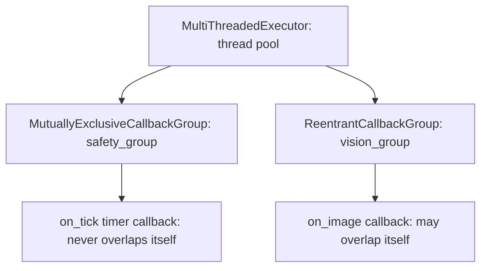

# ROS2 Basics in 5 Days (Python) — Unit 6: Multithreading

Unit 5 ended on a problem: a single slow callback blocks every other callback on a node. This unit covers ROS 2's answer — executors and callback groups — so you can let independent callbacks run concurrently without turning your node into a manual threading exercise.

The diagram below shows this unit's recommended pattern: a `MultiThreadedExecutor` feeding two separate callback groups so the timing-sensitive callback is never delayed by the slow one:



## Why you need multithreading
By default, `rclpy.spin(node)` uses a `SingleThreadedExecutor`: one thread, callbacks dispatched strictly one at a time, in the order they become ready. That's fine for simple nodes, but breaks down as soon as one callback can legitimately take a while (an image-processing subscriber, a slow service call) while other callbacks (a safety-critical timer, a heartbeat publisher) need to keep running on schedule regardless. The fix is a `MultiThreadedExecutor`, which dispatches ready callbacks to a thread pool instead of a single thread:
```python
from rclpy.executors import MultiThreadedExecutor

executor = MultiThreadedExecutor(num_threads=4)
executor.add_node(node)
executor.spin()
```
This alone doesn't guarantee two *specific* callbacks run concurrently, though — that's what callback groups control.

## Why you need callback groups
By default, every callback in a node belongs to the same implicit callback group, and ROS 2 guarantees callbacks *within the same group* never run concurrently — even under a `MultiThreadedExecutor`. This default exists to protect you from data races on `self` state without you asking for it. Callback groups are how you opt specific callbacks out of that guarantee, on a per-callback basis, by assigning them to different groups when you create them:
```python
self.create_subscription(Image, '/camera/image', self.on_image, 10, callback_group=group_a)
self.create_timer(0.1, self.on_tick, callback_group=group_b)
```

## Reentrant callback group
A `ReentrantCallbackGroup` allows its callbacks to run concurrently with each other — including multiple invocations of the *same* callback overlapping if a new message arrives before the previous call finished. Use this when a callback's body is naturally safe to run in parallel (e.g. read-only processing, or it uses its own locking). It maximizes throughput but pushes thread-safety responsibility onto you.

## Mutually exclusive callback group
A `MutuallyExclusiveCallbackGroup` guarantees callbacks within it never overlap in time, same as the implicit default group — but you can create several separate mutually-exclusive groups so that callbacks in *different* groups can still run concurrently with each other, while callbacks *within* each group stay serialized:
```python
from rclpy.callback_groups import MutuallyExclusiveCallbackGroup, ReentrantCallbackGroup

safety_group = MutuallyExclusiveCallbackGroup()   # timer stays predictable, never overlaps itself
vision_group = ReentrantCallbackGroup()           # image callback can overlap itself if needed
```
This is the pattern to reach for by default: isolate anything timing-sensitive into its own mutually-exclusive group so a slow, unrelated callback can never delay it.

## Multiple nodes in one executor
An executor isn't tied to a single node — you can add several nodes to one `MultiThreadedExecutor` and `spin()` them together, which is how you run a small system of cooperating nodes in a single process (useful for testing, or for tightly coupled nodes that should share a process's lifecycle):
```python
executor = MultiThreadedExecutor()
executor.add_node(sensor_node)
executor.add_node(controller_node)
executor.spin()
```
This is distinct from *composition* (loading multiple nodes as plugins into one process via `ros2 component`), which is a more advanced topic beyond this course.

## Try it yourself
Take the `PlantDetector` node from Unit 5 and add a second, unrelated timer callback that logs "heartbeat" every 0.2 seconds. First run it under the default single-threaded executor with an artificial `time.sleep(2)` inside `on_image` and observe the heartbeat stalling. Then split the two callbacks into separate `MutuallyExclusiveCallbackGroup`s under a `MultiThreadedExecutor` and confirm the heartbeat keeps ticking on schedule regardless of the slow image callback.
