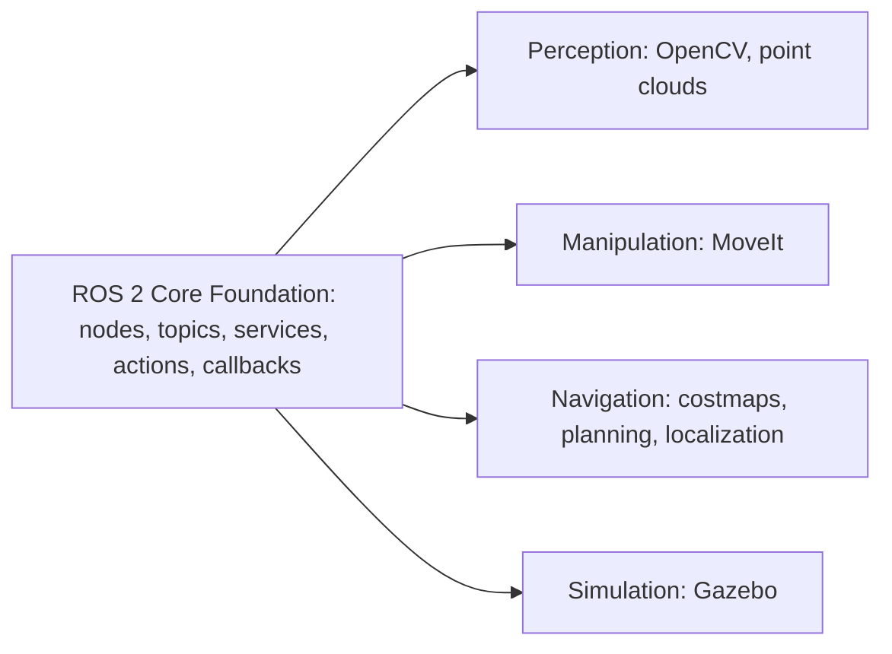

# ROS2 Basics in 5 Days (Python) — Unit 9: Final Recommendations

This closing unit isn't a new topic — it's a map of where to go next, now that you have the core ROS 2 vocabulary (nodes, topics, services, actions, callbacks, multithreading, debugging) under your belt. Five days is enough to become fluent in the *mechanics* of ROS 2; it's deliberately not enough to also cover any one specialized domain, so this unit is about a clean handoff rather than new material.

The diagram below shows how the specialized follow-on courses this unit describes all branch off the same shared foundation:



Every one of those four branches assumes you can already write a node, wire up a topic or service, and debug a broken graph without hand-holding — that's what Units 1–8 gave you.

## What you now have
Recapping by unit, you can:
- **scaffold and build a package** (`ros2 pkg create`, `colcon build`) and launch several nodes together instead of juggling terminals by hand;
- **write nodes that publish and subscribe** on topics, including custom `.msg` interfaces when a built-in type doesn't fit;
- **expose and call services**, choosing synchronous vs. asynchronous clients deliberately rather than by accident;
- **reason about callback dispatch** — the difference between `spin()` and `spin_once()`, and when a slow callback needs its own callback group under a `MultiThreadedExecutor`;
- **run and monitor long-running, cancellable actions**, including writing a custom `.action` interface; and
- **diagnose a broken graph** with `ros2 doctor`, RViz2, and the TF tools, instead of guessing from source code alone.

That's a genuinely complete foundation — the same vocabulary used inside navigation stacks, manipulation pipelines, and perception systems. Those follow-on courses layer *domain* concepts (costmaps, planning scenes, point cloud filters) on top of mechanics you already know, not a different way of writing nodes.

## Where to go next
Pick a direction based on what kind of robot problem interests you most:
- **Perception** — camera/LiDAR processing. Expect to meet `cv_bridge` and `image_transport` for getting images in and out of OpenCV (docs.opencv.org), plus point cloud message types for LiDAR/depth data.
- **Manipulation** — arm control and motion planning, typically via MoveIt (moveit.picknik.ai), which adds concepts like planning scenes and collision-aware trajectory generation on top of the action interfaces you already understand (a MoveIt goal *is* an action goal under the hood).
- **Navigation** — autonomous movement: costmaps, global/local path planning, and localization (e.g. AMCL or SLAM), usually via the Nav2 stack.
- **Simulation** — building and testing robots virtually before touching hardware, e.g. with Gazebo (gazebosim.org), which talks to ROS 2 over the same topics/services/actions you've been using against real (or simulated) hardware.

Before starting a follow-on course, it's worth checking what's already installed for your distro rather than discovering a missing dependency mid-lesson:
```bash
ros2 pkg list | grep -Ei 'nav2|moveit|image_transport|gazebo'   # already installed?
apt search ros-$ROS_DISTRO-navigation2                          # available to install?
```

Whichever direction you pick, revisit this course's units as reference material — you will forget the exact `create_service` signature or the difference between the two callback group types, and that's normal. Bookmark docs.ros.org as your primary reference for API details and distro-specific behavior, since ROS 2 evolves between distributions.

## Habits worth keeping
A few practices from this course are worth carrying forward into every future ROS 2 project, regardless of which specialization you pursue:
- Inspect the graph with CLI tools (`ros2 node info`, `ros2 topic echo`, `ros2 doctor`) *before* reading code, when something misbehaves — it's almost always faster than debugging blind.
- Keep callbacks short, and reach for callback groups deliberately rather than defaulting to `MultiThreadedExecutor` everywhere "just in case." Concurrency you didn't ask for is a common source of hard-to-reproduce bugs.
- Write custom interfaces (`.msg`/`.srv`/`.action`) as soon as a built-in type is a poor fit, rather than overloading an existing message with unrelated fields — future you (and every other node subscribing to it) will thank you.
- Treat launch files as the normal way to start more than one node together, not an afterthought you add once a project gets big.
- Expose tunable values as ROS 2 parameters instead of hardcoded constants, so a node can be reconfigured at launch time — this matters even more once you're tuning navigation or manipulation parameters against real hardware, where a code change means a rebuild.

## Try it yourself
Pick one small project idea that combines at least three primitives from this course — for example, a node that subscribes to a simulated sensor topic, exposes a service to change a threshold, and runs a long "calibration" action when triggered, logging its progress with the leveled logger from Unit 8. Sketch its package structure and interfaces on paper before writing any code — the same design step you'd do for any nontrivial software project, applied to a ROS 2 graph. As a stretch goal, deliberately break something (a QoS mismatch, a missing TF broadcast) and practice diagnosing it with `ros2 doctor` and RViz2 before looking at your own source — that instinct is the single most transferable skill this course teaches.
