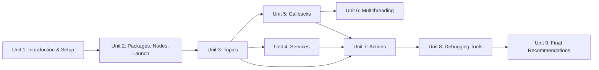

# ROS2 Basics in 5 Days (Python)

This course is a hands-on introduction to ROS 2 using its Python client library (`rclpy`), aimed at programmers who are comfortable coding but new to ROS itself. Rather than front-loading advanced topics, it builds up the core vocabulary every ROS 2 project relies on — packages, nodes, topics, services, callbacks, multithreading, and actions — with the command-line inspection tools and debugging workflow you need to work with that vocabulary confidently, leaving specialized areas like navigation, manipulation, and perception to their own dedicated courses.

The diagram below shows how each unit builds on the ones before it, with Topics (Unit 3) acting as the foundation that Services, Callbacks, and Actions all depend on:

1. [Introduction to the Course](01-introduction-to-the-course.md) — What ROS 2 is, how this course is scoped, and the minimum setup you need before starting.
2. [ROS2 Basic Concepts](02-ros2-basic-concepts.md) — Packages, workspaces, compilation with colcon, nodes, and launch files.
3. [Understanding ROS2 Topics](03-understanding-ros2-topics.md) — Publish/subscribe messaging, the CLI tools for inspecting topics, and building custom message interfaces.
4. [Understanding ROS2 Services](04-understanding-ros2-services.md) — Request/response calls, synchronous vs. asynchronous clients, and custom service interfaces.
5. [Callbacks in ROS 2](05-callbacks-in-ros-2.md) — How the executor dispatches callbacks, and the difference between `spin` and `spin_once`.
6. [Multithreading](06-multithreading.md) — Executors and callback groups for running callbacks concurrently without breaking thread safety guarantees.
7. [Understanding ROS2 Actions](07-understanding-ros2-actions.md) — Long-running, preemptible goals with feedback, and how to build action clients and servers.
8. [Debugging Tools](08-debugging-tools.md) — Logging levels, RViz2 visualization, TF frames, and `ros2 doctor` for diagnosing a broken system.
9. [Final Recommendations](09-final-recommendations.md) — What to study next and habits worth carrying forward.
