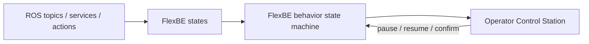

# FlexBe with ROS — Unit 1: Introduction to the Course

This unit sets the stage: what FlexBE actually is, where it fits relative to plain ROS nodes and action servers, and what you will have built by the end of the course.

The diagram below previews how FlexBE layers on top of plain ROS: states wrap ROS primitives, a behavior chains states into a state machine, and the OCS gives a human operator live visibility and control.



## What problem FlexBE solves

Most non-trivial robot tasks are not single actions, they are sequences and decision trees: "navigate to the kitchen, if the door is closed then open it, then pick up the object, if the grasp fails then retry twice before aborting." You *could* encode this as a tangle of `if`/`else` in a single Python script that calls action clients directly, but that script becomes unreadable and untestable fast, and it gives you no visibility into what the robot is doing while it runs.

FlexBE (Flexible Behavior Engine) is a behavior engine built on top of [SMACH](http://wiki.ros.org/smach), ROS's state-machine library. It gives you:

- A **visual editor** (the FlexBE App) for wiring states together into a state machine, so the control flow is a diagram you can inspect, not just code you have to read.
- A clean split between **states** (small, reusable units of work, e.g. "call this action server") and **behaviors** (state machines built by connecting states together).
- An **Operator Control Station (OCS)** at runtime that shows which state is currently active, lets a human pause/resume execution, and supports different levels of operator involvement (autonomy levels — covered in Unit 3).

## How FlexBE relates to plain ROS

If you've already written ROS nodes, topics, services, and actions, none of that goes away. FlexBE states are thin wrappers: a state's `execute()` method is ordinary Python that publishes, subscribes, calls services, or drives an action client, exactly as you would outside FlexBE. What FlexBE adds is the *orchestration layer* on top: it decides which state runs next, feeds outcomes from one state into the next, and gives an operator a live view into the execution.

```
ROS nodes/topics/services/actions  →  FlexBE states (wrap them)  →  FlexBE behavior (state machine)  →  OCS (operator view/control)
```

## Where FlexBE lives in your workspace

Like any other ROS functionality, FlexBE ships as a set of packages you build into your workspace: `flexbe_core` (the base classes like `EventState` and `StateMachine`), `flexbe_onboard` (the runtime that executes behaviors on the robot), and `flexbe_app` (the visual editor and OCS). Your own states and behaviors live in ordinary ROS packages alongside them — a typical layout is one package per robot or project, e.g. `my_flexbe_states/` holding your state classes and `my_flexbe_behaviors/` holding the generated behavior code. You don't need any of this running yet for this unit — just know that "installing FlexBE" means these packages, not a separate standalone program.

## Course roadmap

- **Unit 2** gets you writing your first state and your first behavior — the FlexBE "hello world."
- **Unit 3** covers Actionlib-based states (the most common kind of state in real robots) and autonomy levels, which control how much a human operator needs to confirm before each transition.
- **Unit 4** shows how to unit test states in isolation, so you can catch bugs before ever running the robot.
- **Unit 5** is a small project: two FlexBE states that command a drone to take off and land.

## Setting expectations

FlexBE is most valuable once your robot has more than two or three states worth chaining together, or once you need a human supervisor in the loop. For a single "go pick this up" action, plain code is often simpler — keep that trade-off in mind as you go through the course.

## Try it yourself

Before writing any code, sketch (on paper or in a text file) the state machine for a simple task you already understand, such as "make a cup of coffee": list the states (e.g. `BoilWater`, `AddGrounds`, `Pour`), and for each state, the possible outcomes (e.g. `done`, `failed`) and which state each outcome leads to. This is exactly the diagram you'll later build in the FlexBE editor.
