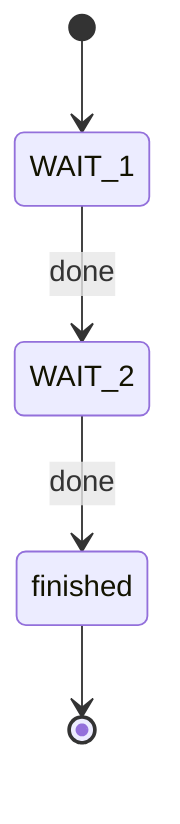

# FlexBe with ROS — Unit 2: Creating a basic Behavior

This unit is where you go from theory to a running state machine: writing your first FlexBE state, then wiring two or more states together into a behavior you can execute from the OCS.

The diagram below shows the two-state behavior built later in this unit: each state's `done` outcome drives the transition to the next state, or to the behavior's own terminal outcome.



## Anatomy of a FlexBE state

A state is a Python class decorated so the FlexBE framework can discover it. At minimum it declares its possible **outcomes** (the labels it can return when it finishes) and implements `execute()`, which runs once per control cycle while the state is active.

```python
from flexbe_core import EventState, Logger

class WaitForSecondsState(EventState):
    """
    Waits for a fixed number of seconds, then returns 'done'.

    -- wait_time  float  Seconds to wait before returning.

    <= done  Waiting finished.
    """

    def __init__(self, wait_time):
        super().__init__(outcomes=['done'])
        self._wait_time = wait_time
        self._start_time = None

    def on_enter(self, userdata):
        # Called once when the state becomes active.
        import time
        self._start_time = time.time()

    def execute(self, userdata):
        import time
        if time.time() - self._start_time >= self._wait_time:
            Logger.loginfo('Wait complete')
            return 'done'
        # Returning nothing keeps the state active for another cycle.
```

Key points:
- **Outcomes** are strings, not exceptions or return codes — they are the "arrows" you'll later connect in the behavior diagram.
- `on_enter()` runs once when a transition activates this state; `execute()` runs repeatedly (typically at the behavior's tick rate) until you return an outcome.
- The docstring's `--` and `<=` annotations aren't decoration — the FlexBE editor parses them to auto-generate the parameter and outcome sockets you'll see in the GUI.

## Wiring states into a behavior

A behavior is a state machine: a set of states plus transitions of the form *(state, outcome) → next state*. You build this either by hand in Python using SMACH's `StateMachine` container, or visually in the FlexBE App, which generates the equivalent Python behind the scenes.

```python
from flexbe_core import StateMachine
from my_flexbe_states.wait_for_seconds_state import WaitForSecondsState

sm = StateMachine(outcomes=['finished'])
with sm:
    StateMachine.add('WAIT_1', WaitForSecondsState(wait_time=2.0),
                      transitions={'done': 'WAIT_2'})
    StateMachine.add('WAIT_2', WaitForSecondsState(wait_time=1.0),
                      transitions={'done': 'finished'})
```

Every state you add gets a unique name (`'WAIT_1'`), and its `transitions` dict maps each possible outcome to either another state's name or one of the behavior's own outcomes (here, `'finished'`).

## Passing data between states with userdata

States often need to share data — e.g. one state computes a target pose, the next one consumes it. FlexBE (via SMACH) does this with a `userdata` object and explicit `input_keys`/`output_keys` on each state, so data flow is declared, not implicit global state:

```python
class ComputeTargetState(EventState):
    def __init__(self):
        super().__init__(outcomes=['done'], output_keys=['target_pose'])

    def execute(self, userdata):
        userdata.target_pose = compute_pose()
        return 'done'
```

## Running it from the OCS

Once a behavior is built (in the editor or by hand) and checked into a `flexbe_states`/`flexbe_behaviors` package, you launch the FlexBE runtime (`onboard` on the robot side, `ocs` on the operator side) and start the behavior from the Behavior Dashboard. The OCS highlights the currently active state live, which is the fastest way to debug "why did my robot stop at step 3."

## Try it yourself

Extend the two-state example above with a third state, `CheckBatteryState`, that returns `'ok'` or `'low'` based on a hardcoded battery percentage variable. Wire `'low'` to a new terminal outcome `'aborted'` and `'ok'` to your existing `'finished'` path, and trace through by hand which path the state machine takes for a battery value of 15%.
