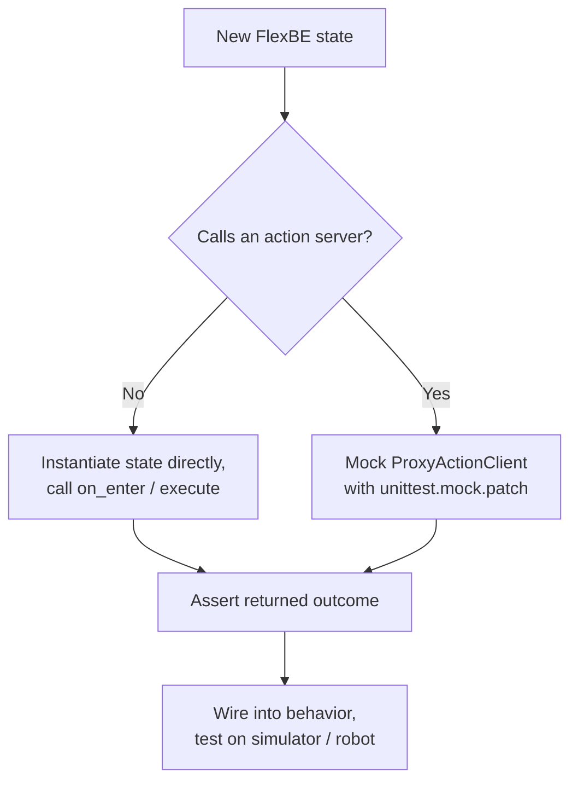

# FlexBe with ROS — Unit 4: Unit Testing

States are just Python classes, which means you can — and should — test them without ever launching a robot, a simulator, or even a ROS master. This unit covers how to isolate state logic and test it the same way you'd test any other class.

The flowchart below shows the decision this unit walks through: test simple state logic directly, but mock the action client for Actionlib-backed states, before ever touching a simulator or robot.



## Why test states in isolation

Behaviors fail in layers: the state logic can be wrong, the wiring between states can be wrong, or the real hardware/action server can misbehave. If your only test is "run the whole behavior on the robot," a bug in state logic and a flaky action server look identical from the outside, and every debug cycle costs you a robot (or simulator) boot. Unit testing a state in isolation collapses that to a fast, deterministic, no-robot-required check.

## Testing a plain state

For a state with no external dependencies, you construct it directly and call its lifecycle methods, just like testing any object:

```python
import unittest
from my_flexbe_states.wait_for_seconds_state import WaitForSecondsState

class TestWaitForSecondsState(unittest.TestCase):
    def test_returns_done_after_wait_time(self):
        state = WaitForSecondsState(wait_time=0.01)
        state.on_enter(userdata=None)
        import time
        time.sleep(0.02)
        outcome = state.execute(userdata=None)
        self.assertEqual(outcome, 'done')

    def test_stays_active_before_wait_time(self):
        state = WaitForSecondsState(wait_time=5.0)
        state.on_enter(userdata=None)
        outcome = state.execute(userdata=None)
        self.assertIsNone(outcome)

if __name__ == '__main__':
    unittest.main()
```

Run it exactly like any other Python test:

```bash
python3 -m pytest test_wait_for_seconds_state.py -v
```

## Testing states that call action servers

For an Actionlib-backed state like `SendTrajectoryState` from Unit 3, you don't want a real action server in a unit test — you want to fake `ProxyActionClient` so you can assert on the state's *decision logic* (what outcome it returns for a given result) without any ROS infrastructure running. `unittest.mock` is the standard tool:

```python
from unittest.mock import MagicMock, patch

class TestSendTrajectoryState(unittest.TestCase):
    @patch('my_flexbe_states.send_trajectory_state.ProxyActionClient')
    def test_returns_done_on_success(self, mock_client_cls):
        mock_client = MagicMock()
        mock_client.has_result.return_value = True
        mock_client.get_result.return_value = True
        mock_client_cls.return_value = mock_client

        state = SendTrajectoryState(action_topic='/arm_controller/follow_joint_trajectory')
        state.on_enter(userdata=None)
        outcome = state.execute(userdata=None)

        self.assertEqual(outcome, 'done')
```

This pins down a subtle but important idea: your state's job is to translate *action results into outcomes*. That translation logic is exactly what a unit test should pin down, independent of whether the real action server is reachable.

## Testing userdata flow

If a state reads or writes `userdata`, pass a real (or `smach.UserData()`-backed) object into `execute()` and assert on what got written, the same way you'd assert on any function's return value or side effect.

## Where this fits in the workflow

A practical rhythm: write the state, write a unit test for each outcome it can produce (including failure/timeout paths, which are easy to forget), run the tests locally, and only then wire the state into a behavior and test on the simulator or robot. Catching a typo in outcome-handling logic in a millisecond-fast unit test beats catching it three minutes into a drone flight.

## Try it yourself

Write a unit test for the `CheckBatteryState` you sketched in Unit 2's exercise. Cover three cases: a battery level clearly "ok," a level clearly "low," and the boundary value itself — and check whether your state's behavior at the boundary is actually what you intended.
