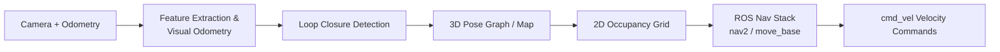

# Programming Drones with ROS — Unit 3: 2D Navigation with RTABMap

Manual velocity commands don't scale past a few meters of flight. This unit introduces RTABMap (Real-Time Appearance-Based Mapping) to build a map of the environment from the drone's camera, and then shows how to flatten that map into a 2D navigation problem the standard ROS navigation stack can solve.

The diagram below traces data from the drone's camera through RTABMap's SLAM pipeline to the 2D occupancy grid and velocity commands that let the drone navigate itself:



## What RTABMap actually does
RTABMap is a graph-based SLAM (Simultaneous Localization and Mapping) library. As the drone flies, it:
1. Extracts visual features from each incoming camera frame.
2. Estimates how far the drone has moved since the last frame (visual odometry), adding a new node to a pose graph.
3. Compares each new frame against previously visited places to detect **loop closures** — recognizing "I've been here before."
4. When a loop closure is found, corrects accumulated drift across the whole graph, which is what keeps a long flight's map from smearing into an unusable curve.

It works with RGB-D cameras (color + depth) or a combination of a mono camera and odometry, which is what makes it a good fit for the AR Drone's front camera plus IMU/optical-flow odometry. Documentation and tuning parameters live at the project's own site, referenced from `docs.ros.org` package pages for `rtabmap_ros`.

## Building a map from the drone's camera feed
With the drone driver and RTABMap both running, you fly the drone around the space you want mapped — either manually with a teleop node or a scripted pattern — while RTABMap subscribes to the camera and odometry topics and builds the map live:

```bash
ros2 launch rtabmap_ros rtabmap.launch.py \
    rgb_topic:=/drone/front_camera/image_raw \
    depth_topic:=/drone/front_camera/depth \
    odom_topic:=/drone/odom
```

Watch the map build up in RViz as `map`/`grid` topics; a good mapping run deliberately revisits earlier areas so RTABMap gets the loop-closure opportunities it needs to correct drift.

## Loop closure in practice
A loop closure only fires when RTABMap is confident two views are of the same place — controlled by a similarity threshold on the feature match. Fly too fast, in too textureless an environment (blank walls, uniform carpet), or with too much motion blur, and you'll get few or no candidate matches, and the map will drift uncorrected. This is the single most common practical failure mode in drone SLAM, and worth deliberately testing: fly the same loop once slowly and once quickly, and compare the resulting maps.

## From a 3D map to 2D navigation
The drone flies in 3D, but for most indoor navigation tasks you only need to avoid obstacles at flight altitude — so RTABMap can project its 3D point cloud into a 2D occupancy grid at a given height band, the same `nav_msgs/OccupancyGrid` format used by ground robots. That grid feeds directly into the standard ROS navigation stack (`nav2` / `move_base`), letting you send a goal pose and get a planned, obstacle-avoiding path in the plane:

```bash
ros2 topic pub -1 /goal_pose geometry_msgs/msg/PoseStamped \
  '{header: {frame_id: "map"}, pose: {position: {x: 3.0, y: 1.5, z: 0.0}}}'
```

The navigation stack turns that goal into a stream of velocity commands on the same `cmd_vel` topic you used by hand in Unit 2 — this is the first time in the course the drone flies itself.

## Try it yourself
Map a small loop (an office, a lab room) with the drone, saving the result with RTABMap's database export. Then load the saved map back and send two or three sequential 2D navigation goals across it, watching in RViz whether the planned paths correctly route around the obstacles you actually flew past while mapping.
