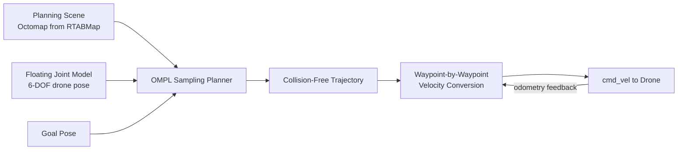

# Programming Drones with ROS — Unit 4: 3D Navigation with MoveIt!

Unit 3 flattened the world into a 2D floor plan, which is fine at a fixed altitude but throws away the drone's real advantage: it can fly over, under, and around obstacles in full 3D. This unit repurposes MoveIt — normally a robot-arm motion planning framework — to plan collision-free paths through 3D space for the drone itself.

The diagram below shows how MoveIt turns a goal pose into an obstacle-avoiding trajectory that gets executed as closed-loop velocity commands:



## Treating the drone as a "manipulator" with a floating joint
MoveIt plans motion for a *planning group*: a chain of joints with defined limits, connected by a kinematic model described in a URDF/SRDF pair, going to some end-effector pose. A robot arm's planning group is its chain of revolute joints. A drone has no joints at all — it's a single rigid body free to translate and rotate in space. MoveIt handles this by modeling the drone's pose as a **virtual floating joint**: a 6-degree-of-freedom joint (3 translation + 3 rotation) connecting a fixed "world" frame to the drone's body frame. The "planning group" then consists of that single virtual joint, and the "end effector" is the drone body itself.

This is a legitimate, if unconventional, use of the framework: MoveIt doesn't care whether the DOFs it's solving for come from a chain of arm joints or one floating joint — the planner just needs a valid state space and a collision model.

## Building the planning scene
MoveIt plans against a **planning scene**: a 3D representation of known obstacles the path must avoid. For a drone, this is typically the same map (or an octomap derived from it) you already built with RTABMap in Unit 3, loaded as collision geometry instead of a flat occupancy grid:

```bash
ros2 launch drone_moveit_config demo.launch.py
ros2 topic pub -1 /octomap_binary octomap_msgs/msg/Octomap ...  # or load via move_group's octomap updater
```

Static obstacles (walls, furniture, structures you already mapped) go in as the base scene; you can also add primitive boxes/cylinders programmatically via MoveIt's `PlanningSceneInterface` for known objects like a landing pad or no-fly column.

## Planning collision-free 3D paths with OMPL
MoveIt's default planning backend is OMPL (Open Motion Planning Library), which offers sampling-based planners (RRT, RRT-Connect, PRM, and variants) well suited to a 6-DOF floating body searching an open 3D volume. You set a target pose for the virtual joint and ask for a plan:

```python
move_group.set_pose_target(goal_pose)   # goal_pose: geometry_msgs/Pose in the world frame
plan_result = move_group.plan()
```

The planner returns a trajectory: a time-parameterized sequence of poses for the floating joint from the drone's current position to the goal, guaranteed (subject to the fidelity of your collision model) not to intersect any obstacle in the planning scene. Visualize it in RViz's MoveIt plugin before trusting it on real hardware — sampling-based planners can occasionally produce needlessly convoluted paths, which is easy to spot visually and re-plan around.

## Executing the plan on the drone
MoveIt's `execute()` call assumes a joint trajectory controller — which a drone doesn't have. Instead, you convert the planned sequence of poses into the velocity commands from Unit 2: iterate the trajectory waypoints, and at each step compute a velocity command (position-error based, or simply the trajectory's own velocity field if OMPL's time-parameterization populated it) that drives the drone from its current odometry-reported pose toward the next waypoint, publishing on `cmd_vel` exactly as before. This "planning is offline, execution is closed-loop" split is standard practice whenever MoveIt is used outside its native arm-controller context.

## Try it yourself
In the simulator, place a single box obstacle directly between the drone's current position and a goal point roughly 2 meters ahead at the same altitude. Plan and visualize a path with MoveIt — confirm the planned trajectory rises or swings around the box rather than passing through it — then execute it and compare the drone's actual flown path (from odometry) against the planned one.
