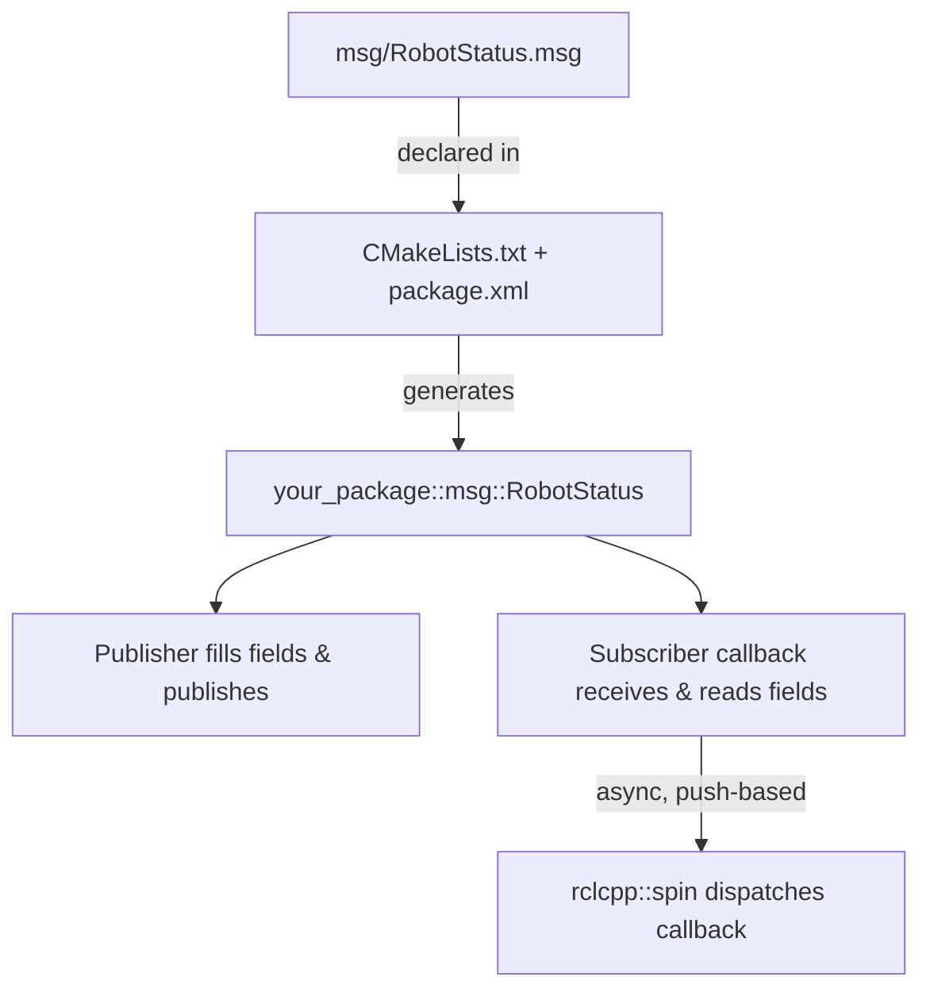

# ROS Basics in 5 Days (C++) — Unit 5: Understanding ROS Topics - Subscribers & Messages

This unit closes the loop on Unit 4: how to receive data on a topic, and how to define your own message type once the built-in ones (strings, numbers, poses) don't fit what you need to send.

The diagram below traces a custom message from its `.msg` definition through code generation to use in a publisher and an asynchronously-invoked subscriber callback.



## What a subscriber is
A subscriber registers interest in a topic and a callback function to run every time a message arrives. Unlike a service call, this is asynchronous and push-based — you never poll; ROS invokes your callback whenever data shows up, on whatever thread is running `spin()`. That means callback code should be fast: expensive work in a subscriber callback delays processing of every other callback on that node.

## Writing a subscriber node in C++
This subscribes to the `/greeting` topic from Unit 4 and logs each message as it arrives:

```cpp
#include "rclcpp/rclcpp.hpp"
#include "std_msgs/msg/string.hpp"

int main(int argc, char **argv) {
  rclcpp::init(argc, argv);
  auto node = std::make_shared<rclcpp::Node>("greeting_subscriber");

  auto sub = node->create_subscription<std_msgs::msg::String>(
      "/greeting", 10,
      [node](const std_msgs::msg::String::SharedPtr msg) {
        RCLCPP_INFO(node->get_logger(), "received: %s", msg->data.c_str());
      });

  rclcpp::spin(node);
  rclcpp::shutdown();
  return 0;
}
```

Note that the subscriber declares the same topic name and message type as the publisher — a mismatch on either (a typo in the name, or a different message type) means the two nodes simply never connect, silently, with no crash on either side. This is the single most common bug in a beginner's first pub/sub pair, and it's why Unit 11 spends time on the graph-visualization tool that lets you *see* whether a connection actually formed.

## Creating your own message type
When built-in types don't match your data, you define a `.msg` file inside a `msg/` directory in your package — a plain-text schema, one field per line as `type name`:

```
# msg/RobotStatus.msg
string  robot_name
float64 battery_percent
bool    is_charging
```

Your package's `CMakeLists.txt` needs a call to generate C++ code from this file (e.g. `rosidl_generate_interfaces` in ROS 2, or `add_message_files` + `generate_messages` in ROS 1), and `package.xml` needs the message-generation dependencies declared. After a build, the type becomes available as `your_package::msg::RobotStatus`, usable exactly like a built-in message in both publisher and subscriber code.

## Using the custom message
Once generated, publishing and subscribing look identical to the built-in-type examples above — you just fill in your own fields instead of `.data`:

```cpp
auto msg = your_package::msg::RobotStatus();
msg.robot_name = "unit1";
msg.battery_percent = 87.5;
msg.is_charging = false;
pub->publish(msg);
```

## Try it yourself
Define a `RobotStatus.msg` like the one above, wire it into your package's build files, then write a publisher that sends one every second with a fake but changing battery percentage, and a subscriber that logs a warning when `battery_percent` drops below 20.
