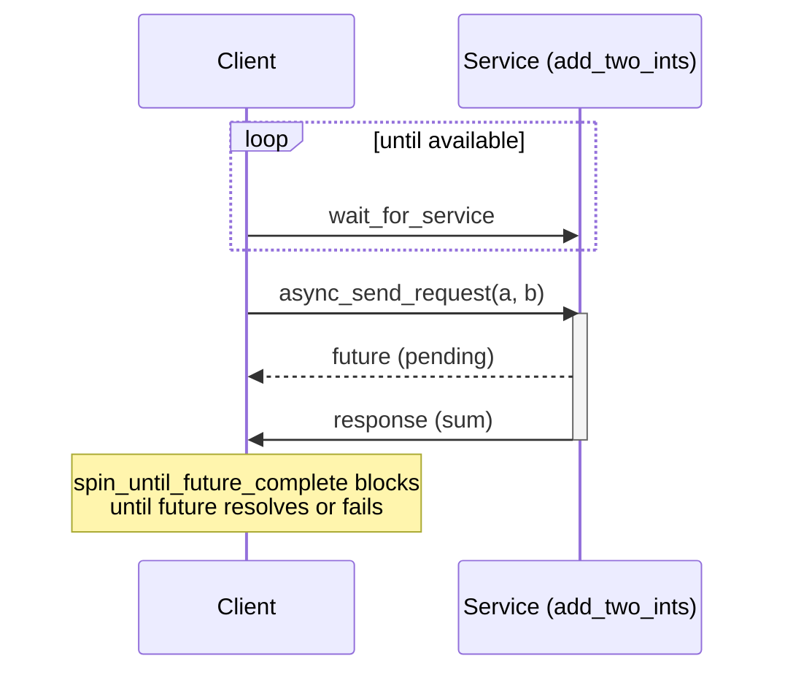

# ROS Basics in 5 Days (C++) — Unit 6: Understanding ROS Services - Clients

Topics are the wrong tool when you need a direct answer to a specific question — "what's the current map resolution," "please recalculate this transform." That's what services are for. This unit covers calling one; the next covers building one.

The sequence below shows a client waiting for the service to appear, sending a request, and blocking on the future until the response resolves.



## Request/response versus publish/subscribe
A service is a synchronous(-feeling) remote procedure call: a client sends a **request** message and receives exactly one **response** message back, addressed specifically to that client — nothing like a topic's many-to-many broadcast. Use a service when the interaction is "ask once, get one answer" and the work is short (milliseconds, not seconds); for anything long-running, cancellable, or that needs progress updates, use an action (Units 9-10) instead. A common beginner mistake is using a service for something that takes tens of seconds — the calling code blocks or has to manage timeouts awkwardly, which is exactly the problem actions solve.

## Service definitions
A service's interface is declared in a `.srv` file: request fields, a `---` separator, then response fields.

```
# srv/AddTwoInts.srv
int64 a
int64 b
---
int64 sum
```

Like custom messages, this needs generation wiring in `CMakeLists.txt`/`package.xml`, after which it's usable in code as `your_package::srv::AddTwoInts`.

## Writing a service client in C++
A client needs a handle to the service and then sends a request, waiting for the response:

```cpp
#include "rclcpp/rclcpp.hpp"
#include "your_package/srv/add_two_ints.hpp"

int main(int argc, char **argv) {
  rclcpp::init(argc, argv);
  auto node = std::make_shared<rclcpp::Node>("add_two_ints_client");
  auto client = node->create_client<your_package::srv::AddTwoInts>("add_two_ints");

  while (!client->wait_for_service(std::chrono::seconds(1))) {
    RCLCPP_INFO(node->get_logger(), "waiting for service to appear...");
  }

  auto request = std::make_shared<your_package::srv::AddTwoInts::Request>();
  request->a = 3;
  request->b = 4;

  auto future = client->async_send_request(request);
  if (rclcpp::spin_until_future_complete(node, future) ==
      rclcpp::FutureReturnCode::SUCCESS) {
    RCLCPP_INFO(node->get_logger(), "sum = %ld", future.get()->sum);
  } else {
    RCLCPP_ERROR(node->get_logger(), "service call failed");
  }

  rclcpp::shutdown();
  return 0;
}
```

## Sync-flavored calls are still async under the hood, and can fail
`async_send_request` always returns a future immediately; `spin_until_future_complete` is what makes the call *feel* synchronous by blocking this thread until the future resolves (or the node stops spinning). Two failure modes to always handle: the service may not exist yet when you call (hence `wait_for_service` in a loop), and the call can simply fail or time out, which is why you check the return code before trusting `future.get()`. ROS 1's `roscpp` client API (`ros::ServiceClient::call`) is genuinely synchronous and blocks directly, but the failure-handling discipline is the same.

## Try it yourself
Using the `AddTwoInts.srv` definition above, write a client that calls the service five times with different `a`/`b` pairs and prints each sum. Run it before the server exists (from Unit 7) and confirm it correctly waits rather than crashing.
