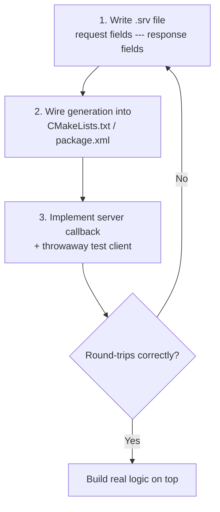

# ROS Basics in 5 Days (C++) — Unit 7: Understanding ROS Services - Server

Every client from Unit 6 needs something on the other end. This unit builds the server side, and covers designing your own service message from scratch — a skill you'll reuse constantly once you start wiring real robot behaviors together.

The flowchart below captures the three-step design loop this unit walks through, repeating until the request/response round-trips correctly.



## Anatomy of a service server
A server registers a name and a callback; when a request arrives, ROS invokes the callback with the request and a response object for you to fill in and return. Unlike a subscriber callback (which returns nothing), a service callback's job is specifically to produce the response — the caller is blocked (or waiting on a future) until you do.

## Writing a service server in C++
Using the same `AddTwoInts` interface from Unit 6:

```cpp
#include "rclcpp/rclcpp.hpp"
#include "your_package/srv/add_two_ints.hpp"

void handle_add(
    const std::shared_ptr<your_package::srv::AddTwoInts::Request> request,
    std::shared_ptr<your_package::srv::AddTwoInts::Response> response) {
  response->sum = request->a + request->b;
}

int main(int argc, char **argv) {
  rclcpp::init(argc, argv);
  auto node = std::make_shared<rclcpp::Node>("add_two_ints_server");

  auto service = node->create_service<your_package::srv::AddTwoInts>(
      "add_two_ints", &handle_add);

  RCLCPP_INFO(node->get_logger(), "ready to add two ints");
  rclcpp::spin(node);
  rclcpp::shutdown();
  return 0;
}
```

The equivalent in `roscpp` is `nh.advertiseService("add_two_ints", handle_add)`, with a callback returning `bool` (`true` for success) instead of writing into a pre-allocated response object.

## Designing your own service, end to end
Building a new service is a three-step loop you'll repeat often: (1) write the `.srv` file describing exactly what a caller must provide and what they get back, (2) wire the generation step into `CMakeLists.txt`/`package.xml`, (3) implement one server and (usually) one throwaway test client to confirm it round-trips before you build real logic on top of it. Design the request/response fields narrowly — a service called `SetSpeed` that takes a single `float64 speed` and returns a single `bool success` is easier to use correctly than one bundled with five loosely related optional fields.

```
# srv/SetSpeed.srv
float64 speed
---
bool success
string message
```

## Threading and blocking, briefly
By default a node's service callbacks run on the same executor thread as its other callbacks (timers, subscriptions), so a slow service handler delays everything else that node does — the same rule as subscriber callbacks in Unit 5. If a service genuinely needs to do slow work, either offload it to a background thread and respond when done, or reconsider whether it should be an action instead (Units 9-10 cover exactly this case).

## Try it yourself
Implement the `SetSpeed` server above: have it reject (return `success = false`, with a message explaining why) any request where `speed` is negative or greater than some max you choose, and accept everything else. Test it against a client that tries a negative value, a too-large value, and a valid one.
