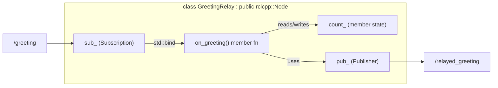

# ROS Basics in 5 Days (C++) — Unit 8: Using C++ Classes in ROS

Every node so far has been a single `main()` function with lambdas and free functions. That's fine for a 20-line demo, but it stops scaling the moment a node owns more than one publisher, subscriber, or piece of state that callbacks need to share. This unit shows the class-based pattern real ROS C++ code actually uses.

The diagram below shows the `GreetingRelay` class's internal wiring: the subscription callback is a member function that reads and updates shared member state before publishing.



## Why wrap a node in a class
Free-function callbacks that need to share state (a running average, a counter, a cached last message) end up reaching for global variables, which is exactly the kind of code you already know to avoid outside of ROS. Wrapping the node in a class fixes this the normal C++ way: shared state becomes member variables, callbacks become member functions with natural access to that state, and setup logic moves into a constructor instead of being scattered through `main()`.

## The standard shape
Inherit from `rclcpp::Node`, do all setup in the constructor, and keep publishers/subscribers/services as member variables so they live as long as the object does:

```cpp
#include "rclcpp/rclcpp.hpp"
#include "std_msgs/msg/string.hpp"

class GreetingRelay : public rclcpp::Node {
public:
  GreetingRelay() : Node("greeting_relay"), count_(0) {
    pub_ = create_publisher<std_msgs::msg::String>("/relayed_greeting", 10);
    sub_ = create_subscription<std_msgs::msg::String>(
        "/greeting", 10,
        std::bind(&GreetingRelay::on_greeting, this, std::placeholders::_1));
  }

private:
  void on_greeting(const std_msgs::msg::String::SharedPtr msg) {
    count_++;
    auto out = std_msgs::msg::String();
    out.data = msg->data + " (relayed #" + std::to_string(count_) + ")";
    pub_->publish(out);
  }

  rclcpp::Publisher<std_msgs::msg::String>::SharedPtr pub_;
  rclcpp::Subscription<std_msgs::msg::String>::SharedPtr sub_;
  int count_;
};

int main(int argc, char **argv) {
  rclcpp::init(argc, argv);
  rclcpp::spin(std::make_shared<GreetingRelay>());
  rclcpp::shutdown();
  return 0;
}
```

`main()` is now three lines and never changes shape no matter how complex the node gets — all the interesting code lives in the class. Note `std::bind(&GreetingRelay::on_greeting, this, ...)` (or an equivalent lambda capturing `this`) is required to hook a member function up as a callback, since member functions carry an implicit `this` argument that free functions don't.

## Encapsulating multiple interfaces cleanly
The real payoff shows up once a node has several publishers, a subscriber, and a service, all needing to coordinate through shared state (e.g. don't publish a command until a status subscriber has received at least one message). As a member variable, that "have I received data yet" flag is trivially shared between the constructor, the subscriber callback, and a timer callback — no globals, no passing state through function arguments across unrelated callbacks.

## Composition over one giant node
Resist the urge to put your whole robot's logic in one class. The same discipline you'd apply to any C++ codebase applies here: a class per responsibility, one node per class (usually), and let the ROS graph — not internal function calls — be the seam between responsibilities. This is what makes individual pieces independently testable and replaceable later.

## Try it yourself
Rewrite the `SetSpeed` service server from Unit 7 as a class that also tracks, as a member variable, how many requests have been accepted versus rejected, and exposes that count through a simple additional service or a periodically published message.
