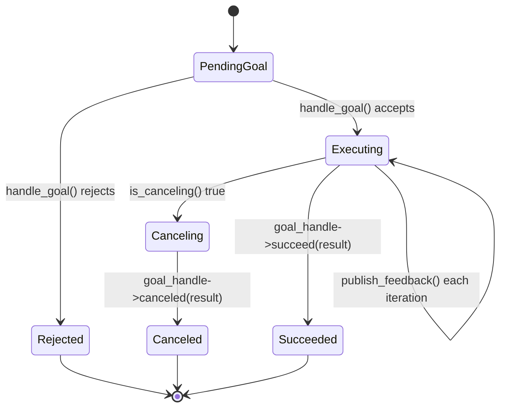

# ROS Basics in 5 Days (C++) — Unit 10: Understanding ROS Actions - Servers

The client from Unit 9 needs a server to talk to. Building one is the most involved node type in this course, because unlike a service callback (run once, return), an action server callback typically runs a loop — publishing feedback, checking for cancellation, and eventually producing a result.

The state diagram below shows a goal's lifecycle on the server side, from acceptance through the feedback loop to its terminal state.



## Anatomy of an action server
An action server registers three callbacks: one to decide whether to **accept or reject** an incoming goal, one to decide whether to accept a **cancel request**, and one that actually **executes** the goal once accepted — this last one is where your real work and your feedback-publishing loop live. The execution callback typically runs on its own thread (or is dispatched to one), since it may run for seconds or longer and must not block the node's other callbacks.

## Writing an action server in C++
Continuing the `Fibonacci` action from Unit 9:

```cpp
#include "rclcpp/rclcpp.hpp"
#include "rclcpp_action/rclcpp_action.hpp"
#include "your_package/action/fibonacci.hpp"
#include <thread>

using Fibonacci = your_package::action::Fibonacci;
using GoalHandle = rclcpp_action::ServerGoalHandle<Fibonacci>;

rclcpp_action::GoalResponse handle_goal(
    const rclcpp_action::GoalUUID &, std::shared_ptr<const Fibonacci::Goal> goal) {
  if (goal->order < 1) return rclcpp_action::GoalResponse::REJECT;
  return rclcpp_action::GoalResponse::ACCEPT_AND_EXECUTE;
}

rclcpp_action::CancelResponse handle_cancel(const std::shared_ptr<GoalHandle>) {
  return rclcpp_action::CancelResponse::ACCEPT;
}

void execute(const std::shared_ptr<GoalHandle> goal_handle) {
  auto feedback = std::make_shared<Fibonacci::Feedback>();
  auto result = std::make_shared<Fibonacci::Result>();
  feedback->partial_sequence = {0, 1};

  for (int i = 0; i < goal_handle->get_goal()->order && rclcpp::ok(); ++i) {
    if (goal_handle->is_canceling()) {
      result->sequence = feedback->partial_sequence;
      goal_handle->canceled(result);
      return;
    }
    auto n = feedback->partial_sequence.size();
    feedback->partial_sequence.push_back(
        feedback->partial_sequence[n - 1] + feedback->partial_sequence[n - 2]);
    goal_handle->publish_feedback(feedback);
    std::this_thread::sleep_for(std::chrono::milliseconds(200));
  }

  result->sequence = feedback->partial_sequence;
  goal_handle->succeed(result);
}

int main(int argc, char **argv) {
  rclcpp::init(argc, argv);
  auto node = std::make_shared<rclcpp::Node>("fibonacci_server");
  auto server = rclcpp_action::create_server<Fibonacci>(
      node, "fibonacci", &handle_goal, &handle_cancel,
      [](const std::shared_ptr<GoalHandle> gh) {
        std::thread(execute, gh).detach();
      });
  rclcpp::spin(node);
  rclcpp::shutdown();
  return 0;
}
```

## Designing your own action
The same discipline from Unit 7's service design applies, with one extra question: what does meaningful *feedback* look like for this goal? For a navigation goal it might be distance remaining; for a gripper it might be current jaw position. If you can't think of anything useful to report incrementally, the task probably doesn't need to be an action — a service may suffice after all.

## Honoring cancellation is not optional
Note the `goal_handle->is_canceling()` check inside the execution loop — without it, calling cancel from the client does nothing but flip an internal flag that your server never looks at, and the goal runs to completion regardless. Any execution loop longer than a fraction of a second should check this on every iteration.

## Try it yourself
Add a `bool report_intermediate` field to the `Fibonacci` goal (or your own action) that, when false, skips publishing feedback and only returns the final result — then write a client that sends both variants and confirms it only receives feedback callbacks in the `true` case.
