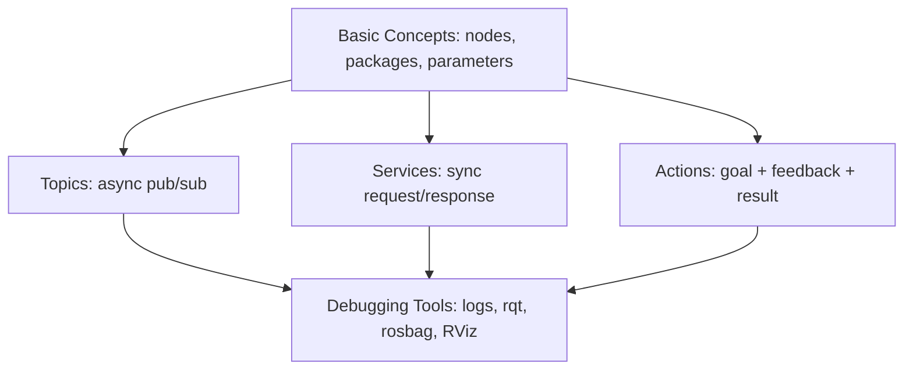

# ROS Basics in 5 Days (Python) — Unit 1: ROS Deconstruction

Before diving into code, this unit lays out the map of everything you need to learn to program a robot with ROS, and explains the teaching method the rest of the course follows. Think of it as the syllabus made concrete.

The diagram below shows how the five core areas relate: basic concepts underpin the three communication mechanisms, and debugging tools apply across all of them.

## The five things you need to learn

ROS can feel enormous because its documentation covers navigation stacks, perception pipelines, simulators, and more. Strip that away and the actual *core* of ROS — the part every single ROS program depends on — is small:

- **Basic concepts**: nodes, packages, the parameter server, environment variables, and `roscore`/the discovery mechanism that lets nodes find each other. This is the scaffolding everything else sits on.
- **Topics**: an asynchronous, many-to-many publish/subscribe channel for streaming data (sensor readings, velocity commands, images). No acknowledgment, no return value — just a continuous flow.
- **Services**: a synchronous, one-to-one request/response call, like a remote function call. You ask, you block, you get an answer back.
- **Actions**: for long-running, goal-oriented tasks (navigate to this pose, close the gripper) that need progress feedback and the ability to be cancelled mid-way — something neither topics nor services handle well on their own.
- **Debugging tools**: logging, `rqt` introspection tools, `rosbag` for recording/replaying data, and RViz for 3D visualization — because a robot that silently does the wrong thing is far harder to fix than one that crashes with a stack trace.

Everything else in ROS — navigation, manipulation, perception packages — is built as ordinary nodes talking over exactly these three mechanisms. Master topics, services, and actions, and you can read the source of almost any ROS package and understand its architecture.

## The main goal of this course

The goal isn't to memorize API calls. It's to build a mental model precise enough that, given an unfamiliar ROS package, you can answer: which nodes exist, what topics/services/actions connect them, and what each message actually carries. That model is what lets you debug other people's robots and design your own systems, not just complete tutorial exercises.

## How this course teaches ROS: two angles at once

Each concept in this course is attacked two ways. First, a **theoretical pass**: a short explanation of what the mechanism is and why it exists, usually with a diagram-in-words comparing it to something you already know (a topic is like a radio broadcast; a service is like a function call; an action is like a service that streams progress updates). Second, an **applied pass**: you write the actual Python code against a simulated robot and watch it behave — no mechanism in this course is left as pure theory. This mirrors how most experienced ROS developers actually learn: read just enough to know what a tool is for, then use it until the shape of it is obvious.

## Practical notes for the rest of the course

A few housekeeping points that matter once you start typing commands:

- **ROS distribution**: this course teaches concepts and command patterns that are stable across recent ROS 2 distributions (Humble, Iron, Jazzy, and beyond). Command names shown here are current ROS 2 CLI syntax (`ros2 <verb> ...`); if your installed distribution differs slightly, `ros2 <verb> --help` will show you the exact flags.
- **Workspaces**: you'll do all your work inside a ROS workspace (a directory with a `src/` folder built with `colcon`), which Unit 2 sets up from scratch.
- **Simulation first**: every exercise in this course runs against a simulated robot, so a missing physical robot is never a blocker — you can complete the entire course on a laptop.

## Getting a certificate and where credit is due

Some versions of this course offer a certificate once you complete every unit's exercises and pass the auto-corrected quizzes in Units 4, 6, and 9 — a useful checkpoint even if you don't need the paper, since it forces you to actually finish the hands-on work rather than just read it. And as with any course built on an open-source project, credit belongs partly elsewhere: ROS itself is the product of a large open-source community, and the specific simulated robots and exercises used throughout this course (the mobile base, the quadrotor) build on packages and simulation environments maintained by that same community.

## Try it yourself

Pick any ROS package you can find online (search for a small one on GitHub, e.g. a simple teleoperation package). Without reading its full source, look only at its `package.xml` and the topic/service/action names it advertises, and write one sentence guessing what each communication channel is for. You'll be doing this kind of reverse-engineering constantly once you're past this course.
