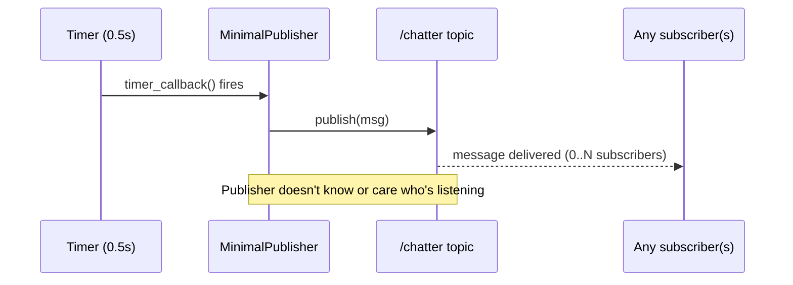

# ROS Basics in 5 Days (Python) — Unit 3: Understanding ROS Topics - Publishers

Topics are the workhorse of ROS communication — most of the data flowing through a robot (sensor readings, velocity commands, state estimates) moves over topics. This unit covers the *publishing* side: how a node broadcasts data for anyone to consume.

The sequence below shows the fire-and-forget nature of publishing: the timer drives the callback, and the publisher sends into the topic without knowing who (if anyone) is listening.



## What a topic publisher is

A topic is a named, typed channel. A **publisher** is a node's declaration that it will periodically send data on that channel — it doesn't know or care who, if anyone, is listening. This is the defining trait of pub/sub communication: it's decoupled. You can add a second subscriber to `/cmd_vel` (say, a logger that records every velocity command for later analysis) without changing a single line of the publisher's code. Compare that to services, covered in Unit 5, where the caller and callee are directly coupled by a single request/response exchange.

Because publishing is fire-and-forget, it's the right tool for continuous streams: laser scans, camera frames, joint states, odometry — data that's naturally a sequence over time, where the latest value usually matters more than guaranteeing every single message was received.

## Messages

Every topic has a **message type** — a strict schema defining the fields the data must contain, similar to a struct or a protobuf definition. ROS ships a large library of standard message packages (`std_msgs`, `geometry_msgs`, `sensor_msgs`) so that unrelated packages agree on how to represent common things like a 3D twist or a point cloud. You inspect a message type's fields with:

```bash
ros2 interface show std_msgs/msg/String
ros2 interface show geometry_msgs/msg/Twist
```

`std_msgs/msg/String` is the simplest message you'll use, with a single field: `string data`. You'll define your *own* custom message types in Unit 4, but for your first publisher, sticking to a standard type keeps the focus on the publish/subscribe mechanics.

## Create your first publisher

A publisher node has three parts: create a publisher object bound to a topic name and message type, create a timer (or some other trigger) that fires periodically, and inside that callback, construct a message and call `.publish()`.

```python
import rclpy
from rclpy.node import Node
from std_msgs.msg import String

class MinimalPublisher(Node):
    def __init__(self):
        super().__init__('minimal_publisher')
        self.publisher_ = self.create_publisher(String, 'chatter', 10)
        self.timer = self.create_timer(0.5, self.timer_callback)
        self.count = 0

    def timer_callback(self):
        msg = String()
        msg.data = f'Hello ROS, message #{self.count}'
        self.publisher_.publish(msg)
        self.get_logger().info(f'Publishing: "{msg.data}"')
        self.count += 1

def main():
    rclpy.init()
    node = MinimalPublisher()
    rclpy.spin(node)
    rclpy.shutdown()

if __name__ == '__main__':
    main()
```

The `10` in `create_publisher(String, 'chatter', 10)` is the queue size (QoS depth) — how many outgoing messages to buffer if a subscriber can't keep up. Run it and verify it's alive without writing a subscriber at all:

```bash
ros2 run my_first_pkg minimal_publisher
# in another terminal:
ros2 topic echo /chatter
ros2 topic hz /chatter    # confirm the publish rate matches your timer
```

## Try it yourself

Modify `MinimalPublisher` to publish `geometry_msgs/msg/Twist` messages on `/cmd_vel` at 2 Hz instead of `std_msgs/String` on `/chatter`, alternating the linear x velocity between `0.2` and `-0.2` every message so a robot would visibly rock back and forth. Confirm with `ros2 topic echo /cmd_vel` that the values alternate as expected.
