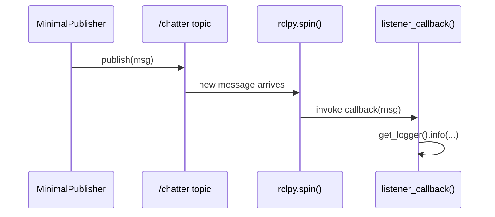

# ROS Basics in 5 Days (Python) — Unit 4: Understanding ROS Topics - Subscribers

Publishers are only half of the topic story. This unit covers the receiving end — subscribers — and how to define your own message type when none of the standard ones fit your data.

The sequence below shows what `rclpy.spin()` actually does: it's the loop that notices a new message and drives your callback, rather than your code calling the callback itself.



## The topic subscriber

A **subscriber** registers interest in a topic and a callback function; ROS invokes that callback every time a new message arrives, asynchronously, on the executor's thread. Unlike a normal function call, you never call the callback yourself — you hand control to `rclpy.spin()` and let the ROS executor drive your node's callbacks as messages arrive on any subscribed topic, timer, service, or action.

```python
import rclpy
from rclpy.node import Node
from std_msgs.msg import String

class MinimalSubscriber(Node):
    def __init__(self):
        super().__init__('minimal_subscriber')
        self.subscription = self.create_subscription(
            String, 'chatter', self.listener_callback, 10)

    def listener_callback(self, msg):
        self.get_logger().info(f'I heard: "{msg.data}"')

def main():
    rclpy.init()
    node = MinimalSubscriber()
    rclpy.spin(node)
    rclpy.shutdown()

if __name__ == '__main__':
    main()
```

The `10` again sets the incoming queue depth. Note that the subscriber's message type and topic name must match the publisher's *exactly* — ROS will not connect a `String` subscriber to a `Twist` publisher on the same topic name; they simply won't see each other, which is a common source of "why isn't my callback firing" bugs.

## Hands-on: publisher and subscriber together

Run `minimal_publisher` from Unit 3 in one terminal and `minimal_subscriber` in another (same workspace, both built and sourced) and watch the subscriber's log lines track the publisher's output in real time. Then use the introspection tools to confirm the connection exists independently of your own logging:

```bash
ros2 node info /minimal_subscriber   # shows it's subscribed to /chatter
ros2 topic info /chatter --verbose   # shows publisher AND subscriber counts
```

If `ros2 topic info` shows one publisher and zero subscribers, your subscriber node either isn't running, is subscribed to the wrong topic name, or hasn't been sourced from a freshly built workspace.

## Custom topic messages

When `std_msgs` types (bare strings, ints, floats) aren't expressive enough, you define a custom `.msg` file. Put it in a `msg/` folder inside a package (by convention, a dedicated `_msgs` package, e.g. `my_robot_msgs`) and declare it in `CMakeLists.txt`/`package.xml` so the interface generator picks it up:

```
# my_robot_msgs/msg/RobotStatus.msg
string robot_name
float64 battery_percent
bool is_charging
```

After building, this generates a full Python class (`RobotStatus`) with those three fields, usable exactly like any standard message type:

```python
from my_robot_msgs.msg import RobotStatus

msg = RobotStatus()
msg.robot_name = 'bb8'
msg.battery_percent = 87.5
msg.is_charging = False
self.publisher_.publish(msg)
```

Custom messages can nest other messages and use array fields, which is how complex types like `sensor_msgs/msg/LaserScan` are built up from simpler primitives.

## Try it yourself

Define a custom message `TemperatureAlert` with fields `string sensor_id`, `float64 celsius`, and `bool over_threshold`. Write a publisher that sends a random-ish temperature reading every second and sets `over_threshold` to `true` whenever `celsius > 40.0`, and a subscriber that only logs a warning when it receives a message with `over_threshold == true`.
