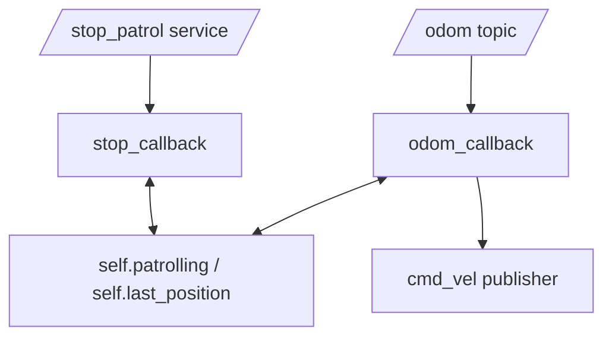

# ROS Basics in 5 Days (Python) — Unit 7: Using Python Classes in ROS

Every example so far has already used a class without dwelling on why. This unit makes that choice explicit: how object-oriented structure maps onto ROS nodes, and what you gain (and could lose) by using it well.

The diagram below shows the `PatrolNode` example: three separate ROS interfaces (a subscription, a publisher, a service) all reading and writing the same shared instance state instead of talking to each other directly.



## Object-oriented programming in the context of ROS

You already know OOP — this isn't a Python tutorial. The relevant point is *why* ROS's client libraries (`rclpy`) are built around subclassing `Node`. A ROS node typically needs to hold onto state across many independent callback invocations: a publisher handle, a subscription handle, counters, cached sensor readings, configuration values. A plain function has no natural place to keep that state between calls; a class instance does, via `self`. So the idiomatic ROS pattern is: one class per node, `__init__` sets up publishers/subscribers/services/timers and initializes state, and instance methods serve as the callbacks that mutate that state over the node's lifetime.

## What a Python class buys you here, concretely

Recall the boilerplate from every earlier example:

```python
class MinimalPublisher(Node):
    def __init__(self):
        super().__init__('minimal_publisher')
        self.publisher_ = self.create_publisher(String, 'chatter', 10)
        self.timer = self.create_timer(0.5, self.timer_callback)
        self.count = 0

    def timer_callback(self):
        ...
```

`super().__init__('minimal_publisher')` registers the node with the ROS graph under that name — this is inheritance doing real work, not ceremony: `Node` provides `create_publisher`, `create_subscription`, `create_service`, `create_timer`, `get_logger`, and parameter handling, all pre-wired to this specific node's identity. `self.publisher_` and `self.count` are instance attributes that persist between calls to `timer_callback` — which is exactly what you need, since the count must increment across many independent timer firings.

## Combining multiple ROS interfaces in one class

Real nodes are rarely "just a publisher" or "just a subscriber" — they mix several interfaces, and a class is what makes that manageable:

```python
class PatrolNode(Node):
    def __init__(self):
        super().__init__('patrol_node')
        self.cmd_pub = self.create_publisher(Twist, 'cmd_vel', 10)
        self.odom_sub = self.create_subscription(
            Odometry, 'odom', self.odom_callback, 10)
        self.status_srv = self.create_service(
            Trigger, 'stop_patrol', self.stop_callback)
        self.patrolling = True
        self.last_position = None

    def odom_callback(self, msg):
        self.last_position = msg.pose.pose.position
        if self.patrolling:
            self.cmd_pub.publish(self._next_command())

    def stop_callback(self, request, response):
        self.patrolling = False
        response.success = True
        return response

    def _next_command(self):
        cmd = Twist()
        cmd.linear.x = 0.2
        return cmd
```

Every callback (`odom_callback`, `stop_callback`) reads and writes shared instance state (`self.patrolling`, `self.last_position`) — this is the pattern you'll use for essentially every non-trivial node from here on, including the action servers in Unit 9. Note the private helper `_next_command`: nothing stops you from adding ordinary (non-callback) methods to a node class for internal logic, exactly as you would in any other OOP design.

## Try it yourself

Take your `SetLed` service server from Unit 6 and extend the class with a new subscriber on a topic `/battery_level` (`std_msgs/msg/Float64`) that updates an instance attribute `self.battery_percent` whenever a new reading arrives. Change the `set_led_callback` to return this live `self.battery_percent` in its response instead of the hardcoded `76.0` — this is the first time in the course two different callbacks on the same node communicate through shared state instead of ROS messages.
