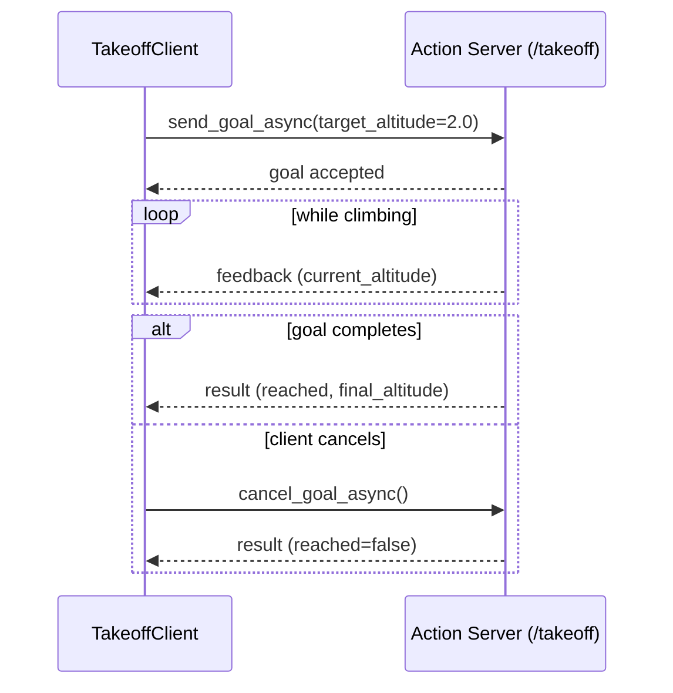

# ROS Basics in 5 Days (Python) — Unit 8: Understanding ROS Actions - Clients

Topics stream data and services answer quick questions, but neither handles a task that takes real time and needs to be monitored or cancelled. That's what actions are for. This unit covers the client side, using a simulated quadrotor as the running example.

The sequence below shows the full goal lifecycle from the client's perspective: send a goal, receive feedback while it runs, and either get a result or cancel partway through.



## The quadrotor simulation

For this unit, exercises run against a simulated quadrotor (drone) that exposes an action for taking off to and holding a target altitude — a good example precisely because it *isn't* instantaneous: the drone needs several seconds to climb, you'd like to know how high it currently is while it climbs, and you might want to abort the climb partway through. Keep this scenario in mind through the rest of the unit; every action concept below maps onto "tell the drone to climb to 2 meters and let me track/cancel that."

## What are actions, and how do they differ from topics and services?

An action is built from *three* message parts, not two: a **goal** (what you're asking for — e.g. target altitude), **feedback** (periodic progress updates streamed back while the goal is active — e.g. current altitude), and a **result** (the final outcome once the goal finishes — e.g. success/failure and total time taken). Structurally, an action server is implemented on top of topics and services under the hood, but as a user of the action, you interact with it through a dedicated action client/server API that hides that plumbing.

```
# example: Takeoff.action
float64 target_altitude
---
bool reached
float64 final_altitude
---
float64 current_altitude
```

The three sections (separated by `---`) are goal, result, and feedback, in that order.

## Calling an action server, and the action client

Calling an action server means sending a goal, then handling three possible outcomes over time: feedback arriving, a result arriving, or you deciding to cancel. A Python action client:

```python
import rclpy
from rclpy.node import Node
from rclpy.action import ActionClient
from my_drone_msgs.action import Takeoff

class TakeoffClient(Node):
    def __init__(self):
        super().__init__('takeoff_client')
        self._client = ActionClient(self, Takeoff, 'takeoff')

    def send_goal(self, altitude):
        self._client.wait_for_server()
        goal = Takeoff.Goal()
        goal.target_altitude = altitude
        send_future = self._client.send_goal_async(
            goal, feedback_callback=self.feedback_cb)
        send_future.add_done_callback(self.goal_response_cb)

    def feedback_cb(self, feedback_msg):
        self.get_logger().info(
            f'Current altitude: {feedback_msg.feedback.current_altitude:.2f} m')

    def goal_response_cb(self, future):
        goal_handle = future.result()
        if not goal_handle.accepted:
            self.get_logger().info('Goal rejected')
            return
        result_future = goal_handle.get_result_async()
        result_future.add_done_callback(self.result_cb)

    def result_cb(self, future):
        result = future.result().result
        self.get_logger().info(f'Reached: {result.reached} at {result.final_altitude:.2f} m')
```

## Doing other work while the action runs, and preempting a goal

Because `send_goal_async` returns immediately, the node's executor is free to keep processing other callbacks — subscriptions, timers, other service calls — while the drone climbs in the background. This is the key advantage over a blocking service call for long tasks: your node stays responsive. If circumstances change mid-climb (an obstacle detected on another topic, say), you cancel the in-flight goal rather than waiting for it to finish:

```python
def cancel_takeoff(self, goal_handle):
    cancel_future = goal_handle.cancel_goal_async()
    cancel_future.add_done_callback(
        lambda f: self.get_logger().info('Cancel request sent'))
```

The server decides how to actually respond to a cancel request (Unit 9 covers writing that logic) — the client only *requests* preemption, it can't force an immediate stop.

## Testing an action from the command line

Before ROS 2's current tooling, ROS 1 had a graphical tool called `axclient` for manually sending goals to an action server. The direct equivalent today is the `ros2 action` CLI, which needs no custom client code at all:

```bash
ros2 action list
ros2 action info /takeoff
ros2 action send_goal /takeoff my_drone_msgs/action/Takeoff "{target_altitude: 2.0}" --feedback
```

The `--feedback` flag streams feedback messages to your terminal as they arrive, which is invaluable for testing an action server in isolation before writing any client code against it.

## Try it yourself

Using `ros2 action send_goal --feedback` against any action server available in your environment (or the `Takeoff` example above if you've implemented Unit 9's server), send a goal, watch the feedback stream, and press Ctrl-C partway through — then check with `ros2 action list` and `ros2 action info` whether the server considers the goal still active or aborted.
