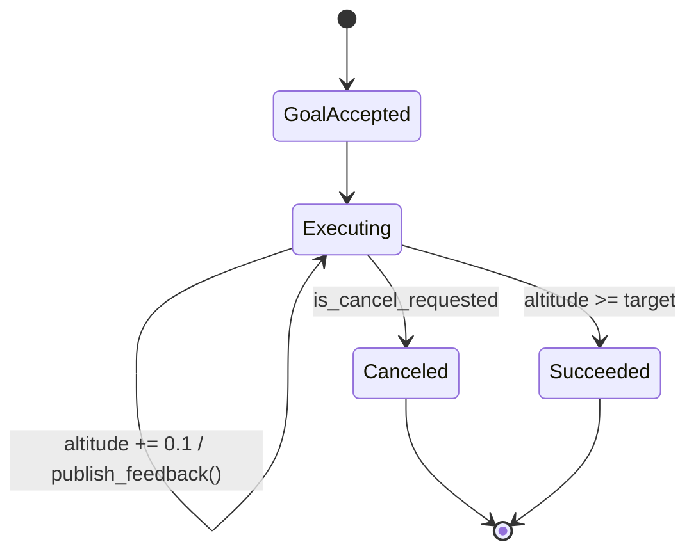

# ROS Basics in 5 Days (Python) — Unit 9: Understanding ROS Actions - Servers

You've driven an action from the client side; now you'll build the server that actually executes the goal, streams feedback, and produces a result — the most involved node type in this course, because it has to manage state over time instead of responding instantly.

The state diagram below shows the `execute_callback` loop as a state machine: it stays in "Executing" publishing feedback each pass, until either the target is reached or a cancel request is noticed.



## The action server

An action server registers an **execute callback** that ROS invokes in its own thread whenever a new goal is accepted. Unlike a service callback (which runs once and returns), an execute callback typically contains a loop: do a bit of work, publish feedback, check whether cancellation was requested, repeat until done, then return a result.

```python
import time
import rclpy
from rclpy.action import ActionServer
from rclpy.node import Node
from my_drone_msgs.action import Takeoff

class TakeoffServer(Node):
    def __init__(self):
        super().__init__('takeoff_server')
        self._server = ActionServer(
            self, Takeoff, 'takeoff', self.execute_callback)
        self.altitude = 0.0

    def execute_callback(self, goal_handle):
        target = goal_handle.request.target_altitude
        feedback = Takeoff.Feedback()

        while self.altitude < target:
            if goal_handle.is_cancel_requested:
                goal_handle.canceled()
                result = Takeoff.Result()
                result.reached = False
                result.final_altitude = self.altitude
                return result

            self.altitude += 0.1
            feedback.current_altitude = self.altitude
            goal_handle.publish_feedback(feedback)
            time.sleep(0.1)

        goal_handle.succeed()
        result = Takeoff.Result()
        result.reached = True
        result.final_altitude = self.altitude
        return result

def main():
    rclpy.init()
    node = TakeoffServer()
    rclpy.spin(node)
    rclpy.shutdown()

if __name__ == '__main__':
    main()
```

Three method calls on `goal_handle` matter here: `publish_feedback()` sends an in-progress update to any client that asked for it; `goal_handle.is_cancel_requested` is how the server notices a client asked to preempt; and exactly one of `succeed()`, `abort()`, or `canceled()` must be called before returning, or the client's result future never resolves cleanly.

## Try it yourself: run client and server together

Run `TakeoffServer` in one terminal and the `TakeoffClient` from Unit 8 (or `ros2 action send_goal --feedback`) in another. Send a goal for `target_altitude: 3.0`, watch the feedback climb by 0.1 every 100ms, and confirm the final result reports `reached: true`. Then send another goal and cancel it (Ctrl-C the CLI call, or call `cancel_goal_async` from a client) partway up — confirm the result reports `reached: false` with whatever altitude it reached before cancellation.

## Custom action messages

Just like `.msg` and `.srv` files, you author `.action` files in an `action/` directory, with three sections separated by `---`: goal, result, feedback (in that order — easy to mix up with services, which are only two sections). A second worked example, for a "drive to distance" action on a ground robot:

```
# my_robot_msgs/action/DriveDistance.action
float64 target_meters
---
bool success
float64 meters_traveled
---
float64 meters_traveled_so_far
```

The generated Python class exposes `.Goal()`, `.Result()`, and `.Feedback()` nested types automatically, exactly like the `Takeoff` example above — there's nothing special about actions here versus the topic and service message generation you've already used in Units 4 and 6.

## Design habit: keep the execute callback responsive to cancellation

The most common bug in a first action server is a loop that does a large chunk of work (or sleeps a long time) between checks of `is_cancel_requested`. If your real work is inherently chunky (e.g. a single call to a slow motion-planning library), poll for cancellation as frequently as your actual task allows, and document clearly what granularity of cancellation clients can expect — "cancels within one planning step" is a legitimate limitation, but callers need to know it.

## Try it yourself

Implement the `DriveDistance` action server above, incrementing `meters_traveled_so_far` by `0.05` every 50ms until it reaches `target_meters`, publishing feedback each step. Then write a quick client (or use `ros2 action send_goal --feedback`) that requests `target_meters: 1.0` and confirms the feedback stream ends with a result reporting `success: true` and `meters_traveled: 1.0`.
