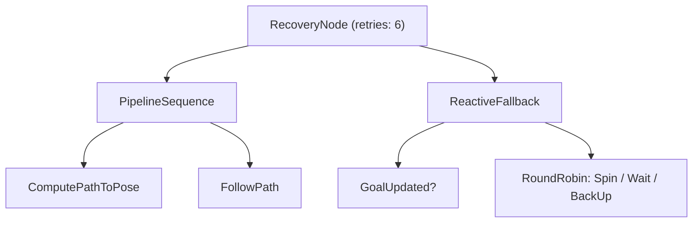

# Advanced ROS2 Navigation — Unit 2: Behavior Trees

Nav2's high-level decision-making — "plan, then follow the path, and if that fails, try a recovery, and if that fails too, give up" — is not hardcoded C++. It's data: an XML file interpreted at runtime by the `bt_navigator` node using a behavior tree. This unit opens that file up and teaches you to read, extend, and debug it.

The diagram below previews the shape of Nav2's default recovery tree (dissected later in this unit) as a tree of composite and leaf nodes rather than raw XML.



## What is the BT Navigator

A **behavior tree (BT)** is a tree of nodes evaluated top-to-bottom, left-to-right, on every "tick." Each node returns `SUCCESS`, `FAILURE`, or `RUNNING`. The two workhorse composite node types you'll see constantly in Nav2's trees are:

- **Sequence** — ticks children in order, stops (returns `FAILURE`) at the first child that fails; returns `SUCCESS` only if all children succeed. This is your "do A, then B, then C" logic.
- **Fallback** (a.k.a. Selector) — ticks children in order, stops (returns `SUCCESS`) at the first child that succeeds; only fails if every child fails. This is your "try A, and if that doesn't work, try B" logic.

`bt_navigator` is a ROS 2 lifecycle node that loads one of these XML trees, ticks it at a fixed rate (commonly 10 Hz), and each tick walks down through composites into **leaf nodes** — Action nodes (call the planner, call the controller, spin in place) and Condition nodes (is the goal reached? is a recovery needed?) — that are themselves implemented as pluginlib plugins backed by real ROS 2 actions and topics. This is why "compute a path" in the tree corresponds to an actual `ComputePathToPose` action call to `planner_server` under the hood.

## Anatomy of the behavior tree XML

Nav2 ships default trees (e.g. `navigate_to_pose_w_replanning_and_recovery.xml`) that follow a recognizable shape:

```xml
<root BTCPP_format="4">
  <BehaviorTree ID="MainTree">
    <RecoveryNode number_of_retries="6" name="RecoveryNode">
      <PipelineSequence name="NavigateWithReplanning">
        <RateController hz="1.0">
          <ComputePathToPose goal="{goal}" path="{path}" planner_id="GridBased"/>
        </RateController>
        <FollowPath path="{path}" controller_id="FollowPath"/>
      </PipelineSequence>
      <ReactiveFallback name="RecoveryFallback">
        <GoalUpdated/>
        <RoundRobin name="RecoveryActions">
          <Spin spin_dist="1.57"/>
          <Wait wait_duration="5"/>
          <BackUp backup_dist="0.15" backup_speed="0.025"/>
        </RoundRobin>
      </ReactiveFallback>
    </RecoveryNode>
  </BehaviorTree>
</root>
```

Read it as: keep replanning and following the path (`PipelineSequence` re-ticks the planner every second while `FollowPath` runs continuously); if that whole branch fails, fall back to trying a recovery action (spin, wait, back up, cycling through them with `RoundRobin`) up to six times before giving up entirely (`RecoveryNode`'s retry count). The `{goal}` and `{path}` syntax is a **blackboard** entry — a shared key-value store all nodes in the tree can read and write, which is how a `ComputePathToPose` output becomes a `FollowPath` input without any node needing a direct reference to another.

## Creating and providing your own behavior

You extend Nav2's decision-making by writing a new XML tree (composing existing action/condition nodes differently) or a brand-new leaf node in C++ registered as a BT plugin, then telling `bt_navigator` to use it. The simplest extension is usually just a new XML file — for example, a tree that skips recoveries entirely and fails fast, useful for a robot operating in a controlled test environment where you want errors to surface immediately rather than be retried away.

Point `bt_navigator` at your custom tree via its parameters:

```yaml
bt_navigator:
  ros__parameters:
    default_nav_to_pose_bt_xml: "/absolute/path/to/my_custom_tree.xml"
    plugin_lib_names:
      - nav2_compute_path_to_pose_action_bt_node
      - nav2_follow_path_action_bt_node
      - nav2_spin_action_bt_node
      # ...one entry per BT node plugin your tree references
```

**Hands-on practice:** write a minimal tree that computes a path and follows it with zero recovery — a bare `Sequence` of `ComputePathToPose` then `FollowPath` — save it as your own `.xml`, point `default_nav_to_pose_bt_xml` at it, restart `bt_navigator`, and send a goal. Then deliberately obstruct the path and observe that the robot now fails outright instead of recovering, confirming your tree (not the default) is running.

## Visualizing with Groot and recovery behaviors

Hand-reading XML gets old fast. **Groot** (the BT.CPP visual editor/monitor, ships alongside `BehaviorTree.CPP`) connects live to a running `bt_navigator` over its BT monitoring port and shows you the tree ticking in real time — which node is `RUNNING`, which just returned `FAILURE` — which is by far the fastest way to debug "why did my robot just spin in place." Point Groot's "Monitor" mode at the navigator's publisher port (configured via the `bt_navigator`'s groot parameters) and drive a goal to watch it light up node-by-node.

**Recovery behaviors** — `Spin`, `Wait`, `BackUp`, and `DriveOnHeading` are the built-in ones — exist because navigation failure is normal, not exceptional: a costmap can mark a transient obstacle lethal, a controller can get stuck against a wall, a plan can become momentarily infeasible. Rather than bailing out immediately, Nav2's default trees treat these as a first line of defense, escalating to task failure only after several combined attempts. When you write your own trees, deciding *which* recoveries to try, in what order, and how many times is the actual design work — the leaf nodes are already built for you.

## Try it yourself

Open one of Nav2's default BT XML files (search your ROS 2 install for `navigate_to_pose_w_replanning_and_recovery.xml`) and, without changing behavior, redraw it on paper as a tree with Sequence/Fallback/RecoveryNode boxes. Then make one real change: swap the `RoundRobin` recovery order so `Wait` runs before `Spin`, save it as a custom tree, point `bt_navigator` at it, and confirm with Groot (or `ros2 topic echo` on the BT log topic) that your new order is actually what executes when you force a recovery.
