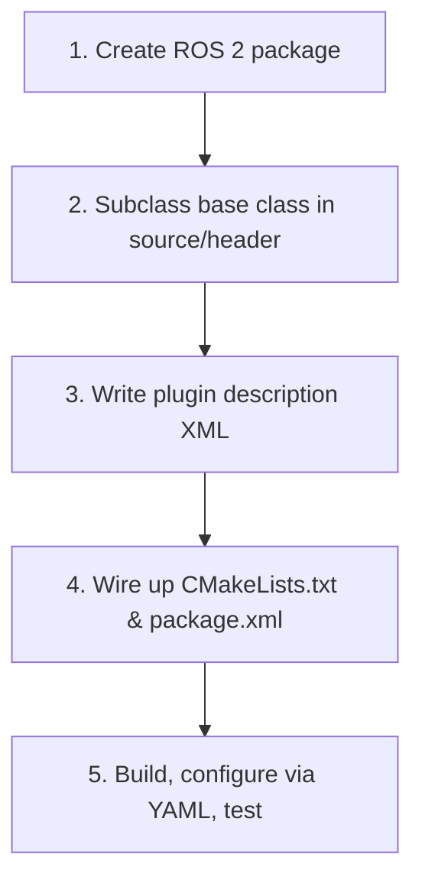

# Advanced ROS2 Navigation — Unit 3: Nav2 Plugins and Custom Plugin Creation

Nearly every algorithmic piece of Nav2 — how a costmap layer marks obstacles, how a global path is computed, how a robot is steered along it — is a swappable plugin loaded at runtime, not something you edit and recompile Nav2 itself for. This unit covers how that plugin system works and walks through building one of each kind: a costmap plugin, a planner plugin, and a controller plugin.

The diagram below is the five-step recipe this unit keeps returning to — every custom costmap, planner, or controller plugin walks the same path from bare package to a loaded, tested plugin.



## Plugins in Nav2: the pluginlib pattern

Nav2 builds on ROS's `pluginlib`: each server (`costmap_2d`, `planner_server`, `controller_server`, ...) defines a C++ base class with a fixed interface, and plugins are concrete subclasses compiled into their own shared library, registered by name, and selected purely through YAML parameters at launch time — no changes to Nav2's own source. This is exactly the same mechanism `rviz2` uses for display types and `gazebo`/similar simulators use for sensor/physics plugins, so if you've touched either before the pattern will feel familiar.

The registration has two halves that must agree: a `PLUGINLIB_EXPORT_CLASS` macro in your `.cpp` naming the concrete class and the base class it implements, and a plugin description XML that maps a human-readable plugin name to that same class, referenced from `package.xml` so `pluginlib`'s class loader can find it via ROS's ament index at runtime — nothing is hardcoded to a file path.

## Default plugins: costmap, planner, and controller

Before writing your own, know what ships by default, since most custom plugins are really "the default one, tweaked":

- **Costmap layers** (`nav2_costmap_2d::Layer`): `StaticLayer` (loads the map), `ObstacleLayer`/`VoxelLayer` (mark live sensor obstacles), `InflationLayer` (spreads cost outward from obstacles so the planner keeps clearance). Layers stack — each one modifies a shared costmap in sequence.
- **Global planners** (`nav2_core::GlobalPlanner`): `NavfnPlanner` (Dijkstra/A* on the costmap), `SmacPlanner2D`/`SmacPlannerHybrid` (more modern, kinematically-aware planners).
- **Controllers** (`nav2_core::Controller`): `DWBLocalPlanner` (Dynamic Window Approach, itself pluginized further into critics), `RegulatedPurePursuitController` (path-tracking geared toward smooth, predictable following).

A custom plugin implements the same base-class interface as one of these and drops in as a direct replacement.

## The custom plugin workflow

All three plugin types (costmap, planner, controller) follow the identical five-step recipe — only the base class and the method bodies differ:

**Step 1 — create a new ROS 2 package.** A plugin is an ordinary `ament_cmake` package that depends on the relevant Nav2 core package:

```bash
ros2 pkg create my_nav2_plugins --build-type ament_cmake \
  --dependencies rclcpp nav2_core nav2_costmap_2d pluginlib
```

**Step 2 — write the source and header.** Subclass the appropriate base (`nav2_core::GlobalPlanner`, `nav2_core::Controller`, or `nav2_costmap_2d::Layer`) and implement its pure virtual methods — for a planner, that's chiefly `createPlan()`:

```cpp
// my_planner.hpp
class MyPlanner : public nav2_core::GlobalPlanner {
public:
  void configure(const rclcpp_lifecycle::LifecycleNode::WeakPtr & parent,
                  std::string name, std::shared_ptr<tf2_ros::Buffer> tf,
                  std::shared_ptr<nav2_costmap_2d::Costmap2DROS> costmap) override;
  nav_msgs::msg::Path createPlan(const geometry_msgs::msg::PoseStamped & start,
                                  const geometry_msgs::msg::PoseStamped & goal) override;
};
```

**Step 3 — write the plugin description XML**, pairing your class name with the base class `pluginlib` should load it as:

```xml
<class_libraries>
  <library path="my_nav2_plugins">
    <class type="my_nav2_plugins::MyPlanner" base_class_type="nav2_core::GlobalPlanner">
      <description>A minimal custom global planner.</description>
    </class>
  </library>
</class_libraries>
```

**Step 4 — wire up `CMakeLists.txt` and `package.xml`.** Build the library, `pluginlib_export_plugin_description_file()` to register the XML from step 3, and install both:

```cmake
add_library(my_nav2_plugins SHARED src/my_planner.cpp)
ament_target_dependencies(my_nav2_plugins rclcpp nav2_core pluginlib)
pluginlib_export_plugin_description_file(nav2_core my_planner_plugin.xml)
```

**Step 5 — configure, compile, and test.** Build with `colcon build --packages-select my_nav2_plugins`, point the relevant server at your plugin by name in its parameter YAML (e.g. `planner_server.ros__parameters.GridBased.plugin: "my_nav2_plugins::MyPlanner"`), restart the server, and send a navigation goal to confirm your code — not the default — is producing the path.

**Hands-on practice:** run through all five steps for a trivial costmap plugin that does nothing but mark one hardcoded rectangular region as lethal cost, and confirm it appears layered on top of the static map in RViz.

## Costmap, planner, and controller plugins: what differs

The base classes diverge exactly where the responsibilities do. A **costmap plugin** (`Layer`) implements `updateBounds()`/`updateCosts()` and only ever touches a shared cost grid — it has no notion of a path or a goal. A **planner plugin** (`GlobalPlanner`) implements `createPlan()`, consuming a costmap and a start/goal pose and returning a `nav_msgs::msg::Path`; it runs once per replanning cycle, not continuously. A **controller plugin** (`Controller`) implements `computeVelocityCommands()`, running at the control loop's full rate (commonly 20 Hz+) and turning "here's the current path and the robot's current pose" into a single `Twist`/`TwistStamped` every tick — it's the only one of the three with hard real-time expectations, since a slow controller directly stalls the robot.

## Try it yourself

Pick the `RegulatedPurePursuitController` (or your simulator's default controller) and read its parameter list in the Nav2 documentation. Then, following the five-step recipe above, scaffold (steps 1–4 only, no need to finish the algorithm) a new controller plugin package that subclasses `nav2_core::Controller` with stub method bodies, and get it building and loading by name in `controller_server` — even if `computeVelocityCommands()` just returns a zero `Twist`, confirming it loads without error is the real milestone.
