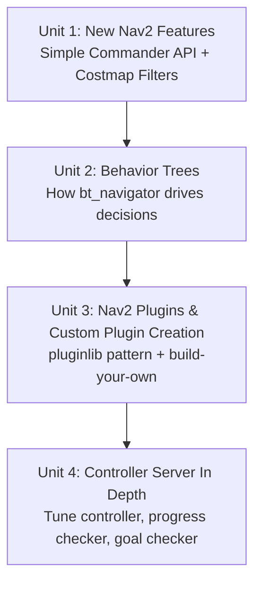

# Advanced ROS2 Navigation

This course picks up where a basic Nav2 course leaves off: instead of just getting a robot from A to B, it goes into the pieces that make Nav2 extensible and production-ready — scripting navigation and shaping costmaps with new Nav2 features, reading and authoring the behavior trees that drive Nav2's decision-making, building your own costmap/planner/controller plugins from scratch, and tuning the controller server's three cooperating plugin roles until path-following actually behaves the way you want.

The diagram below shows how each unit builds on the one before it, moving from scripting and configuring existing Nav2 behavior to authoring and tuning your own.

1. [New Nav2 Features](01-new-nav2-features.md) — The Simple Commander API for scripting goals from Python, and Costmap Filters (keepout masks, speed limits) for encoding map-based rules.
2. [Behavior Trees](02-behavior-trees.md) — How the BT Navigator uses behavior trees to drive navigation, reading/writing tree XML, Groot visualization, and recovery behaviors.
3. [Nav2 Plugins and Custom Plugin Creation](03-nav2-plugins-and-custom-plugin-creation.md) — The pluginlib pattern behind Nav2, the default costmap/planner/controller plugins, and the five-step recipe for building your own of each.
4. [Controller Server In Depth](04-controller-server-in-depth.md) — Controller server configuration and its three main plugins: the controller, the progress checker, and the goal checker.
