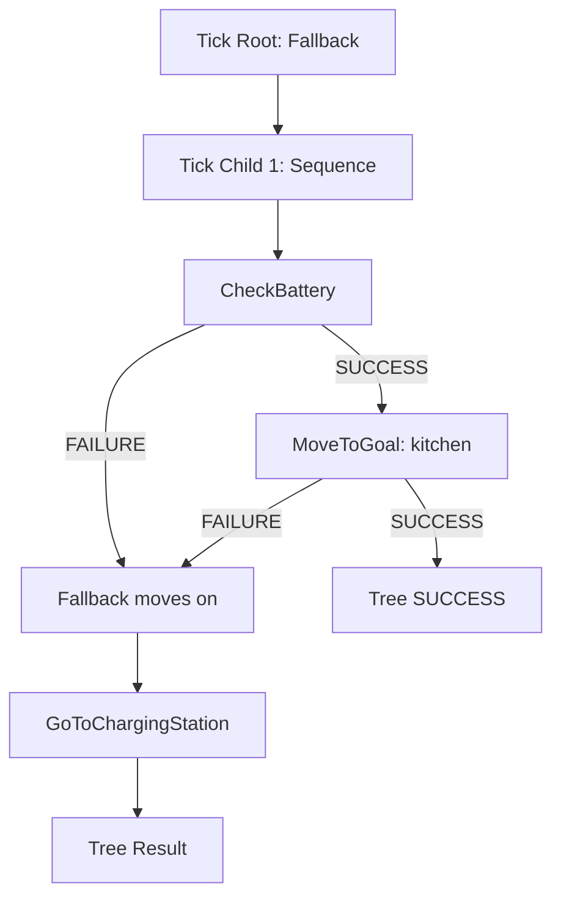

# Behavior Trees for ROS2 — Unit 1: Introduction to the Course

This unit sets expectations for the course: what Behavior Trees (BTs) are for, why ROS2 developers reach for them instead of state machines, and what you'll be able to build by the end. It also gets a minimal toolchain running so later units aren't blocked on setup.

The diagram below traces how a single tick flows through the sample tree shown later in this unit, so you can see the "try the kitchen, otherwise recharge" logic play out step by step.



## Why Behavior Trees, and why now

Robot behavior logic tends to start as a handful of `if`/`else` statements and grow into an unmaintainable tangle as more edge cases, recoveries, and modes get added. Finite State Machines (FSMs) help for a while, but the number of transitions grows roughly with the square of the number of states, and adding a single new "abort and retry" rule can mean touching transitions all over the graph.

Behavior Trees solve the same problem — deciding what a robot should do moment to moment — with a structure that composes instead of tangling. A BT is a tree of nodes, evaluated ("ticked") from the root, that returns one of three statuses: `SUCCESS`, `FAILURE`, or `RUNNING`. Composability is the key property: you can build a "pick up object" subtree once, test it in isolation, and reuse it inside a larger "clear the table" tree without touching its internals. This is why BTs became the standard decision-making layer in Nav2 (ROS2's navigation stack) and are increasingly common in manipulation and multi-robot task allocation.

## What this course covers

- **Unit 2** builds the conceptual foundation: nodes, ticks, statuses, and the canonical control-flow node types (Sequence, Fallback, Parallel, Decorator).
- **Unit 3** goes deeper into design: blackboards, ports, reactive vs. non-reactive patterns, and how to structure large trees so they stay readable.
- **Unit 4** connects BTs to ROS2 using the BehaviorTree.CPP library — writing custom nodes that call ROS2 actions, services, and topics.
- **Unit 5** covers stochastic/probabilistic nodes and a light introduction to automated planning feeding into BT structure.
- **Unit 6** is a final project: an original mini-robot-behavior tree you design, implement, and test yourself.

## A five-minute practical demo

Before installing anything, look at what a BT actually looks like in the two forms you'll use throughout the course: an XML tree definition, and the C++ registration code that gives the XML tags meaning.

```xml
<root BTCPP_format="4">
  <BehaviorTree ID="MainTree">
    <Fallback>
      <Sequence>
        <CheckBattery/>
        <MoveToGoal goal="kitchen"/>
      </Sequence>
      <GoToChargingStation/>
    </Sequence>
  </BehaviorTree>
</root>
```

Read this the way the engine ticks it: the root `Fallback` tries its first child (the `Sequence`); if `CheckBattery` fails, the whole `Sequence` fails, and control falls through to `GoToChargingStation`. Notice you can read the *intent* ("try to reach the kitchen, otherwise recharge") straight off the structure — that readability is the main selling point over a hand-rolled FSM.

## Setting up your environment

You'll need a working ROS2 install (any currently supported distribution) and the BehaviorTree.CPP library, which is packaged for ROS2 as `behaviortree_cpp` plus the visual editor `Groot2`. On a Debian-based ROS2 install:

```bash
sudo apt update
sudo apt install ros-$ROS_DISTRO-behaviortree-cpp
```

Verify the package is visible to your workspace:

```bash
ros2 pkg list | grep behaviortree
```

If you plan to follow along with Nav2-flavored examples later, also install `ros-$ROS_DISTRO-nav2-behavior-tree`, which ships a library of navigation-specific BT nodes you can inspect as real-world reference material.

## Try it yourself

Install `behaviortree_cpp` (or confirm it's already present), then find and open the sample XML trees that ship with the package — on most installs they live under `/opt/ros/$ROS_DISTRO/share/behaviortree_cpp/` or `nav2_behavior_tree/behavior_trees/`. Pick one file and, without running it, write down in plain English what you think the robot does, in what order, and under what failure condition it would deviate from the "happy path". You'll revisit this exact skill — reading intent off tree structure — constantly for the rest of the course.
