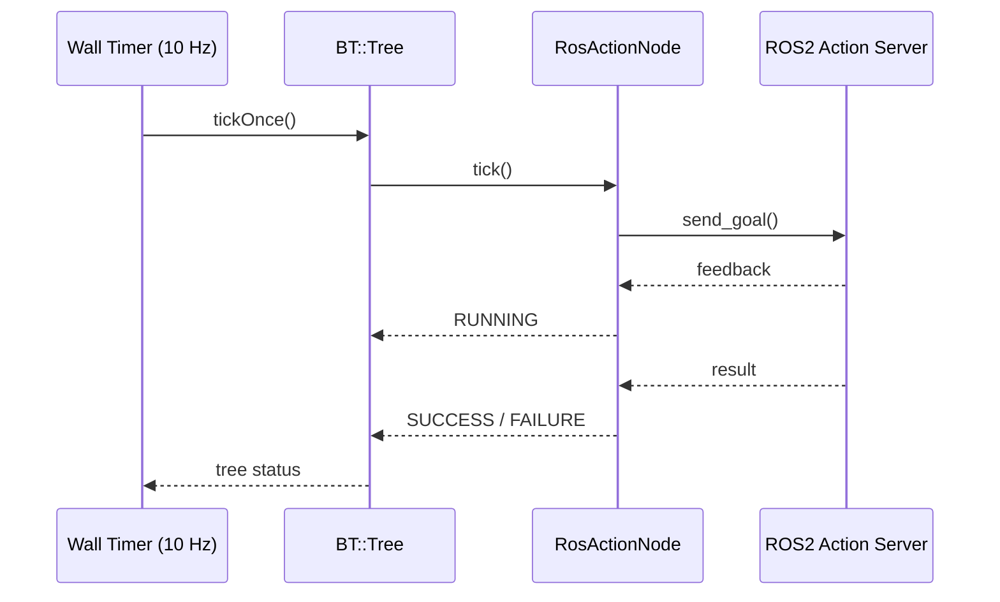

# Behavior Trees for ROS2 — Unit 4: Integration of Behavior Trees with ROS2

Everything so far has been abstract tree structure. This unit makes it concrete: writing custom BehaviorTree.CPP nodes that call ROS2 actions, services, and topics, loading and ticking a tree from a ROS2 node, and visualizing execution live with Groot2.

The sequence diagram below shows one tick cycle end-to-end: the wall timer driving the tree, the tree ticking a `RosActionNode`, and that node talking to a real ROS2 action server over goal/feedback/result.



## Custom action nodes that call ROS2 actions

Most robot behaviors of any duration — navigation, arm trajectories, grippers — are already exposed as ROS2 **actions**, so the natural BT leaf node wraps an action client. BehaviorTree.CPP provides `BT::RosActionNode` as a base class specifically for this:

```cpp
#include <behaviortree_ros2/bt_action_node.hpp>
#include <nav2_msgs/action/navigate_to_pose.hpp>

class NavigateToPose : public BT::RosActionNode<nav2_msgs::action::NavigateToPose>
{
public:
  using RosActionNode::RosActionNode;

  static BT::PortsList providedPorts()
  {
    return providedBasicPorts({ BT::InputPort<std::string>("goal_frame") });
  }

  bool setGoal(RosActionNode::Goal& goal) override
  {
    goal.pose.header.frame_id = getInput<std::string>("goal_frame").value();
    return true;
  }

  BT::NodeStatus onResultReceived(const WrappedResult& result) override
  {
    return result.code == rclcpp_action::ResultCode::SUCCEEDED
               ? BT::NodeStatus::SUCCESS
               : BT::NodeStatus::FAILURE;
  }
};
```

The base class handles sending the goal, reporting `RUNNING` while the action server works, and processing feedback — you only implement the three or four hooks specific to your action: building the goal, and interpreting the result. Services and topics follow the same pattern with `RosServiceNode` and `RosTopicSubNode`/`RosTopicPubNode`.

## Registering nodes and loading a tree

Custom node classes need to be registered with a `BT::BehaviorTreeFactory` before the XML tags that reference them mean anything:

```cpp
BT::BehaviorTreeFactory factory;

BT::RosNodeParams params;
params.nh = node;                 // your rclcpp::Node::SharedPtr
params.default_port_value = "navigate_to_pose";

factory.registerNodeType<NavigateToPose>("NavigateToPose", params);
factory.registerNodeType<DetectObject>("DetectObject");

auto tree = factory.createTreeFromFile("/path/to/pick_and_place.xml");
```

## Ticking the tree inside a ROS2 node

The tree needs to be driven — ticked on a timer, inside a normal `rclcpp::Node`, so it participates in the ROS2 executor like any other subscription callback:

```cpp
class BTExecutorNode : public rclcpp::Node
{
public:
  BTExecutorNode() : Node("bt_executor")
  {
    // ...factory setup and tree = factory.createTreeFromFile(...)...
    timer_ = create_wall_timer(
        std::chrono::milliseconds(100),
        [this]() {
          BT::NodeStatus status = tree_.tickOnce();
          if (status != BT::NodeStatus::RUNNING) {
            RCLCPP_INFO(get_logger(), "Tree finished with status: %d", (int)status);
            timer_->cancel();
          }
        });
  }
private:
  BT::Tree tree_;
  rclcpp::TimerBase::SharedPtr timer_;
};
```

A 10 Hz tick rate (100 ms) is a common default — fast enough to feel responsive, slow enough not to burn CPU on trees with expensive condition checks.

## Visualizing and debugging with Groot2

Groot2 is BehaviorTree.CPP's companion editor and live monitor. Point it at a running tree (via the built-in `PublisherZMQ`/`Groot2Publisher` node inserted in your factory setup) and you get a real-time highlighted view of which nodes are `RUNNING`, which just returned `SUCCESS`/`FAILURE`, and the current blackboard contents — invaluable for debugging a tree that "sort of works" but fails somewhere you can't immediately see from logs alone.

## Try it yourself

Take one leaf action from your Unit 3 "fetch a coffee mug" tree (e.g. the grasp action) and write the skeleton of a `RosActionNode` subclass for it against a plausible ROS2 action interface of your choosing (define the `.action` file's goal/result fields yourself if none exists). You don't need it to compile against a real package — the goal is to correctly implement `setGoal` and `onResultReceived` for your chosen interface.
